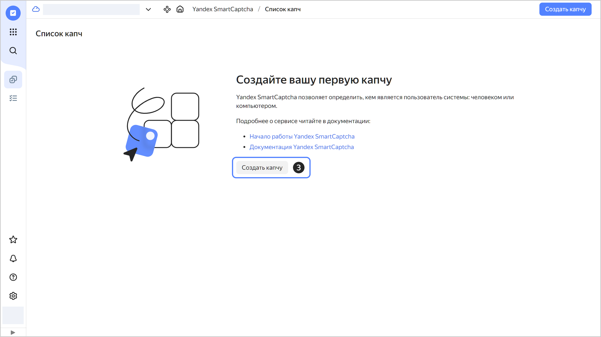
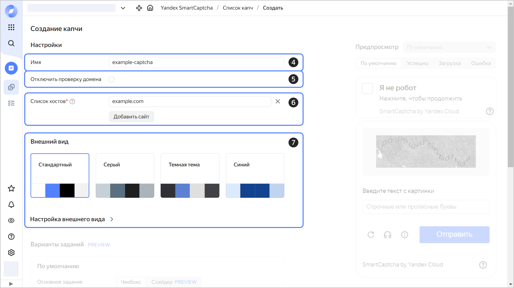
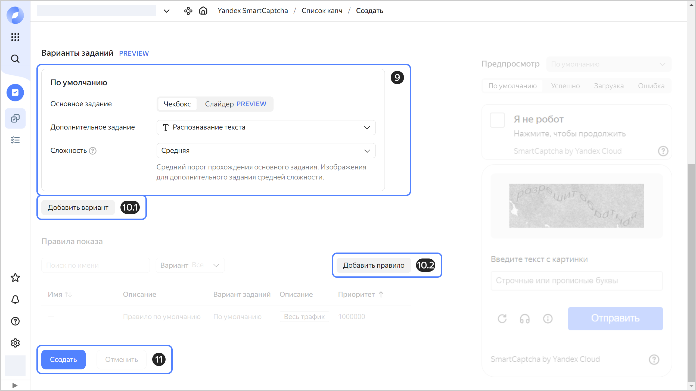

# Создать капчу

{{ captcha-name }} позволяет создавать [капчи](../concepts/validation.md) нескольких уровней сложности для разных входящих запросов. Уровень сложности запроса определяется по базовым параметрам входящего трафика.

При создании капчи вы можете:

* Подключить капчу к нескольким сайтам.
* Настроить внешний вид капчи: фон, состояния и ошибки, стиль кнопки **Я не робот**.
* Выбрать тип задания и сложность прохождения капчи.
* Показывать разные варианты капчи в зависимости от параметров входящего запроса. Например, выбрать разную капчу для пользователей из разных регионов.



- Консоль управления {#console}

  1. В [консоли управления]({{ link-console-main }}) выберите каталог.
  1. Выберите сервис **{{ ui-key.yacloud.iam.folder.dashboard.label_smartcaptcha_ru }}**.
  1. Нажмите **{{ ui-key.yacloud.smartcaptcha.button_captcha-settings-create }}**.

     

  1. Укажите **{{ ui-key.yacloud.common.name }}** создаваемой капчи:

      

  1. (Опционально) Выберите [**{{ ui-key.yacloud.smartcaptcha.label_no-hostname-check }}**](../concepts/domain-validation.md).
  1. Введите **{{ ui-key.yacloud.smartcaptcha.label_allowed-sites }}** в формате IP-адресов или доменных имен. Указывайте адрес без протокола и без `/` в конце, например, `example.com`.

     Капча будет работать и во всех поддоменах указанных доменных имен.

  1. Настройте **{{ ui-key.yacloud.smartcaptcha.label_section-style }}** кнопки **Я не робот** и окна с заданием:
     * `{{ ui-key.yacloud.smartcaptcha.value_config-standard }}` — внешний вид по умолчанию.
     * `Серый`.
     * `Темная тема`.
     * `Синий`.

      В разделе **{{ ui-key.yacloud.smartcaptcha.label_section-customization }}** вы можете задать свои параметры окна задания и других элементов: через форму или через описание стилей в формате `JSON`.

      Все изменения будут отображаться в окне предпросмотра.

     

  1. Настройте **Варианты заданий**. Вы можете указать только капчу по умолчанию или добавить дополнительные [варианты](../concepts/captcha-variants.md), если по разным входящим запросам нужно показывать разную капчу.
  
  1. Для варианта **По умолчанию** укажите:
      * **{{ ui-key.yacloud.smartcaptcha.label_main-challenge }}** — тип [основного задания](../concepts/tasks.md#main-task), которое предлагается решить пользователю.
      * **{{ ui-key.yacloud.smartcaptcha.label_additional-challenge }}** — тип [дополнительного задания](../concepts/tasks.md#additional-task), которое предлагается решить пользователю.
      * **{{ ui-key.yacloud.smartcaptcha.label_complexity }}** — [сложность](../concepts/tasks.md#task-difficulty) задания, которое увидит пользователь:
      * `{{ ui-key.yacloud.smartcaptcha.value_complexity-easy }}` — простое задание.
      * `{{ ui-key.yacloud.smartcaptcha.value_complexity-medium }}` — задание среднего уровня сложности.
      * `{{ ui-key.yacloud.smartcaptcha.value_complexity-hard }}` — сложное задание.
      * `{{ ui-key.yacloud.smartcaptcha.value_complexity-force_hard }}` — сложное задание с дополнительным вопросом. От пользователя требуется решение дополнительного задания, вне зависимости от результатов выполнения основного задания.

        Пример задания можно посмотреть в окне предпросмотра.

        

  1. Чтобы по разным запросам показывать разную капчу:
     1. Нажмите кнопку **Добавить вариант** и задайте настройки аналогично капче по умолчанию.

        Чтобы удалить вариант, нажмите . Если вариант используется в правиле показа, удалить его нельзя

     1. Добавьте [правила для входящего трафика](../concepts/captcha-variants.md#captcha-view-rules), которые будут определять, какой вариант капчи показывать:
         * Нажмите кнопку **Добавить правило**.
         * Введите имя и описание правила.
         * Выберите вариант капчи.
         * Укажите приоритет правила от `1` до `999999`.
          
            Правила проверяются в порядке приоритета от меньшего к большему: `1`, `2` и так далее. Если трафик соответствует нескольким правилам, к нему применится первое сработавшее правило.
          
         * Укажите одно или несколько [условий для входящего трафика](../concepts/captcha-variants.md#traffic-conditions):
            * `IP` — IP-адрес, диапазон адресов или регион IP-адресов;
            * `HTTP header` — строка в заголовке HTTP;
            * `URI` — путь входящего запроса к сайту;
            * `Host` — домен, на который пришел запрос.
           
         * Нажмите кнопку **Добавить**.
          
            Чтобы удалить правило, нажмите . Правило по умолчанию удалить нельзя.

     1. Таким же способом добавьте другие варианты капчи и правила для входящего трафика.

  1. Нажмите **{{ ui-key.yacloud.common.create }}**.

     

  Капча отобразится на странице сервиса в разделе **{{ ui-key.yacloud.smartcaptcha.label_captcha-settings-list }}**.


