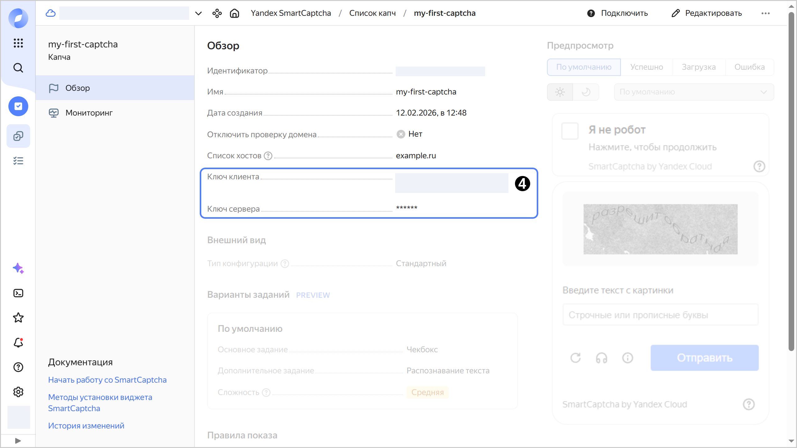

# Получить ключи капчи

В этом разделе вы узнаете, как получить [ключи капчи](../concepts/keys.md). С помощью клиентского ключа вы можете [добавить виджет](../quickstart.md#add-widget) {{ captcha-name }} на свою страницу. Серверный ключ потребуется для [проверки ответа](../quickstart.md#check-answer) пользователя.



- Консоль управления {#console}

    1. В [консоли управления]({{ link-console-main }}) выберите каталог.
    1. [Перейдите]({{ link-console-main }}/link/smartcaptcha) в сервис **{{ ui-key.yacloud.iam.folder.dashboard.label_smartcaptcha_ru }}**.
    1. Нажмите на имя капчи или [создайте](../quickstart.md#creat-captcha) новую капчу.
    1. На вкладке **{{ ui-key.yacloud.common.overview }}** скопируйте значения полей **{{ ui-key.yacloud.smartcaptcha.label_client-key }}** и **{{ ui-key.yacloud.smartcaptcha.label_server-key }}**.

       

- CLI {#cli}

  

  

  1. 

  1. Получите клиентский ключ, указав имя или идентификатор капчи:

     ```bash
     yc smartcaptcha captcha get <идентификатор_капчи>
     ```

     Клиентский ключ возвращается в поле `client_key`:

     ```text
     id: bpne29ifsca8********
     folder_id: b1geoelk7fld********
     cloud_id: b1gia87mbaom********
     client_key: ysc1_MtyvvAUieCSUfHb6tugqFAbTyesgGzXWU50sZq0E********
     created_at: "2025-02-24T17:16:13.034742Z"
     name: test
     allowed_sites:
       - example.com
     complexity: MEDIUM
     pre_check_type: CHECKBOX
     challenge_type: IMAGE_TEXT
     ```

  1. Получите серверный ключ:

     ```bash
     yc smartcaptcha captcha get-secret-key <идентификатор_капчи>
     ```

     Результат:

     ```text
     server_key: ysc2_MtyvvAUieCSUfHb6tugqFAbTyesgGzXWU50sZq0E********
     ```

  Оба ключа сразу возвращает команда `yc smartcaptcha captcha get-keys <идентификатор_капчи>`.

  

- {{ TF }} {#tf}

  

  

  С помощью {{ TF }} можно получить только клиентский ключ. Серверный ключ через источник данных не возвращается — используйте консоль управления, CLI или API.

  1. Добавьте в конфигурационный файл {{ TF }} блоки `data` и `output`:

      ```hcl
      data "yandex_smartcaptcha_captcha" "my-captcha" {
        captcha_id = "<идентификатор_капчи>"
      }

      output "my-client-key" {
        value = data.yandex_smartcaptcha_captcha.my-captcha.client_key
      }
      ```

      Где:

      * `data "yandex_smartcaptcha_captcha"` — описание капчи в качестве источника данных:

         * `captcha_id` — идентификатор капчи.

      * `output "my-client-key"` — выходная переменная, которая содержит клиентский ключ:

         * `value` — возвращаемое значение.

      Подробнее о параметрах источника данных `yandex_smartcaptcha_captcha` читайте в [документации провайдера]({{ tf-provider-datasources-link }}/smartcaptcha_captcha).

  1. Создайте ресурсы:

      

      Чтобы посмотреть результат, выполните команду:

      ```bash
      terraform output
      ```

      Результат:

      ```text
      my-client-key = ysc1_MtyvvAUieCSUfHb6tugqFAbTyesgGzXWU50sZq0E********
      ```

- API {#api}

  Чтобы получить [клиентский ключ](../concepts/keys.md), воспользуйтесь методом REST API [get](../api-ref/Captcha/get.md) для ресурса [Captcha](../api-ref/Captcha/index.md) или вызовом gRPC API [CaptchaService/Get](../api-ref/grpc/Captcha/get.md). Ключ возвращается в поле `clientKey`.

  Чтобы получить [серверный ключ](../concepts/keys.md), воспользуйтесь методом REST API [GetSecretKey](../api-ref/Captcha/getSecretKey.md) для ресурса [Captcha](../api-ref/Captcha/index.md) или вызовом gRPC API [CaptchaService/GetSecretKey](../api-ref/grpc/Captcha/getSecretKey.md). Ключ возвращается в поле `serverKey`.

  **Пример вызова REST API**

  ```bash
  export IAM_TOKEN="<IAM-токен>"
  curl \
    --request GET \
    --header "Authorization: Bearer $IAM_TOKEN" \
    --url 'https://smartcaptcha.{{ api-host }}/smartcaptcha/v1/captchas/<идентификатор_капчи>:getSecretKey'
  ```

  Где `IAM_TOKEN` — [IAM-токен](../../iam/concepts/authorization/iam-token.md).

  Результат:

  ```json
  {
    "serverKey": "ysc2_MtyvvAUieCSUfHb6tugqFAbTyesgGzXWU50sZq0E********"
  }
  ```

  



#### Полезные ссылки {#see-also}

* [{#T}](../concepts/keys.md)
* [{#T}](get-info.md)
