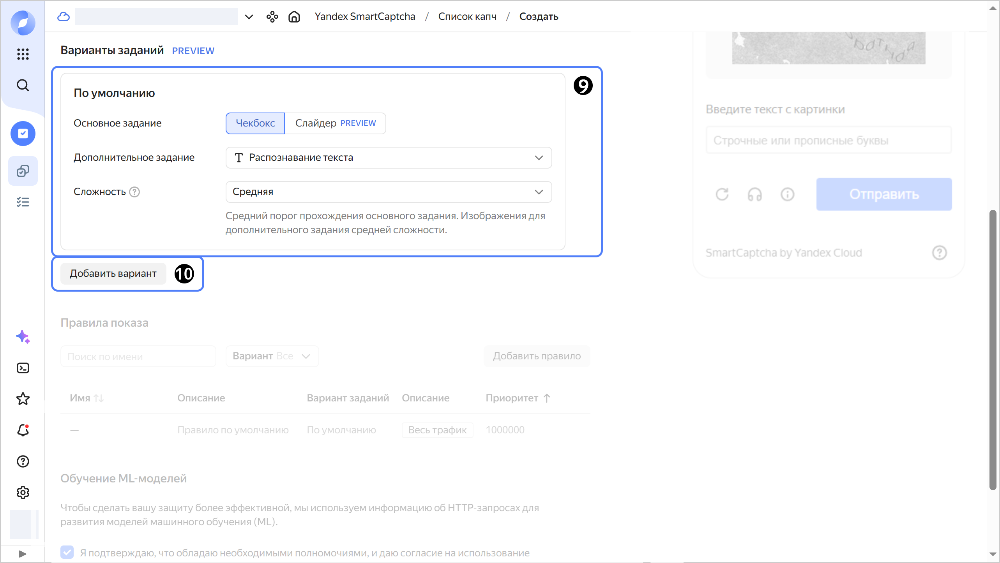
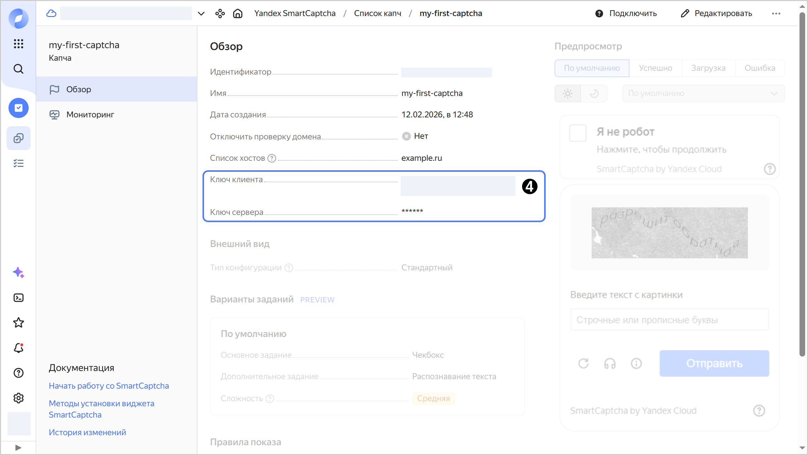

# Как начать работать с {{ captcha-full-name }}

{{ captcha-full-name }} — сервис защиты от ботов и автоматизированных атак.

Чтобы добавить капчу на свою HTML-страницу:

1. [Создайте капчу](#create-captcha) в {{ yandex-cloud }}.
1. [Скопируйте ключи](#get-keys) на странице с информацией о капче.
1. [Добавьте код виджета капчи](#add-widget) в свою HTML-страницу.
1. [Проверьте ответ пользователя](#check-answer) с помощью отправки POST-запроса.

## Перед началом работы {#before-begin}

1. Перейдите в [консоль управления]({{ link-console-main }}). Войдите в {{ yandex-cloud }} или зарегистрируйтесь, если вы еще не зарегистрированы.
1. На странице [**{{ ui-key.yacloud_billing.billing.label_service }}**]({{ link-console-billing }}) убедитесь, что у вас подключен [платежный аккаунт](../billing/concepts/billing-account.md), и он находится в статусе `ACTIVE` или `TRIAL_ACTIVE`. Если платежного аккаунта нет, [создайте его](../billing/quickstart/index.md).


## Создайте капчу {#create-captcha}





- Консоль управления {#console}

    1. В [консоли управления]({{ link-console-main }}) выберите каталог.
    1. [Перейдите](../console/operations/select-service.md#select-service) в сервис **{{ ui-key.yacloud.iam.folder.dashboard.label_smartcaptcha_ru }}**.
    1. Нажмите кнопку **{{ ui-key.yacloud.smartcaptcha.button_captcha-settings-create }}**.

    1. Введите имя капчи, например `sm-captcha`.
    1. Укажите список сайтов, на которых будет размещаться капча. Например, `my-shop.com`.
    1. **{{ ui-key.yacloud.smartcaptcha.label_section-style }}** оставьте без изменений.
    1. Выберите параметры капчи по умолчанию (или оставьте текущие):
       1. [Основное задание](./concepts/tasks.md#main-task) — будет показано пользователю первым.
       1. [Дополнительное задание](./concepts/tasks.md#additional-task) — будет показано, если результат выполнения основного задания кажется сервису подозрительным или если выбран максимальный уровень сложности.
       1. Выберите [сложность](./concepts/tasks.md#task-difficulty) — `{{ ui-key.yacloud.smartcaptcha.value_complexity-medium }}`.

         Можно добавить [варианты заданий](concepts/captcha-variants.md) и настроить правила для входящего трафика, чтобы показывать разную капчу разным пользователям. В этом примере будет добавлена только одна капча по умолчанию для всех пользователей.

       

    1. Нажмите кнопку **{{ ui-key.yacloud.common.create }}**.




## Получите ключи капчи {#get-keys}



- Консоль управления {#console}
    
    После создания капчи выберите ее в списке и скопируйте два ключа:
    * **{{ ui-key.yacloud.smartcaptcha.label_client-key }}** — для добавления виджета {{ captcha-name }} на ваш сайт или страницу.
    * **{{ ui-key.yacloud.smartcaptcha.label_server-key }}** — для [проверки ответа](#check-answer) пользователя.

    Сохраните их в безопасном месте.

    



## Добавьте виджет на страницу {#add-widget}

Добавьте виджет автоматическим методом:

1. Подключите JS-скрипт к вашей HTML-странице. Для этого разместите в любом месте страницы (например, внутри тега `<head>`) код:

    ```html
    <script src="https://{{ captcha-domain }}/captcha.js" defer></script>
    ```

    Скрипт `captcha.js` автоматически найдет все `div` с классом `smart-captcha` и установит в них виджет.

1. Добавьте на страницу пустой контейнер (элемент `div`) для виджета капчи:

    ```html
    <div
        id="captcha-container"
        class="smart-captcha"
        data-sitekey="<ключ_клиента>"
    ></div>
    ```

    Где `<ключ_клиента>` — ключ, скопированный после создания капчи.

    

На странице появится кнопка **Я не робот**. Когда пользователь нажмет кнопку, сервис проверит его запрос.
Если запрос покажется подозрительным, сервис предложит пользователю пройти задание капчи.

## Проверьте ответ пользователя {#check-answer}

После проверки капчи пользователю выдается уникальный токен. Токен добавляется в HTML-страницу, в контейнер с виджетом капчи как элемент `<input>`:

```html
<div id="captcha-container" class="smart-captcha" ...>
    <input type="hidden" name="smart-token" value="<токен>">
    ...
</div>
```

Для проверки токена отправьте POST-запрос на адрес `https://{{ captcha-domain }}/validate`, передав параметры в формате `x-www-form-urlencoded`:

```
secret=<ключ_сервера>&token=<токен>&ip=<IP-адрес_пользователя>
```

Где:



Пример функции проверки токена:



- cURL {#curl}

    ```bash
    curl -X POST https://{{ captcha-domain }}/validate \
      -d "secret=<ключ_сервера>" \
      -d "token=<токен_из_формы>" \
      -d "ip=<IP_пользователя>"
    ```

- Node.js {#node}

    ```js
    const https = require('https'),
        querystring = require('querystring');

    const SMARTCAPTCHA_SERVER_KEY = "<ключ_сервера>";


    function check_captcha(token, callback) {
        const postData = querystring.stringify({
            secret: SMARTCAPTCHA_SERVER_KEY,
            token: token,
            ip: '<IP-адрес_пользователя>', // Способ получения IP-адреса пользователя зависит от вашего фреймворка и прокси.
        });
    
        const options = {
            hostname: '{{ captcha-domain }}',
            port: 443,
            path: '/validate',
            method: 'POST',
            headers: {
                'Content-Type': 'application/x-www-form-urlencoded',
                'Content-Length': Buffer.byteLength(postData),
            },
        };
    
        const req = https.request(options, (res) => {
            let content = '';
    
            res.on('data', (chunk) => {
                content += chunk;
            });
    
            res.on('end', () => {
                if (res.statusCode !== 200) {
                    console.error(`Allow access due to an error: code=${res.statusCode}; message=${content}`);
                    callback(true);
                    return;
                }
    
                try {
                    const parsedContent = JSON.parse(content);
                    callback(parsedContent.status === 'ok');
                } catch (err) {
                    console.error('Error parsing response: ', err);
                    callback(true);
                }
            });
        });
    
        req.on('error', (error) => {
            console.error(error);
            callback(true);
        });
    
        // Записываем POST-данные в тело запроса
        req.write(postData);
        req.end();
    }


    let token = "<токен>";
    check_captcha(token, (passed) => {
        if (passed) {
            console.log("Passed");
        } else {
            console.log("Robot");
        }
    });
    ```

- PHP {#php}

    ```php
    define('SMARTCAPTCHA_SERVER_KEY', '<ключ_сервера>');

    function check_captcha($token) {
        $ch = curl_init("https://{{ captcha-domain }}/validate");
        $args = [
            "secret" => SMARTCAPTCHA_SERVER_KEY,
            "token" => $token,
            "ip" => "<IP-адрес_пользователя>", // Нужно передать IP-адрес пользователя.
                        // Способ получения IP-адреса пользователя зависит от вашего прокси.
        ];
        curl_setopt($ch, CURLOPT_TIMEOUT, 1);
        curl_setopt($ch, CURLOPT_POST, true);    
        curl_setopt($ch, CURLOPT_POSTFIELDS, http_build_query($args));
        curl_setopt($ch, CURLOPT_RETURNTRANSFER, true);
    
        $server_output = curl_exec($ch); 
        $httpcode = curl_getinfo($ch, CURLINFO_HTTP_CODE);
        curl_close($ch);
    
        if ($httpcode !== 200) {
            echo "Allow access due to an error: code=$httpcode; message=$server_output\n";
            return true;
        }
     
        $resp = json_decode($server_output);
        return $resp->status === "ok";
    }

    $token = "<токен>"; // Например, $_POST['smart-token'];
    if (check_captcha($token)) {
        echo "Passed\n";
    } else {
        echo "Robot\n";
    }
    ```

- Python {#python}

    ```py
    import requests
    import sys
    import json

    SMARTCAPTCHA_SERVER_KEY = "<ключ_сервера>"

    def check_captcha(token):
        resp = requests.post(
           "https://{{ captcha-domain }}/validate",
           data={
              "secret": SMARTCAPTCHA_SERVER_KEY,
              "token": token,
              "ip": "<IP-адрес_пользователя>"  # Способ получения IP-адреса зависит от вашего фреймворка и прокси.
                                                # Например, во Flask это может быть request.remote_addr
           },
           timeout=1
        )
        server_output = resp.content.decode()
        if resp.status_code != 200:
           print(f"Allow access due to an error: code={resp.status_code}; message={server_output}", file=sys.stderr)
           return True
        return json.loads(server_output)["status"] == "ok"

    token = "<токен>"  # Например, request.form["smart-token"]
    if check_captcha(token):
        print("Passed")
    else:
        print("Robot")
    ```



В ответ сервис отправит JSON-объект с полями:

* `status` — результат проверки: `ok` или `failed`. Если проверка успешна, в JSON-объект добавляется поле `host` — сайт, на котором была пройдена проверка.
* `message` — сообщение о проверке, например, `Token invalid or expired`.
  
Примеры ответов см. в разделе [Валидация пользователя](concepts/validation.md#service-response).

## Частые вопросы {#faq}

**Как проверить работу капчи?**

Откройте страницу с капчей в режиме инкогнито или используйте VPN — это повысит вероятность появления задания.

**Как настроить внешний вид капчи?**

См. раздел [Расширенные настройки виджета](./concepts/widget-methods.md).

**Что делать, если капча не отображается?**

Проверьте, что домен добавлен в список разрешенных сайтов в настройках капчи.

## Полезные ссылки {#links}

* [Методы подключения виджета](./concepts/widget-methods.md)
* [Настройка внешнего вида](./concepts/captcha-variants.md)
* [API Reference](./api-ref/)