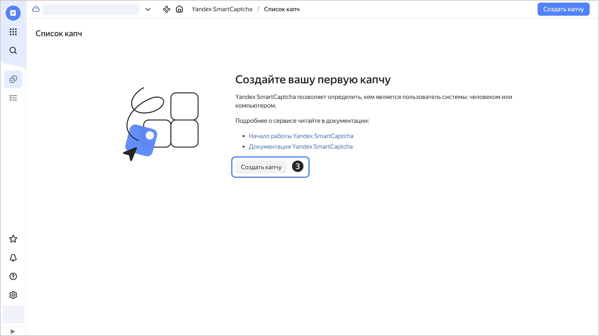
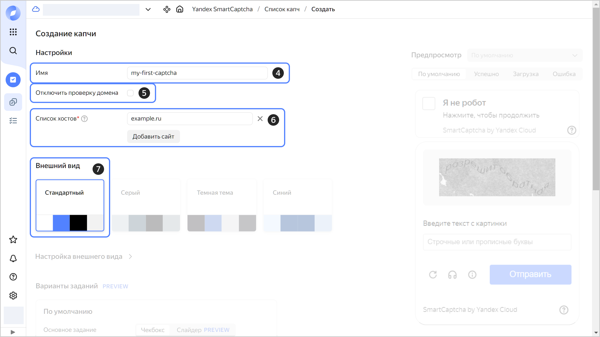
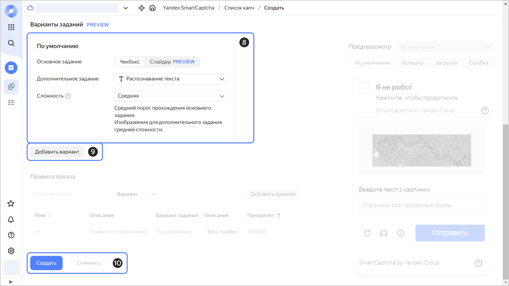
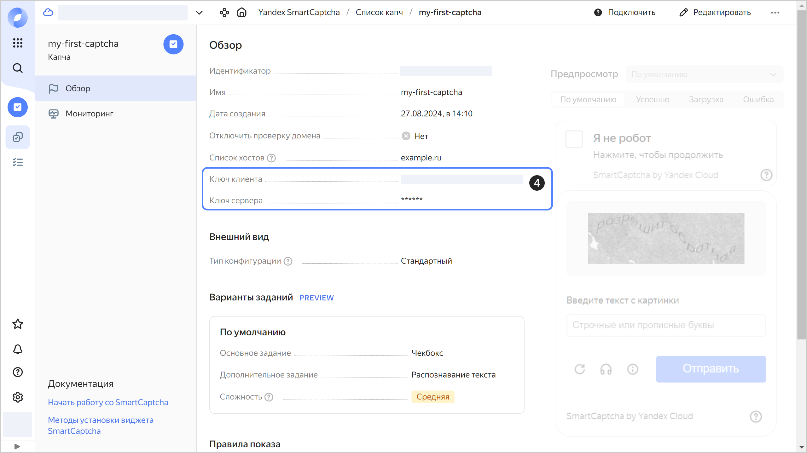

# Как начать работать с {{ captcha-full-name }}

Чтобы начать работу с сервисом:

1. [Создайте капчу](#creat-captcha).
1. [Получите ключи](#get-keys).
1. [Добавьте виджет на страницу](#add-widget).
1. [Проверьте ответ пользователя](#check-answer).


## Перед началом работы {#before-begin}

1. Перейдите в [консоль управления]({{ link-console-main }}). Войдите в {{ yandex-cloud }} или зарегистрируйтесь, если вы еще не зарегистрированы.
1. На странице [**{{ ui-key.yacloud_billing.billing.label_service }}**]({{ link-console-billing }}) убедитесь, что у вас подключен [платежный аккаунт](../billing/concepts/billing-account.md), и он находится в статусе `ACTIVE` или `TRIAL_ACTIVE`. Если платежного аккаунта нет, [создайте его](../billing/quickstart/index.md).


## Создайте капчу {#creat-captcha}



- Консоль управления {#console}

    1. В [консоли управления]({{ link-console-main }}) выберите каталог.
    1. Выберите сервис **{{ ui-key.yacloud.iam.folder.dashboard.label_smartcaptcha_ru }}**.
    1. Нажмите кнопку **{{ ui-key.yacloud.smartcaptcha.button_captcha-settings-create }}**.

       

    1. Введите имя капчи. Требования к имени:

        

    1. (Опционально) Отключите [проверку имени домена](./concepts/domain-validation.md).
    1. Укажите список сайтов, на которых будет размещаться капча.
    1. **{{ ui-key.yacloud.smartcaptcha.label_section-style }}** оставьте стандартным.

       

    1. Настройте капчу по умолчанию:
       1. Выберите тип [основного задания](./concepts/tasks.md#main-task), которое предлагается решить пользователю.
       1. Выберите тип [дополнительного задания](./concepts/tasks.md#additional-task), которое предлагается решить пользователю.
       1. Выберите [сложность](./concepts/tasks.md#task-difficulty) `{{ ui-key.yacloud.smartcaptcha.value_complexity-medium }}`.

    1. Вы можете добавить [варианты заданий](concepts/captcha-variants.md) и настроить правила для входящего трафика, чтобы показывать разную капчу разным пользователям. В этом примере будет добавлена только одна капча по умолчанию для всех пользователей.
    1. Нажмите кнопку **{{ ui-key.yacloud.common.create }}**.

       




## Получите ключи капчи {#get-keys}



- Консоль управления {#console}

    1. В [консоли управления]({{ link-console-main }}) выберите каталог.
    1. Выберите сервис **{{ ui-key.yacloud.iam.folder.dashboard.label_smartcaptcha_ru }}**.
    1. Нажмите на имя капчи или [создайте](#creat-captcha) новую капчу.
    1. На вкладке **{{ ui-key.yacloud.common.overview }}** скопируйте значения полей **{{ ui-key.yacloud.smartcaptcha.label_client-key }}** и **{{ ui-key.yacloud.smartcaptcha.label_server-key }}**.

    



С помощью ключа клиента вы можете [добавить виджет](#add-widget) {{ captcha-name }} на свою страницу. Ключ сервера потребуется для [проверки ответа](#check-answer) пользователя.


## Добавьте виджет на страницу {#add-widget}

Добавьте виджет автоматическим методом:

1. Подключите JS-скрипт к странице пользователя. Для этого разместите в любом месте страницы (например, внутри тега `<head>`) код:

    ```html
    <script src="https://smartcaptcha.yandexcloud.net/captcha.js" defer></script>
    ```

    Скрипт `captcha.js` автоматически найдет все `div` с классом `smart-captcha` и установит в них виджет.

1. Добавьте на страницу пустой контейнер (элемент `div`), чтобы скрипт `captcha.js` загрузил в него виджет:

    ```html
    <div
        id="captcha-container"
        class="smart-captcha"
        data-sitekey="<ключ_клиента>"
    ></div>
    ```

    

На странице отобразится кнопка **Я не робот**. Сервис проверит запрос пользователя, когда он нажмет кнопку. Если запрос покажется подозрительным, сервис предложит пользователю решить задание.


## Проверьте ответ пользователя {#check-answer}

После проверки пользователю выдается уникальный токен. Токен загружается в элемент `<input type="hidden" name="smart-token" value="<токен>"` внутри контейнера с виджетом. Например, так:

```html
<div id="captcha-container" class="smart-captcha" ...>
    <input type="hidden" name="smart-token" value="<токен>">
    ...
</div>
```

Для проверки токена нужно отправить POST-запрос на адрес `https://smartcaptcha.yandexcloud.net/validate`, передав параметры в формате `x-www-form-urlencoded`:

```
secret=<ключ_сервера>&token=<токен>&ip=<IP-адрес_пользователя>
```

Где:



В ответ сервис отправит JSON-объект с полями `status` и `message`. Когда поле `status` принимает значение `ok`, в JSON-объект добавляется поле `host`. Оно показывает, на каком сайте была пройдена проверка. Примеры ответов см. в разделе [Валидация пользователя](concepts/validation.md#service-response).


Пример функции проверки токена:



- Node.js {#node}

    ```js
    const https = require('https'),
        querystring = require('querystring');

    const SMARTCAPTCHA_SERVER_KEY = "<ключ_сервера>";


    function check_captcha(token, callback) {
        const postData = querystring.stringify({
            secret: SMARTCAPTCHA_SERVER_KEY,
            token: token,
            ip: '<IP-адрес_пользователя>', // Способ получения IP-адреса пользователя зависит от вашего фреймворка и прокси.
        });
    
        const options = {
            hostname: 'smartcaptcha.yandexcloud.net',
            port: 443,
            path: '/validate',
            method: 'POST',
            headers: {
                'Content-Type': 'application/x-www-form-urlencoded',
                'Content-Length': Buffer.byteLength(postData),
            },
        };
    
        const req = https.request(options, (res) => {
            let content = '';
    
            res.on('data', (chunk) => {
                content += chunk;
            });
    
            res.on('end', () => {
                if (res.statusCode !== 200) {
                    console.error(`Allow access due to an error: code=${res.statusCode}; message=${content}`);
                    callback(true);
                    return;
                }
    
                try {
                    const parsedContent = JSON.parse(content);
                    callback(parsedContent.status === 'ok');
                } catch (err) {
                    console.error('Error parsing response: ', err);
                    callback(true);
                }
            });
        });
    
        req.on('error', (error) => {
            console.error(error);
            callback(true);
        });
    
        // Write the POST data to the request body
        req.write(postData);
        req.end();
    }


    let token = "<токен>";
    check_captcha(token, (passed) => {
        if (passed) {
            console.log("Passed");
        } else {
            console.log("Robot");
        }
    });
    ```

- PHP {#php}

    ```php
    define('SMARTCAPTCHA_SERVER_KEY', '<ключ_сервера>');

    function check_captcha($token) {
        $ch = curl_init("https://smartcaptcha.yandexcloud.net/validate");
        $args = [
            "secret" => SMARTCAPTCHA_SERVER_KEY,
            "token" => $token,
            "ip" => "<IP-адрес_пользователя>", // Нужно передать IP-адрес пользователя.
                        // Способ получения IP-адреса пользователя зависит от вашего прокси.
        ];
        curl_setopt($ch, CURLOPT_TIMEOUT, 1);
        curl_setopt($ch, CURLOPT_POST, true);    
        curl_setopt($ch, CURLOPT_POSTFIELDS, http_build_query($args));
        curl_setopt($ch, CURLOPT_RETURNTRANSFER, true);
    
        $server_output = curl_exec($ch); 
        $httpcode = curl_getinfo($ch, CURLINFO_HTTP_CODE);
        curl_close($ch);
    
        if ($httpcode !== 200) {
            echo "Allow access due to an error: code=$httpcode; message=$server_output\n";
            return true;
        }
     
        $resp = json_decode($server_output);
        return $resp->status === "ok";
    }

    $token = "<токен>"; //Например, $_POST['smart-token'];
    if (check_captcha($token)) {
        echo "Passed\n";
    } else {
        echo "Robot\n";
    }
    ```

- Python {#python}

    ```py
    import requests
    import sys
    import json

    SMARTCAPTCHA_SERVER_KEY = "<ключ_сервера>"

    def check_captcha(token):
        resp = requests.post(
           "https://smartcaptcha.yandexcloud.net/validate",
           data={
              "secret": SMARTCAPTCHA_SERVER_KEY,
              "token": token,
              "ip": "<IP-адрес_пользователя>"   # Способ получения IP-адреса зависит от вашего фреймворка и прокси.
                                                # Например, во Flask это может быть request.remote_addr
           },
           timeout=1
        )
        server_output = resp.content.decode()
        if resp.status_code != 200:
           print(f"Allow access due to an error: code={resp.status_code}; message={server_output}", file=sys.stderr)
           return True
        return json.loads(server_output)["status"] == "ok"

    token = "<токен>"  # Например, request.form["smart-token"]
    if check_captcha(token):
        print("Passed")
    else:
        print("Robot")
    ```




## Что дальше {#whats-next}

* Узнайте больше [о методах подключения](./concepts/widget-methods.md) виджета {{ captcha-name }}.