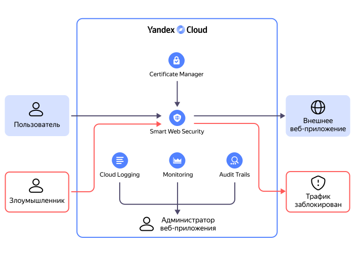

# Защита веб-приложений во внешней инфраструктуре



{{ sws-name }} позволяет защитить веб-приложения, развернутые как в {{ yandex-cloud }}, так и за его пределами. Например, в вашей внутренней инфраструктуре или на других хостингах. {{ sws-name }} предлагает различные средства защиты от информационных угроз на прикладном уровне L7 модели OSI. Это могут быть [DDoS-атаки](../../glossary/ddos.md), атаки [ботов](https://ru.wikipedia.org/wiki/Ботнет), [SQL-инъекции](https://ru.wikipedia.org/wiki/Внедрение_SQL-кода), [межсайтовый скриптинг](https://ru.wikipedia.org/wiki/Межсайтовый_скриптинг) и другие.

## Схема защиты внешних ресурсов {#scheme-protect}

Все внешние запросы к веб-приложению проходят через {{ sws-name }}. Чтобы расшифровать и проанализировать HTTPS-трафик, в сервис [{{ certificate-manager-name }}](../../certificate-manager/) потребуется загрузить приватный ключ и сертификат вашего сервера, на котором работает веб-приложение. После анализа вредоносные запросы блокируются, остальные перенаправляются на веб-приложение.

Администратор веб-приложения в любой момент может посмотреть статистику по трафику: общее количество запросов, количество запросов, заблокированных различными профилями, и так далее.

## Компоненты технологии защиты доменов {#components}

Для фильтрации входящего трафика используется обратное проксирование. Все HTTP-запросы от посетителей сайта или веб-приложения направляются к целевому ресурсу через прокси-сервер {{ sws-name }}. К прокси-серверу подключается один или несколько доменов защищаемого ресурса. Домену можно назначить [профиль безопасности](profiles.md), в котором вы настраиваете защиту Anti-DDoS, Web Application Firewall (WAF) и при необходимости ограничиваете нагрузку на приложение с помощью Advanced Rate Limiter (ARL).

Таким образом, чтобы защищать веб-приложения или бэкенды, вам потребуется настроить прокси-сервер и домен. А также добавить сертификат для расшифровки и проверки трафика HTTPS.

### Прокси-сервер {#proxy}

_Прокси-сервер_ — это посредник, на который поступают все запросы пользователей к вашему сайту или приложению. Он имеет выделенный IP-адрес для приема запросов, поэтому IP-адрес вашего сервера будет скрыт от внешних пользователей. На прокси-сервере настроен балансировщик нагрузки, который обеспечивает стабильную работу при большом количестве внешних запросов, и включена базовая [защита от DDoS](../../vpc/ddos-protection/).



На прокси-сервере установлено ограничение MTU для всех пакетов — 1450 байт.



Чтобы прокси-сервер принимал запросы, отправленные на ваш домен, настройте перенаправление. Для этого добавьте А-запись для DNS вида: `<IP-адрес прокси-сервера> : <адрес домена>`. IP-адрес прокси-сервера будет доступен после создания в его параметрах. Добавить А-запись можно через личный кабинет вашего хостинг-провайдера или регистратора доменов. Также вы можете делегировать управление доменом [{{ dns-full-name }}](../../dns/). Тогда А-записи настраиваются в {{ yandex-cloud }}.

Перенаправление обычно начинает действовать через несколько минут. Но иногда процесс может занять до 24 часов.

Вы можете добавить несколько прокси-серверов, например, чтобы разделить стабильную версию приложения и версию, которая находится в разработке.

Для каждого прокси-сервера можно настроить логирование. Вы можете записывать все логи или отфильтровать их для экономии места в хранилище.

К прокси-серверу можно подключить несколько доменов. Количество доменов см. в разделе [{#T}](limits.md).

### Домен {#domain}

При настройке домена потребуется указать:

* _Адрес домена_ — адрес вашего сайта или веб-приложения, который вы приобрели у DNS-провайдера или хостинг-провайдера. У вас должна быть возможность управлять А-записями в DNS. Допускается любое доменное имя в формате [ASCII](https://wikipedia.org/wiki/ASCII) или [Punycode](https://wikipedia.org/wiki/Punycode).

* _Тип соединения_, на котором работает ваш сайт — HTTPS или HTTP. Рекомендуется использовать протокол HTTPS, поскольку в этом случае соединение между пользователем и вашим приложением шифруется.

    При выборе протокола HTTPS надо добавить TLS-сертификат и приватный ключ в формате [PEM](https://wikipedia.org/wiki/Privacy-Enhanced_Mail). {{ sws-name }} проверяет срок действия и соответствие добавленного сертификата ключу. Недействительный сертификат не будет загружен.

    Сертификат и ключ используются для терминирования TLS-соединения от пользователя к вашему приложению. Чтобы оценить безопасность трафика, {{ sws-name }} расшифрует и проанализирует трафик.

    Если для вашего приложения еще не настроен протокол HTTPS, вы можете получить сертификат Let's Encrypt в [{{ certificate-manager-full-name }}](../../certificate-manager/operations/managed/cert-create.md). Это можно сделать заранее или в процессе добавления домена.

    Чтобы получить сертификат Let's Encrypt, потребуется подтвердить права на владение доменом. Для этого нужен доступ к учетной записи у регистратора доменов или к хосту, к которому привязан домен.

    Также вы можете использовать незащищенный протокол HTTP, но рекомендуем делать это только в тестовых целях. Как правило, при просмотре таких сайтов браузеры предупреждают пользователей, что сайт небезопасен.
  
* _Целевые ресурсы_ — веб-серверы или бэкенды, на которые будет отправляться проверенный и безопасный трафик. Для целевых ресурсов надо указать IP-адрес и порт, на котором работает ваше веб-приложение.

    Чтобы передавать трафик от {{ sws-name }} к вашему приложению в зашифрованном виде:
    
    * Включите протокол HTTPS.

    * Укажите [SNI](https://wikipedia.org/wiki/Server_Name_Indication) — доменное имя хоста для расширения TLS Server Name Indication. Допускается любое доменное имя в формате ASCII или Punycode. 
    
    * Добавьте доверенный корневой сертификат (Root CA) для цепочки сертификатов, установленной на эндпоинтах бэкендов. Поддерживаются сертификаты стандарта X.509 в формате PEM. Действительность сертификата не проверяется, вам потребуется отслеживать это самостоятельно.

После настройки домена к нему можно подключить [профиль безопасности](profiles.md). Профиль безопасности содержит правила, по которым будут проверяться и фильтроваться запросы к вашему приложению.

## Дополнительные меры защиты {#security-rule}

Чтобы на ваш сайт или приложение могли попасть только проверенные и безопасные запросы от {{ sws-name }}:

* Запретите все входящие запросы.
* Добавьте в разрешенные только [адреса {{ yandex-cloud }}](../../overview/concepts/public-ips.md). Список адресов также будет доступен в параметрах домена, в разделе **Как активировать защиту**.