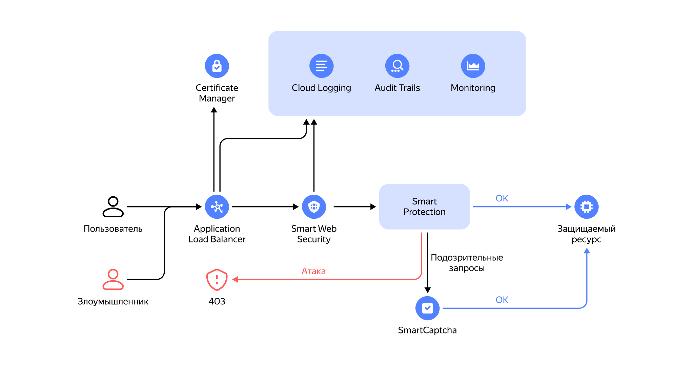

# Обзор сервиса {{ sws-full-name }}



## Принцип работы {#how-it-works}

{{ sws-name }} проверяет HTTP-запросы к защищаемому ресурсу через виртуальный хост L7-балансировщика на соответствие [правилам](rules.md), заданным в [профиле безопасности](profiles.md). В зависимости от результатов проверки запросы направляются к виртуальному хосту, блокируются или отправляются в сервис [{{ captcha-full-name }}](../../smartcaptcha/) для дополнительной верификации.





## Мониторинг и аудит {#monitoring-audit}

Логи {{ sws-name }} передаются в сервис [{{ cloud-logging-full-name }}](../../logging/).

Метрики {{ sws-name }} передаются в сервис [{{ monitoring-full-name }}](../../monitoring/).

Аудитные логи {{ sws-name }} передаются в сервис [{{ at-full-name }}](../../audit-trails/).



## Рекомендации по настройке {{ alb-name }} {#alb-settings-recommendation}



#### См. также {#see-also}

* [Защита облаков в России: основные тенденции и тренды киберугроз в 2025 году](https://yandex.cloud/ru/blog/posts/2025/04/cloud-protection)
* [Как настроить защиту веб‑приложения в облаке с помощью {{ sws-full-name }}](https://yandex.cloud/ru/blog/smart-web-security-how-to)
* [Yandex SWS и CDN: защита и ускорение сайтов для компаний любого масштаба](https://yandex.cloud/ru/blog/sws-cdn-cloudflare-alternative)
* [Что такое SOC: центр мониторинга кибербезопасности](https://yandex.cloud/ru/blog/soc-security-operations-center)