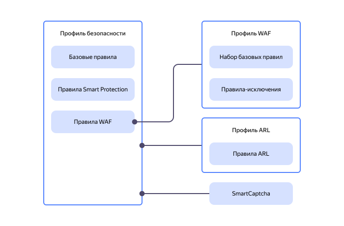

# Профили безопасности

_Профиль безопасности_ — основной элемент сервиса {{ sws-name }}. Профиль состоит из набора [правил](rules.md) для обработки HTTP-трафика. Правила содержат [условия](conditions.md) фильтрации и [действия](rules.md#rule-action), которые применяются к трафику, поступающему к вашему веб-ресурсу. Также в профиле безопасности можно настроить [CAPTCHA](https://ru.wikipedia.org/wiki/Капча) и лимит запросов по различным условиям. Для унификации страниц ответа клиентам при срабатывании правил в профиле можно создать собственные [шаблоны ответов](response-templates.md).



Для создания профилей предусмотрены варианты:
  * _{{ ui-key.yacloud.smart-web-security.title_default-template }}_.

    
    
  * _{{ ui-key.yacloud.smart-web-security.title_no-template }}_. Профиль содержит только базовое правило по умолчанию, включенное для всего трафика.

   

Чтобы включить защиту {{ sws-name }}, [подключите профиль безопасности](../operations/host-connect.md) к своему ресурсу.



## Режимы защиты {#protection-mode}

_Режим защиты_ определяет, какие правила профиля применяются к трафику и насколько строго работает Smart Protection. Режимы позволяют заранее настроить дополнительные правила и включать их при росте нагрузки или атаке.

Для каждого правила вы выбираете, когда оно действует: во всех режимах (по умолчанию), в режимах «Повышенная защита» и «Под атакой» или только в режиме «Под атакой». Итоговое действие для запроса определяется приоритетами активных правил.

В профиле доступны три режима:

* **Нормальный** — для штатной нагрузки. Действуют правила с вариантом «Все режимы».
* **Повышенная защита** — для подозрительного роста нагрузки. Дополнительно действуют правила для режимов «Повышенная защита» и «Под атакой». Smart Protection чаще применяет мягкие проверки к подозрительному трафику.
* **Под атакой** — для атаки или критической нагрузки. Дополнительно действуют правила, выбранные только для этого режима. Smart Protection строже проверяет автоматизированный трафик и чаще направляет пользователей на проверку.

Способ переключения режима можно настроить [при создании](../operations/profile-create.md) или [изменении](../operations/profile-update.md) профиля.

### Автоматическое переключение {#automatic-protection-mode}

Сервис переключает режим в зависимости от входящей нагрузки. По умолчанию действует режим «Нормальный». Для режимов «Повышенная защита» и «Под атакой» отдельно задаются:

* _Порог включения_ — количество входящих запросов за выбранный интервал. Если число запросов за этот интервал превышает порог, сервис включает соответствующий режим.
* _Время сохранения режима_ — задержка перед возвратом к нормальному режиму после снижения нагрузки ниже порога. Она предотвращает частые переключения при колебаниях нагрузки.

Обычную нагрузку оценивайте по [мониторингу трафика](../operations/monitoring.md#monitoring-dashboards), а допустимую — по метрикам приложения или результатам нагрузочного тестирования. Порог режима «Повышенная защита» выбирайте выше обычных пиков с запасом на допустимые всплески. Для режима «Под атакой» задайте более высокий порог, но ниже уровня нагрузки, при котором приложение начинает замедляться или возвращать ошибки.

Для сравнения порогов используйте одинаковый интервал подсчета. При интервале в одну секунду пороги можно напрямую сопоставлять с RPS. После включения автоматического режима проверьте, не усиливается ли защита при штатных пиках, и при необходимости скорректируйте пороги.

### Ручное переключение {#manual-protection-mode}

Выбранный режим сохраняется независимо от нагрузки. [Ручное переключение](../operations/profile-update.md) отключает автоматическое управление, пока вы не включите его снова.

## Анализ тела запроса {#analyze-request-body}

В профиле безопасности можно включить инспекцию тела запроса, чтобы повысить производительность и безопасность веб-приложения. Ограничение максимального размера тела запроса помогает предотвратить избыточное потребление ресурсов и смягчить последствия DoS/DDoS-атак, когда злоумышленники отправляют большие запросы для исчерпания ресурсов сервера.

При настройке профиля безопасности можно выбрать действие при превышении максимального размера тела запроса:

* `{{ ui-key.yacloud.smart-web-security.waf.label_analyze-request-body-action-ignore }}` — используется, когда легитимное приложение часто отправляет большие запросы.
* `{{ ui-key.yacloud.smart-web-security.waf.label_analyze-request-body-action-deny }}` — универсальный и безопасный подход. Сервис блокирует запросы более 8 КБ, что уменьшает риск атак. При блокировке запроса сервис вернет ошибку `403`.

## Схема профилей и правил {#profile-rules-schema}

На схеме ниже показана взаимосвязь профилей и правил в {{ sws-name }}. Главный элемент сервиса — профиль безопасности, в котором можно настроить базовые правила и Smart Protection. Дополнительно можно подключить профиль WAF (через правило WAF), профиль ARL и {{ captcha-name }}.

#### Полезные ссылки {#see-also}

* [Управление профилями безопасности](../operations/index.md#profiles)
* [{#T}](../tutorials/sws-basic-protection.md)
* [Как настроить Ingress-контроллер и тестовые приложения](../../managed-kubernetes/tutorials/alb-ingress-controller.md#create-ingress-and-apps)
