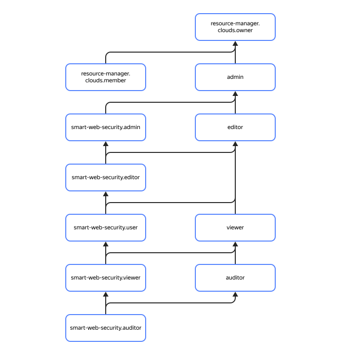

# Управление доступом в {{ sws-name }}

В этом разделе вы узнаете:

* [на какие ресурсы можно назначить роль](#resources);
* [какие роли действуют в сервисе](#roles).



Назначать роли на ресурс могут пользователи, у которых на этот ресурс есть роль `smart-web-security.admin` или одна из следующих ролей:



## На какие ресурсы можно назначить роль {#resources}

Вы можете назначить роль на [организацию](../../organization/), [облако](../../resource-manager/concepts/resources-hierarchy.md#cloud) и [каталог](../../resource-manager/concepts/resources-hierarchy.md#folder). Роли, назначенные на организацию, облако или каталог, действуют и на профили безопасности, которые в них находятся.

## Какие роли действуют в сервисе {#roles-list}



### Сервисные роли {#service-roles}

#### smart-web-security.auditor {#smart-web-security-auditor}



#### smart-web-security.viewer {#smart-web-security-viewer}



#### smart-web-security.user {#smart-web-security-user}



#### smart-web-security.editor {#smart-web-security-editor}



#### smart-web-security.admin {#smart-web-security-admin}



### Примитивные роли {#primitive-roles}



