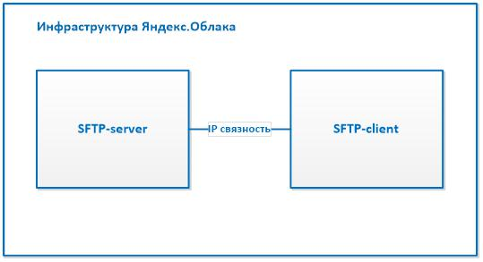

# Настройка [SFTP](https://ru.wikipedia.org/wiki/SFTP)-сервера на Centos 7. Бэкап конфигурационных файлов с SFTP-клиента на SFTP-сервер по расписанию.

В этой инструкции показано как разворачивать SFTP-сервер в инфраструктуре Яндекс.Облака, а также рассмотрен сценарий бэкапа конфигурационных файлов с SFTP-клиента на SFTP-сервер по расписанию.

1. [Подготовьте облако к работе](#before-begin).
1. [Создайте виртуальную машину для SFTP-сервера](#create-vm-sftp-server).
1. [Настройте SFTP-сервер](#config-sftp-server).
1. [Создайте SFTP-пользователя](#create-sftp-user).
1. [Создайте виртуальную машину для SFTP-клиента](#create-vm-sftp-client).
1. [Сделайте бэкап конфигурационных файлов на SFTP-сервер](#backup).
1. [Настройте расписание для бэкапа](#schedule).
1. [Проверьте работоспособность бэкапа](#check-backup).
1. [Восстановите настройки из бэкапа](#restore).




## Подготовьте облако к работе {#before-begin}

Перед тем, как разворачивать сервер, нужно зарегистрироваться в Облаке и создать платежный аккаунт:

## Подготовьте облако к работе {#before-begin}

Перед тем, как разворачивать сервер, нужно зарегистрироваться в Облаке и создать платежный аккаунт:



Если у вас есть активный платежный аккаунт, вы можете создать или выбрать каталог, в котором будет работать ваша виртуальная машина. Перейдите на [страницу облака](https://console.cloud.yandex.ru/cloud) и выберите или создайте каталог, в котором вы хотите создать виртуальную машину для вашего сервера. [Подробнее об иерархии ресурсов Облака](../../resource-manager/concepts/resources-hierarchy.md).


### Необходимые платные ресурсы
В стоимость поддержки SFTP-клиента и  SFTP-сервера входит:
* плата за постоянно запущенную виртуальную машину (см. тарифы Yandex Compute Cloud);
* плата за использование динамического или статического внешнего IP-адреса (см. тарифы Yandex Virtual Private Cloud).


## Создайте виртуальную машину для SFTP-сервера {#create-vm-sftp-server}

Чтобы создать виртуальную машину:

1. На странице каталога в [консоли управления]({{ link-console-main }}) нажмите кнопку **Создать ресурс** и выберите пункт **Виртуальная машина**.
1. В поле **Имя** введите имя виртуальной машины.

    

1. Выберите [зону доступности](../../overview/concepts/geo-scope.md), в которой должна находиться виртуальная машина.
1. В блоке **Публичные образы** выберите образ Centos 7
   
1. В блоке **Вычислительные ресурсы**:
    - Выберите [платформу](../../compute/concepts/vm-platforms.md) виртуальной машины.
    - Укажите необходимое количество vCPU и объем RAM.

   Для запуска SFTP-сервера выберите:
   * **Платформа** — Intel Cascade Lake.
   * **Гарантированная доля vCPU** — 20%.
   * **vCPU** — 2.
   * **RAM** — 2 ГБ.

1. В блоке **Сетевые настройки** нужно выбрать сеть и подсеть, к которым нужно подключить виртуальную машину. Если нужной сети или подсети еще нет, вы можете создать их прямо на странице создания виртуальной машины.

1. В поле **Публичный адрес** оставьте значение **Автоматически**, чтобы назначить виртуальной машине случайный внешний IP-адрес из пула Яндекс.Облака. Чтобы внешний IP-адрес не изменялся после остановки виртуальной машины, [сделайте его статическим](https://cloud.yandex.ru/docs/vpc/operations/set-static-ip).

1. Укажите данные для доступа на виртуальную машину:
    - В поле **Логин** введите имя пользователя.
    - В поле **SSH-ключ** вставьте содержимое файла открытого ключа.
      
      Пару ключей для подключения по SSH необходимо создать самостоятельно, см. [раздел о подключении к виртуальным машинам по SSH](../../compute/operations/vm-connect/ssh.md).
      
    
    
     IP-адрес и имя хоста (FQDN) для подключения к машине назначатся ей при создании. Если вы выбрали вариант **Без адреса** в поле **Публичный адрес**, вы не сможете обращаться к виртуальной машине из интернета.
    
    

1. Нажмите кнопку **Создать ВМ**.

Создание виртуальной машины может занять несколько минут. 


## Настройте SFTP-сервер {#config-sftp-server}

Функционал SFTP сервера включен в стандартную программу SSH, которая поставляется с дистрибутивом Centos 7. Для настройки SFTP-сервера отредактируйте конфигурационный файл `/etc/ssh/sshd_config`.

1. Откройте конфигурационный файл в редакторе vi. Этот редактор поставляется с дистрибутивом и не требует установки. Если вы не знакомы с этим редактором, то подробности вы можете узнать в [официальной документации](https://www.vim.org/docs.php).

    ```bash
    sudo vi /etc/ssh/sshd_config
    ```

1. Добавьте следующие строчки в конец файла:

    ```
    Match User fuser
    ForceCommand internal-sftp
    PasswordAuthentication no
    ChrootDirectory /var/sftp
    PermitTunnel no
    AllowAgentForwarding no
    AllowTcpForwarding no
    X11Forwarding no
    ```

    * `Match User fuser` - указывает на то, что все последующие строчки будут применены только при подключении пользователя `fuser`
    * `ForceCommand internal-sftp` - подключать пользователя только в режиме SFTP и не разрешать доступ в shell,
    * `PasswordAuthentication no` - отключить доступ по логину и паролю, 
`    * ChrootDirectory /var/sftp` - ограничить доступ пользователя только в рамках папки `/var/sftp` 

    * `PermitTunnel no`, `AllowAgentForwarding no`, `AllowTcpForwarding no`, 
`X11Forwarding no` - отключить туннелирование, проброс портов и графических приложений через SSH-сессию 

1.  Сохраните файл.

1. Выведите на экран все раскомментированные строки в конфигурационном файле:
    ```bash
    cat /etc/ssh/sshd_config | grep -v -e '^#' -e '^$'
    ```
    * `grep -v -e '^#' -e '^$'` - вывод строк на основе [регулярного выражения](https://en.wikipedia.org/wiki/Regular_expression).
    * `-e '^#'` - убрать строки начинающиеся на `#` 
    * `-e '^$'` - убрать пустые строки

1. Вывод предыдущей команды должен совпадать с данными строками:
    ```
    HostKey /etc/ssh/ssh_host_rsa_key
    HostKey /etc/ssh/ssh_host_ecdsa_key
    HostKey /etc/ssh/ssh_host_ed25519_key
    SyslogFacility AUTHPRIV
    AuthorizedKeysFile .ssh/authorized_keys
    PasswordAuthentication no
    ChallengeResponseAuthentication no
    GSSAPIAuthentication yes
    GSSAPICleanupCredentials no
    UsePAM yes
    X11Forwarding yes
    AcceptEnv LANG LC_CTYPE LC_NUMERIC LC_TIME LC_COLLATE LC_MONETARY LC_MESSAGES
    AcceptEnv LC_PAPER LC_NAME LC_ADDRESS LC_TELEPHONE LC_MEASUREMENT
    AcceptEnv LC_IDENTIFICATION LC_ALL LANGUAGE
    AcceptEnv XMODIFIERS
    Subsystem sftp  /usr/libexec/openssh/sftp-server
    Match User fuser
    ForceCommand internal-sftp
    PasswordAuthentication no
    ChrootDirectory /var/sftp
    PermitTunnel no
    AllowAgentForwarding no
    AllowTcpForwarding no
    X11Forwarding no
    ```
1. Сохраните файл.

1. Перезагрузите SFTP-сервис для того, чтобы настройки вступили в силу:
    ```bash
    sudo systemctl restart sshd
    ```

1. Создайте группу для SFTP-пользователей:
    ```bash
    sudo groupadd ftpusers
    ```  

1. Создайте папки для сохранения файлов:
    ```bash
    sudo mkdir -p /var/sftp/backups
    ```

    * `sftp` - корневая папка SFTP-сервера
    * `backups` - папка для хранения бэкапов на SFTP-сервере

1.  Установите разрешения на папки таким образом, чтобы все пользователи, входящие в состав группы `ftpusers` могли зписывать и читать файлы на SFTP-сервере:
    ```bash
    sudo chown root:ftpusers /var/sftp/backups
    sudo chmod 770 /var/sftp/backups
    ```

1. Проверьте корректность выставленных разрешений:

    ```bash
    ls -la /var | grep sftp
    ls -la /var/sftp
    ```
    Результат должен быть следующим:
    
    ```bash
    drwxr-xr-x.  4 root root   37 Aug  7 11:35 sftp
    drwxrwx---. 2 root ftpusers 80 Aug  7 08:41 backups
    ```


## Создайте SFTP-пользователя {#create-sftp-user}.

1. Создайте SFTP-пользователя командой:
    ```bash
    sudo useradd fuser
    ```

    Пользователь `fuser` выбран просто для примера.

1. Создайте пароль для SFTP-пользователя
    ```bash
    sudo passwd fuser
    ```

1. Создайте SSH-ключи для пользователя `fuser`. Команда должна выполняться от имени пользователя `fuser`:
    ```bash
    sudo runuser -l  fuser -c 'ssh-keygen'
    ```

    Процесс генерации ключа приведен ниже. Поле `passphrase` оставляется пустым.  

    ```
    [yc-user@ftp-server ~]$ sudo runuser -l fuser -c 'ssh-keygen'      
    Generating public/private rsa key pair.
    Enter file in which to save the key (/home/fuser/.ssh/id_rsa): 
    Created directory '/home/fuser/.ssh'.
    Enter passphrase (empty for no passphrase): 
    Enter same passphrase again: 
    Your identification has been saved in /home/fuser/.ssh/id_rsa.
    Your public key has been saved in /home/fuser/.ssh/id_rsa.pub.
    The key fingerprint is:
    SHA256:S2jRD3/A6ClHW/RZUOeOrl6BsK3pfWdhusGBGZiHE44 fuser@ftp-server.ru-central1.internal
    The key's randomart image is:
    +---[RSA 2048]----+
    |         .. .oo .|
    |       .o+=. o o |
    |      .E=*=oo   .|
    |       = Bo=+. o |
    |      + S +o+.o .|
    |     . + . +...+ |
    |        . o  o= .|
    |         . . +o o|
    |          ..+o.o |
    +----[SHA256]-----+
    ```

1. Создайте файл для сохранения публичных SSH-ключей SFTP-клиента. Поставьте нужные разрешения. 

    ```bash
    sudo touch /home/fuser/.ssh/authorized_keys
    sudo chmod 600 /home/fuser/.ssh/authorized_keys
    sudo chown fuser:fuser /home/fuser/.ssh/authorized_keys
    ```

1. Убедитесь что разрешения выставлены верно:

    ```bash
    ls -la /home/fuser/.ssh/
    ```

    Вывод должен быть таким:
    ```bash
    -rw-------. 1 fuser fuser  421 Aug  7 08:31 authorized_keys
    -rw-------. 1 fuser fuser 1675 Aug  7 08:29 id_rsa
    -rw-r--r--. 1 fuser fuser  419 Aug  7 08:29 id_rsa.pub
    ```

1. Добавьте SFTP-пользователя в SFTP-группу:
    ```bash
    sudo usermod -G ftpusers fuser
    ```

## Создайте виртуальную машину для SFTP-клиента {#create-vm-sftp-client}

Процесс создания виртуальной машины для SFTP-клиента полностью совпадает с созданием виртуальной машины для SFTP-сервера.

1. Выполните пункты 1-9 из раздела [создание виртуальной машины для SFTP-сервера](#create-vm-sftp-server)

1. Создайте пару SSH-ключей на SFTP-клиенте. Процесс аналогичен описанному для пользователя `fuser` в [предыдущем разделе](#create-sftp-user):

    ```bash
    ssh-keygen
    ```

1. Выведите публичный ключ на экране SFTP-клиента:
    ```bash
    cat ~/.ssh/id_rsa.pub
    ```

1. Зайдите на SFTP-сервер и откройте файл `/home/fuser/.ssh/authorized_keys`: 
        
    ```bash
    sudo vi /home/fuser/.ssh/authorized_keys
    ```
1. Скопируйте SSH-ключ, полученый на SFTP-клиенте в конец файла.
1. Сохраните файл.


## Сделайте бэкап конфигурационных файлов на SFTP-сервер {#backup}

Для полного бэкапа виртуальной машины используйте нативную возможность Яндекс.Облака - [снимок диска](https://cloud.yandex.ru/docs/compute/operations/disk-control/create-snapshot). Для последующего восстановления [создайте виртуальную машину из сохраненного снимка](https://cloud.yandex.ru/docs/compute/operations/vm-create/create-from-snapshots). 

В данной инструкции рассмотрен вариант бэкапа не всей файловой системы, как при снимке диска, а только конфигурационных файлов, оканчивающихся на `“.conf”` и находящихся в папке `/etc`. Сам бэкап осуществляется путем архивирования данных конфигурационных файлов в единый архив, передачи этого архива на SFTP-сервер и последующего удаления архива на SFTP-клиенте.


1. Зайдите по SSH на виртуальную машину SFTP-клиента таким же способом, как это было проделано для SFTP-сервера.

1. Установите переменные окружения для корректной работы скрипта. Для этого откройте файл `~/.bash_profile`

    ```bash
    vi ~/.bash_profile
    ```
1. Добавьте следующие строчки в конец файла:
    ```
    export SFTP_SERVER='10.128.0.5'
    export SFTP_USER='fuser'
    ```
   * `10.128.0.5` - IP адрес или [FQDN](https://ru.wikipedia.org/wiki/FQDN) SFTP-сервера. Эту информацию можно посмотреть в настройках виртуальной машины в вашем профиле Яндекс.Облака
     
   

   Значение переменной `SFTP_SERVER` отличается от приведеного в примере! Подставьте IP адрес или FQDN своего SFTP-сервера 

   

1. Примените настройки:
    ```bash
    source ~/.bash_profile
    ```

1. Проверьте что у вас появились данные переменные:
    ```bash
    env | grep SFTP
    ```

    На экране должно появиться:
    ```
    SFTP_USER=fuser
    SFTP_SERVER=10.128.0.5
    ```

1. Выполните бэкап конфигурации выполнив составную команду:

    ```bash
    sudo find /etc -type f -name *.conf -print0 | sudo tar -czf backup.tar.gz --null -T -&& curl -T backup.tar.gz sftp://$SFTP_SERVER/backups/backup_$(hostname)_$(date "+%Y%m%d_%H%M%S").tar.gz --insecure --user $SFTP_USER: && sudo rm -f backup.tar.gz
    ```

    **Пояснения к данной команде.**
    
    Весь процесс бэкапа выполняется последовательностью нескольких команд, разделенных оператором `&&`, означающим, что каждая последующая команда должна выполняться только после завершения предыдущей.

    Поиск всех файлов `.conf` из папки `/etc` осуществляет блок:
    ```bash
    sudo find /etc -type f -name *.conf -print0
    ```
    * Данная команда указывает на то, чтобы искать файлы заканчивающиеся на `“.conf”` (`-name *.conf`), в папке `/etc`. Ключ `-print0` используется для корректной обработки полученных данных командой-архиватором.

    Перемещение конфигурационных файлов в архив:
    ```bash
    sudo tar -czf backup.tar.gz --null -T -
    ```
    * `backup.tar.gz` - название архива
    * блок `--null -T` – нужен для правильного считывания названий файлов из предыдущей команды
    
    Пересылка архива на SFTP-сервер: 
    ```bash
    url -T backup.tar.gz sftp://$SFTP_SERVER/backups/backup_$(hostname)_$(date "+%Y%m%d_%H%M%S").tar.gz --insecure --user $SFTP_USER:
    ```
    
    * `-T` означает загрузить файл `backup.tar.gz` на удаленный сервер.
    * `$SFTP_SERVER`– сюда подставится IP адрес SFTP-сервера.
    * `backup_$(hostname)_$(date "+%Y%m%d_%H%M%S").tar.gz` – добавить к названию архива название компьютера, а также дату и время, когда был создан архив. Название архива на сервере будет выглядеть примерно так: `backup_ftp-server.ru-central1.internal_20190803_180228.tar.gz`. Это позволит не потерятся в навигации по списку бэкапов на сервере.
    * `--insecure` - отключить проверку SSL сертификатов со стороны SFTP-сервера. При этом трафик проходящий по SSH-сессии все равно шифруется.
    * `--user fuser:` – использовать логин `fuser` и публичный SSH-ключ SFTP-клиента.
    
    Удаление архива на SFTP-клиенте:
    ```bash
    sudo rm -f backup.tar.gz
    ```

## Настройте расписание для бэкапа. {#schedule}

Для создания регулярных бэкапов ваших настроек можно использовать встроенную программу `crontab`

1. Откройте `crontab` файл для редактирования:

    ```bash
    crontab -e
    ```

1. Добавьте следующую строку:

    ```
    0 23 * * * sudo find /etc -type f -name *.conf -print0 | sudo tar -czf backup.tar.gz --null -T -&& curl -T backup.tar.gz sftp://$SFTP_SERVER/backups/backup_$(hostname)_$(date "+%Y%m%d_%H%M%S").tar.gz --insecure --user $SFTP_USER: && sudo rm -f backup.tar.gz
    ```

    * `0 23 * * * `- эта запись в начале строки означает, что бэкап будет запускаться каждый день в 11 часов вечера.


## Проверьте работоспособность бэкапа {#check-backup}

1. Запустите на SFTP-клиенте команду для бэкапа:

    ```bash
    sudo find /etc -type f -name *.conf -print0 | sudo tar -czf backup.tar.gz --null -T -&& curl -T backup.tar.gz sftp://$SFTP_SERVER/backups/backup_$(hostname)_$(date "+%Y%m%d_%H%M%S").tar.gz --insecure --user $SFTP_USER: && sudo rm -f backup.tar.gz
    ```

1. Зайдите на SFTP-сервер и убедитесь, что файл вида `backup_ftp-server.ru-central1.internal_20190803_180228.tar.gz` появился в домашнем каталоге SFTP-пользователя. Для этого на SFTP-сервере запустите команду:

    ```bash
    sudo ls /var/sftp/backups
    ```


## Восстановите настройки из бэкапа {#restore}

1. На SFTP-сервере в папке `/var/sftp/backups` выберите бэкап файл из которого вы хотите восстановиться. Например это будет `backup_ftp-server.ru-central1.internal_20190803_180228.tar.gz`   

1. На SFTP-клиенте сделайте переменную окружения для названия бэкап файла:

    ```bash
    SFTP_BACKUP='backup_ftp-server.ru-central1.internal_20190803_180228.tar.gz'
    ```

1. Запустите на SFTP-клиенте команду для восстановления настроек из бэкапа:
    ```bash
    sftp $SFTP_USER@$SFTP_SERVER:/backups/$SFTP_BACKUP . && tar -xzf $SFTP_BACKUP && yes | cp -rfp etc / && rm -rfd etc
    ```

    * `sftp $SFTP_USER@$SFTP_SERVER:/backups/$SFTP_BACKUP .` - Этот блок копирует файл бэкапа `backup_ftp-server.ru-central1.internal_20190803_180228.tar.gz` c SFTP-сервера в текущий каталог на SFTP-клиенте
    
    * `tar -xzf $SFTP_BACKUP` - распаковка файла
    
    * `yes | cp -rfp etc /` - принудительное копирование всех файлов каталога `etc` из бэкапа в каталог `etc` в `root` директории `/`. `yes` - избегать ввода подтверждения при перезаписи файлов.
    
    * `rm -rfd etc` - удалить разархивированное содержимое бэкап-архива

1. Чтобы проверить корректность произведенного бэкапа, добавьте проверочный блок в команду выше:

    ```bash
    sftp $SFTP_USER@$SFTP_SERVER:/backups/$SFTP_BACKUP . && tar -xzf $SFTP_BACKUP && echo "## this is from backup" >> etc/yum.conf && yes | cp -rfp etc / && rm -rfd etc
    ```
    
    * `echo "## this is from backup" >> etc/yum.conf` - этот блок записывает тестовую фразу "## this is from backup" в конец файла `etc/yum.conf`, распакованного из архива.

1. После выполнения восстановления из бэкапа введите следующую команду. 
    ```bash
    cat /etc/yum.conf | grep backup
    ```

    Убедитесь, что на экране отображается тестовая фраза:
    ```bash
    ## this is from backup
    ```
