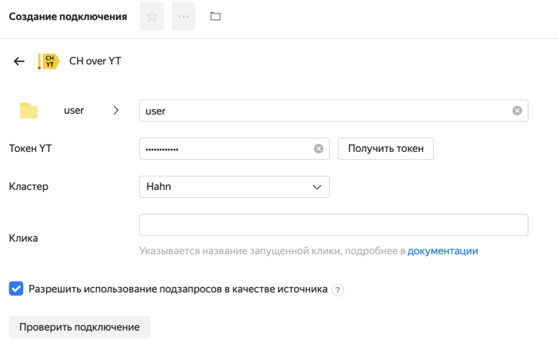

# Визуализация данных из ClickHouse over YT (CHYT)

В этом разделе описано, как подключить CHYT, используя свою клику в качестве источника данных для {{ datalens-short-name }}.

## Перед началом работы {#before-you-begin}

Чтобы использовать YT-таблицу в качестве источника данных, выберите клику CHYT, с которой вы будете работать.



Клика — виртуальный кластер ClickHouse в YT. Она представлена операцией и у нее есть идентификатор (`operation_id`) или алиас (`alias`). Существуют публичные и приватные клики.



При работе с CHYT, и особенно при работе с большими YT-таблицами, рекомендуется создать собственную (приватную) клику.
Если у вас еще нет приватной клики, вы можете [создать ее](https://yt.yandex-team.ru/docs/description/chyt/cliques/start) или воспользоваться публичной кликой `*ch_datalens`. Публичная клика имеет ограниченый ресурс и не гарантирует стабильность работы:

Особенности | Публичная клика | Приватная клика
---- | ---- | ----
Ресурсы | Общий пул (негарантированные 16 инстансов по 8 ядер) | Выделенный пул (гарантированные мощности)
Таймаут запроса | 3 минуты | 60 минут (1 час)
Доступные кластеры | `Hahn` , `Arnold` | `Hahn` , `Arnold`



Обсудите с [командой CHYT](https://t.me/joinchat/DPeS0xFdpaSZoCWTYnhnnw) возможность использования SSD-дисков для таблиц. Это позволит ускорить выполнение операций в клике.



## Подготовьте таблицу данных на YT {#prepare-table}

Перед созданием коннектора в CHYT подготовьте вашу таблицу на YT:

- Таблица должна быть статической. [Подробнее о статических таблицах в YT](https://arcanum.yandex-team.ru/arc/trunk/arcadia/yt/docs/description/storage/static_tables_overview.md).

- Таблица должна быть схематизирована. {{ datalens-short-name }} выполняет запрос к таблице и получает ее схему для формирования датасета. [Подробнее о схемах в YT](https://arcanum.yandex-team.ru/arc/trunk/arcadia/yt/docs/description/storage/static_tables_overview.md).



Рекомендуется включить [поколоночный формат хранения чанков](https://yt.yandex-team.ru/docs/description/storage/chunks#optimize_for) с помощью атрибута `optimize_for = scan` . Это позволит {{ datalens-short-name }} быстрее работать с таблицей.



## Создайте подключение {#create-connection}

Для работы с ClickHouse над YT вам необходимо создать подключение **CH over YT**.

1. Перейдите на [https://stat.yandex-team.ru/connections/](https://stat.yandex-team.ru/connections/) и нажмите кнопку **Создать** в правом верхнем углу.

1. В меню выберите **Connection**.

1. Выберите коннектор **CH over YT**.

1. Заполните следующие поля:

    

    - **Название подключения** — Имя подключения. Имя должно быть уникальным.

    - **Токен YT** — OAuth-токен для работы с YT. Вы можете указать свой токен или токен робота.
      Если у вас еще нет токена, получите его по ссылке [https://oauth.yt.yandex.net/](https://oauth.yt.yandex.net/).

      

      Не забудьте выдать доступ к таблице роботу, если вы указали его OAuth-токен.

      

    - **Кластер** — Кластер YT, на котором хранятся таблицы. Доступны `Hahn`  и `Arnold`.

    - **Клика** — Алиас запущенной клики. Например, `*ch_datalens`  для публичной клики.

      

      Не используйте публичную клику в продовых процессах.

      

      

      Вы можете проверить подключение к хосту перед созданием. Для этого нажмите кнопку **Проверить подключение**.

      

1. Нажмите **Создать**. Подключение появится в списке доступных вам подключений.

## Создайте датасет {#create-dataset}

После создания подключения вы можете создать датасет над ним.

1. Перейдите на [https://stat.yandex-team.ru/datasets/](https://stat.yandex-team.ru/datasets/) и нажмите кнопку **Создать** в правом верхнем углу.

1. В меню выберите **Dataset**.

1. В открывшемся окне в разделе **Подключения** нажмите **+ Добавить**. Выберите подключение **CH over YT**, которое вы создали ранее.

1. Выберите способ указания источника:

    - **Таблица** — Одна таблица на YT. URL из браузера или полный путь к таблице.

    - **Список** — Несколько таблиц на YT. URL из браузера или полный путь к таблице. Каждая таблица с новой строки.

    - **Диапазон** — Диапазон таблиц на YT. Вы можете задать самостоятельно задать диапазон таблицы с помощью полей **Начать с** и **Закончить на**. {{ datalens-short-name }} добавит все таблицы в датасет, которые указаны в диапазоне в алфавитном порядке. Если значения границ оставить пустыми, {{ datalens-short-name }} будет использовать все таблицы в указанной папке. Вы также можете задать только одно значение границы.

      

      Например, в папке расположены двадцать таблиц и они названы `table_1` , `table_2` , `table_3` , ... . Если задать значения границ `1`  и `5` , {{ datalens-short-name }} использует только пять таблиц из папки.

      

    - **SQL** — Выборка данных для датасета через SQL-запрос. Рекомендуется копировать запрос из YQL в синтаксисе ClickHouse и потом вставить его в поле. 
    
      

      Предварительно обработайте запрос из YQL: удалите строки `use hahn`  (`use arnold`) и все символы точки с запятой `;` . Весь YQL-запрос из {{ datalens-short-name }} выполняется как подзапрос.

      

1. Нажмите **Сохранить**. Убедитесь, что данные отображаются в превью датасета.

1. Нажмите Сохранить в правом верхнем углу. Введите имя датасета и нажмите **Создать**. Датасет появится в списке доступных вам датасетов.

Над созданным датасетом вы можете создавать различные чарты и размещать их на дашбордах.

## Часто задаваемые вопросы {#questions}



Публичная клика не гарантирует стабильность.
Не используйте публичную клику для продовых процессов.





`ERR.DS_API.DB.CHYT.TABLE_ACCESS_DENIED `

У пользователя YT-токена нет доступа к выбранной таблице. Используйте другой токен (пользователя, у которого есть доступ к таблице) или выдайте доступ к таблице пользователю, чей токен указан в подключении.
Если вы не знаете, кто создал подключение — создайте новое.





`ERR.DS_API.CLIQUE_STOPPED` 

Не запущена CHYT-клика, которая указана в подключении. Перезапустите ее.





`ERR.DS_API.DB.CHYT.INVALID_SORTED_JOIN`

При использовании подключения CHYT имеют большую роль ключевые колонки таблиц в YT. В мультитабличных датасетах разрешается создавать связь таблиц (делать JOIN) только по ключевым колонкам (key columns) этих таблиц, выполняя следующие требования:
* все колонки, используемые в связи таблиц должны быть частью ключа для обеих из них;
* ключ обеих таблиц должен начинаться именно на эти колонки;
* эти колонки в ключах обеих таблиц должны присутствовать в одном и том же порядке.

Обойти проблему можно следующими способами:
* переключить датасет в материализованный режим — тогда ключевые колонки не будут иметь значения;
* пересоздать исходные таблицы с заданием ключей таких, которыe будут удовлетворять этим условиям.





`ERR.DS_API.DB.CHYT.TABLE_HAS_NO_SCHEMA`

Используемая YT таблица не имеет схемы. Использование таких таблиц в {{ datalens-short-name }} невозможно. Пересоздайте таблицу со схемой (указанием типов данных)


