# Визуализация данных из CSV-файла

В качестве исходных данных будет использоваться файл [SuperHeroes.csv](https://storage.yandexcloud.net/datalens/SuperHeroes.csv) с информацией о супергероях — имя, пол, раса, издатель комиксов и т. д.

В этом сценарии с помощью {{ datalens-short-name }} можно использовать для исследования зависимостей, например:
- Веса супергероя от его пола.
- Веса супергероя от его принадлежности к лагерю хороших или плохих.

Для визуализации и исследования данных [подготовьте облако к работе](#before-you-begin), затем выполните следующие шаги:

1. [Создайте подключение](data-from-csv-visualization.md#step1).
1. [Создайте датасет](data-from-csv-visualization.md#step2).
1. [Создайте первый чарт](data-from-csv-visualization.md#step3).
1. [Создайте второй чарт](data-from-csv-visualization.md#step4).
1. [Создайте дашборд](data-from-csv-visualization.md#step5).
1. [Добавьте чарты на дашборд](data-from-csv-visualization.md#step6).
1. [Добавьте селекторы на дашборд](data-from-csv-visualization.md#step7).
1. [Настройте отображение виджетов и приступите к исследованию зависимостей](data-from-csv-visualization.md#step8).
1. [Продолжите исследования данных о супергероях](data-from-csv-visualization.md#step9).

## Подготовьте облако к работе {#before-you-begin}



## Шаг 1. Создайте подключение и датасет {#step1}

Создайте датасет на основе [подключения](../../datalens/concepts/connection.md) к CSV-файлу.

1. Перейдите в интерфейс [{{ datalens-short-name }}](https://datalens.yandex.ru).
1. Нажмите кнопку **Создать подключение**.

    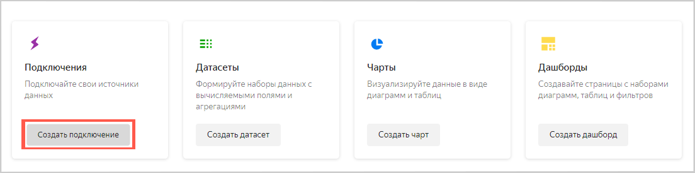

1. Выберите **CSV**.

    

1. Нажмите кнопку **Выбрать CSV-файл**.

    

1. Выберите необходимый файл. В данном примере **SuperHeroes.csv** ([ссылка на скачивание](https://storage.yandexcloud.net/datalens/SuperHeroes.csv)).
   
   Дождитесь, когда на экране появится содержимое таблицы.

1. Нажмите кнопку **Сохранить**.

    

1. После сохранения нажмите кнопку **Создать датасет**.

    

## Шаг 2. Создайте датасет {#step2}

1. Перетащите таблицу **SuperHeroes.csv** из панели выбора на рабочую область.

    

1. Перейдите на вкладку **Датасет**.

    

1. Создайте поле с показателем среднего веса супергероя:
    1. Нажмите значок  в строке **Weight**.
    1. Выберите **Продублировать**.

         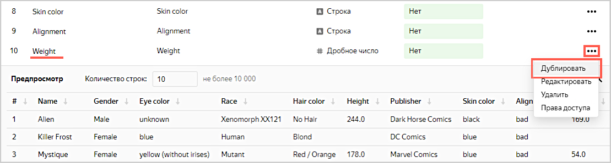

    1. Переименуйте дубликат поля **Weight (1)** в **Weight avg**: нажмите на имя строки, удалите текущее имя и введите новое.
    1. В столбце **Агрегация** для поля **Weight avg** выберите **Среднее**.

        

1. Нажмите кнопку **Сохранить** в верхнем правом углу и сохраните датасет.

    
    
1. Введите имя датасета **SuperHeroes dataset**, нажмите **Создать**.
    
1. После сохранения датасета нажмите **Создать чарт**. 

    

## Шаг 3. Создайте первый чарт {#step3}

Для визуализации разделения по половому признаку создайте [чарт](../../datalens/concepts/chart.md) — столбчатую диаграмму.

1. Добавьте на график имена супергероев. Для этого из раздела **Измерения** перетащите поле **Name** в секцию **X**.
1. Добавьте на график веса супергероев. Для этого из раздела **Показатели** перетащите поле **Weight avg** в секциию **Y**.

    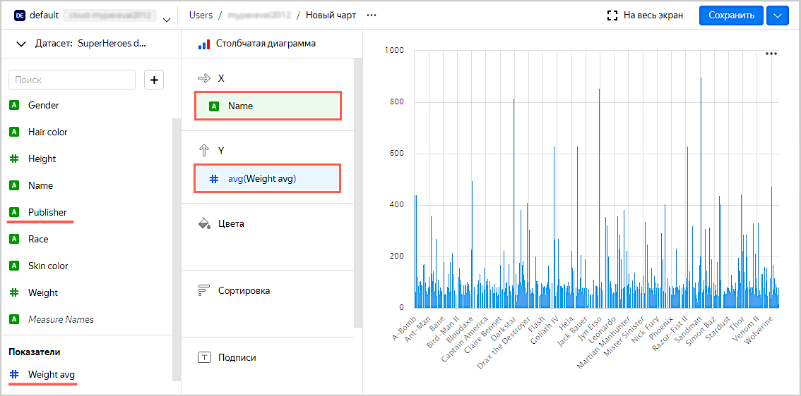

1. Отсортируйте график по весам, например, по убыванию.
    1. Из первой колонки из раздела **Показатели** перетащите поле **Weight avg** в секцию **Сортировка**.
    
        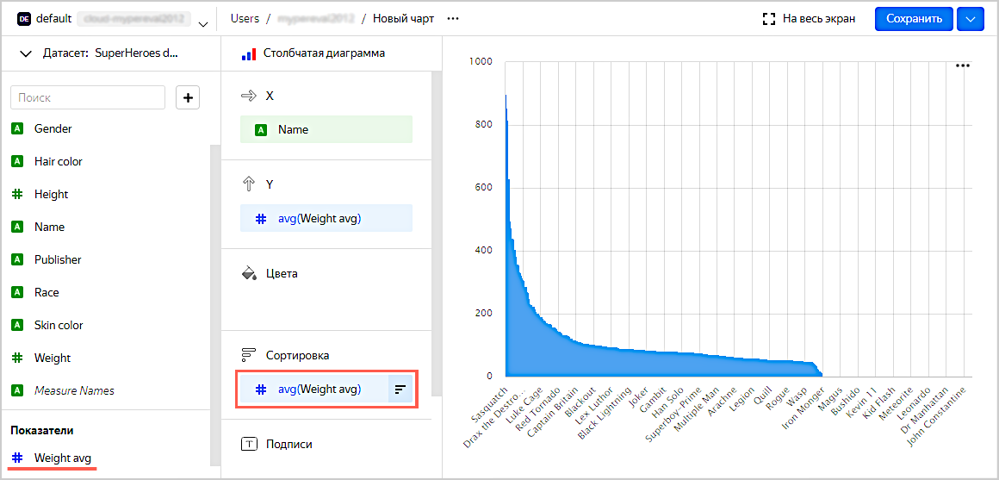
    
1. Оставьте на графике только тех супергероев, чей вес известен (больше нуля).
    1. Из первой колонки из раздела **Показатели** перетащите поле **Weight avg** в секцию **Фильтры**.
    1. В открывшемся окне укажите операцию **Больше** и значение **0**.
    1. Нажмите кнопку **Применить**.

        

1. Добавьте на график цветовое разделение супергероев по половому признаку. Для этого из раздела **Измерения** перетащите поле **Gender** в секцию **Цвет**.

    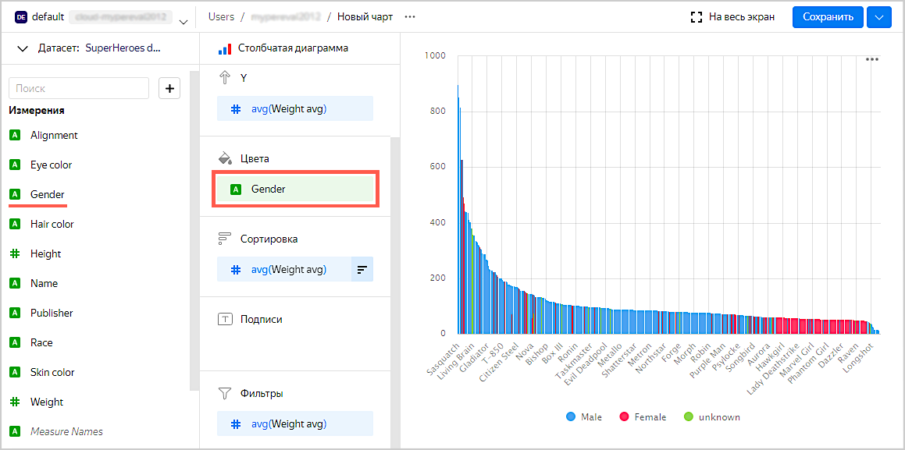

1. Переопределите цвета значений измерения **Gender**.
    1. Нажмите значок настройки в секции **Цвет**.
    
        
    
    1. Выберите цвета: **Female** — розовый, **Male** — синий, **unknown** — оранжевый.
    
        

1. Сохраните чарт.
    1. Нажмите кнопку **Сохранить** в верхнем правом углу и сохраните чарт.

        

    1. В открывшемся окне введите название чарта **SuperHeroes — gender** и нажмите кнопку **Сохранить**.

## Шаг 4. Создайте второй чарт {#step4}

Для визуализации по принадлежности к лагерю хороших или плохих создайте чарт — столбчатую диаграмму.

1. Скопируйте чарт, получившийся на предыдущем шаге.
    1. Нажмите значок галочки рядом с кнопкой **Сохранить** в верхнем правом углу.
    1. Нажмите **Сохранить как**.

        

    1. В открывшемся окне введите название нового чарта **SuperHeroes — alignment**.
    1. Нажмите кнопку **Готово**.

1. Добавьте на график цветовое разделение супергероев по принадлежности к лагерю хороших или плохих. Для этого из раздела **Измерения** перетащите поле **Alignment** в секцию **Цвет**.

    Предыдущее значение секции (поле **Gender**) будет заменено на **Alignment**.

    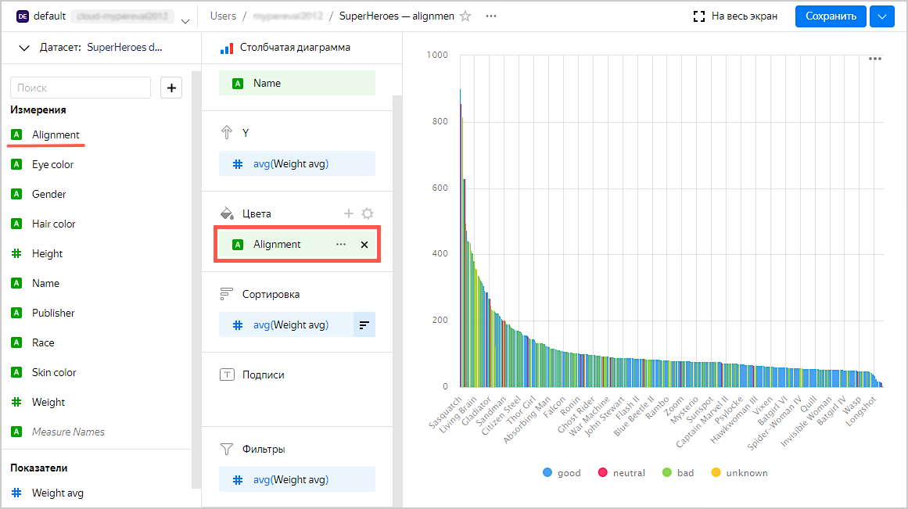
    
1. Переопределите цвета значений измерения **Alignment**.
    1. Нажмите значок настройки в секции **Цвет**.
    1. Выберите цвета: **good** — зеленый, **neutral** — синий, **bad** — красный, **unknown** — оранжевый.
    
        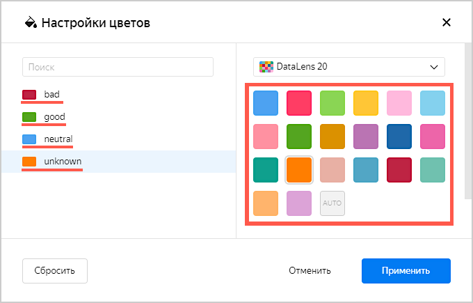

1. Нажмите кнопку **Сохранить** в верхнем правом углу и сохраните чарт.

## Шаг 5. Создайте дашборд {#step5}

Создайте [дашборд](../../datalens/concepts/dashboard.md), на который будут добавлены чарты.

1. Перейдите на главную страницу DataLens. Для этого нажмите на надпись **Yandex DataLens** в левом верхнем углу.
1. Нажмите кнопку **Создать дашборд**.

    
1. Введите название дашборда **SuperHeroes dashboard** и нажмите кнопку **Создать**.

## Шаг 6. Добавьте чарты на дашборд {#step6}

1. При первом открытии после сохранения дашборд открывается в режиме редактирования. Если вы открыли его повторно, то нажмите **Редактировать** в правом верхнем углу.

    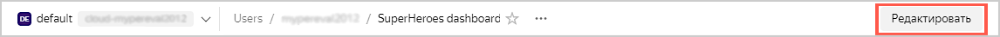

1. Нажмите кнопку **Добавить**.
1. Выберите **Чарт**.

    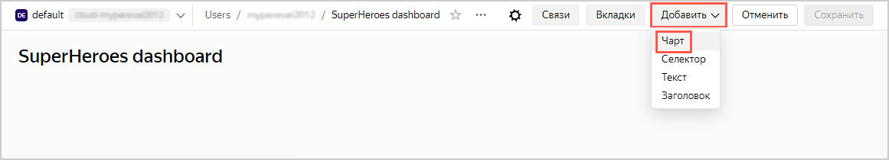

1. В открывшемся окне нажмите кнопку **Выбрать** и выберите чарт **SuperHeroes — gender**.

   После этого автоматически заполнится поле **Заголовок** по названию выбранного чарта.
   
1. Нажмите кнопку **Добавить**.

    

1. Добавьте еще один чарт. Пройдите все шаги сначала и укажите на 5 пункте чарт **SuperHeroes — alignment**.

    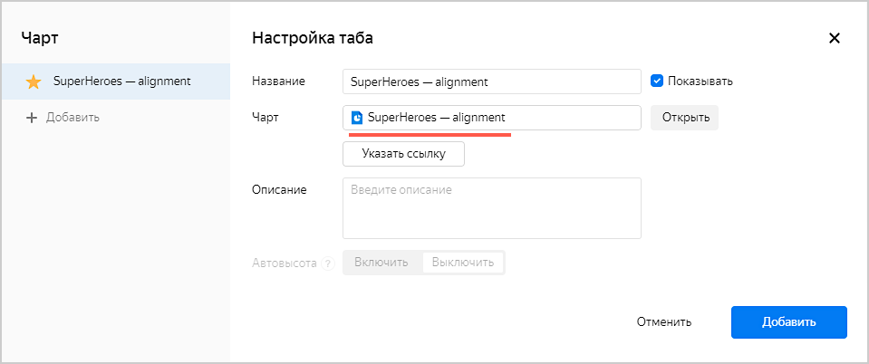

## Шаг 7. Добавьте селекторы на дашборд {#step7}

Добавьте [селекторы](../../datalens/concepts/dashboard.md#selector), чтобы иметь возможность фильтровать супергероев по расам (поле **Race**) и издательствам (поле **Publisher**).

1. Нажмите кнопку **Добавить**.
1. Выберите **Селектор**.

    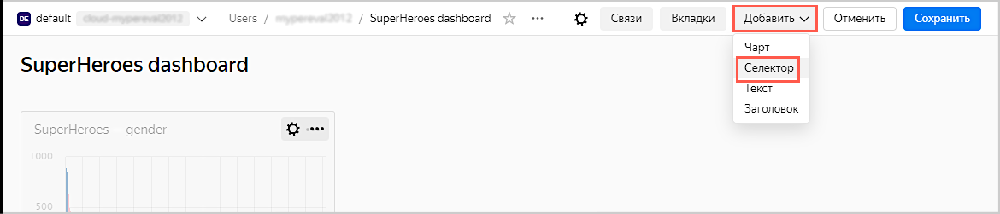

1. Выберите датасет **SuperHeroes dataset**.
1. Выберите поле **Race**.
    
    После этого автоматически заполнится **Заголовок** по названию выбранного поля. 

1. Нажмите галочку **Показывать** напротив заголовка селектора.
1. Включите опцию **Множественный выбор**.
1. Нажмите кнопку **Добавить**.

    

1. Добавьте еще один селектор. Пройдите все шаги сначала и укажите в пункте 6 поле **Publisher**.

    

## Шаг 8. Настройте отображение виджетов и приступите к исследованию зависимостей {#step8}

1. Перетащите селекторы наверх страницы рядом друг с другом.
1. Растяните чарты по ширине дашборда.
1. Нажмите кнопку **Сохранить** в верхнем правом углу и сохраните дашборд.

    

1. Примените различные фильтры и исследуйте зависимости веса от пола и лагеря супергероя.

    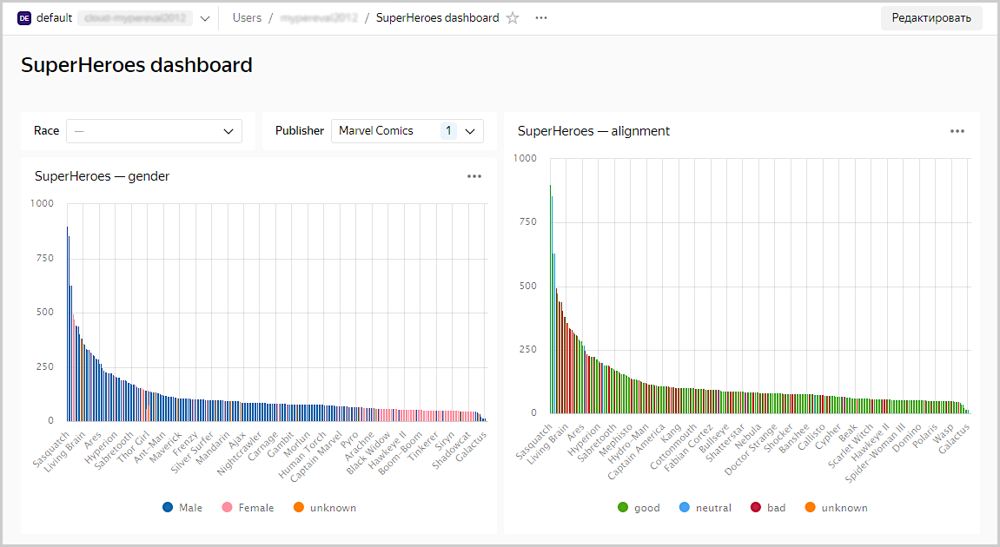

    В датасете, который был исследован, прослеживаются следующие зависимости:
    - Мужчины в основном тяжелее женщин.
    - Плохие супергерои в основном тяжелее хороших.

## Шаг 9. Продолжите исследование данных о супергероях {#step9}

Вы можете создать новые показатели в датасете, например, средний рост (среднее от поля **Height**) и количество супергероев (количество уникальных от поля **Name**) и ответить на вопросы:
- Представителей какой расы больше всего?
- Есть ли зависимость роста от принадлежности к лагерю хороших или плохих?
- Какая студия создала больше всего супергероев?
