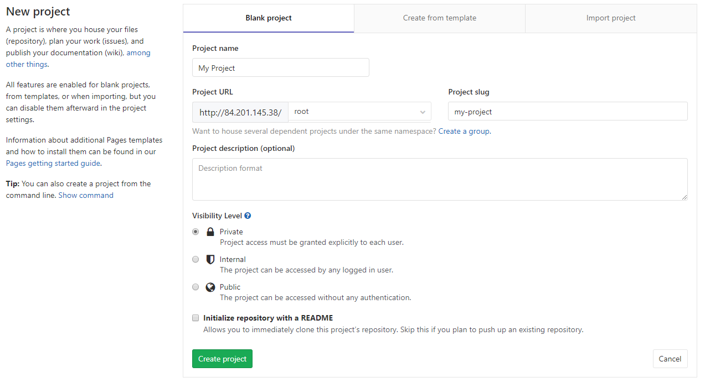
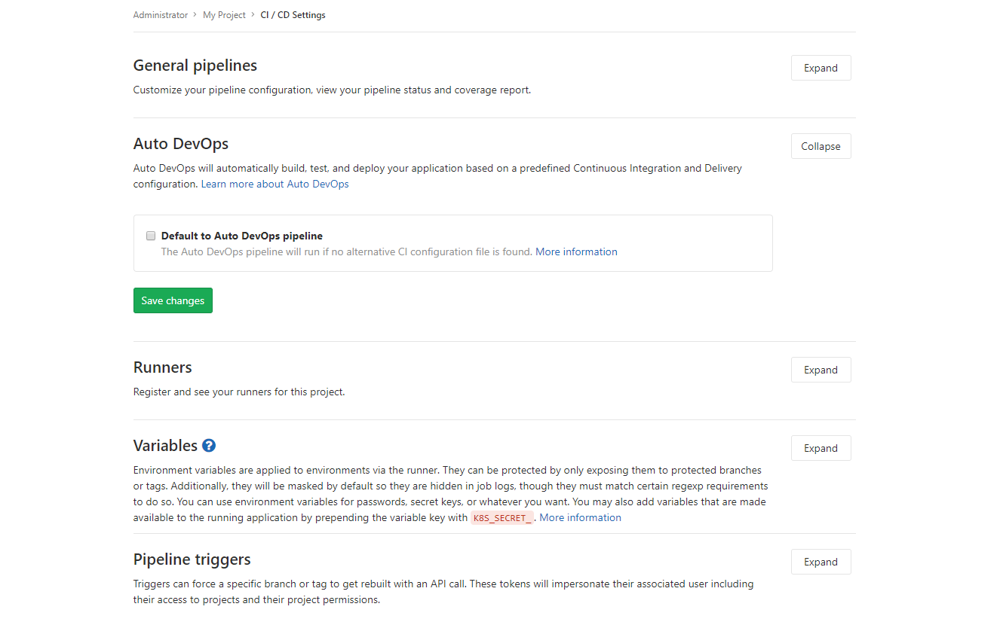
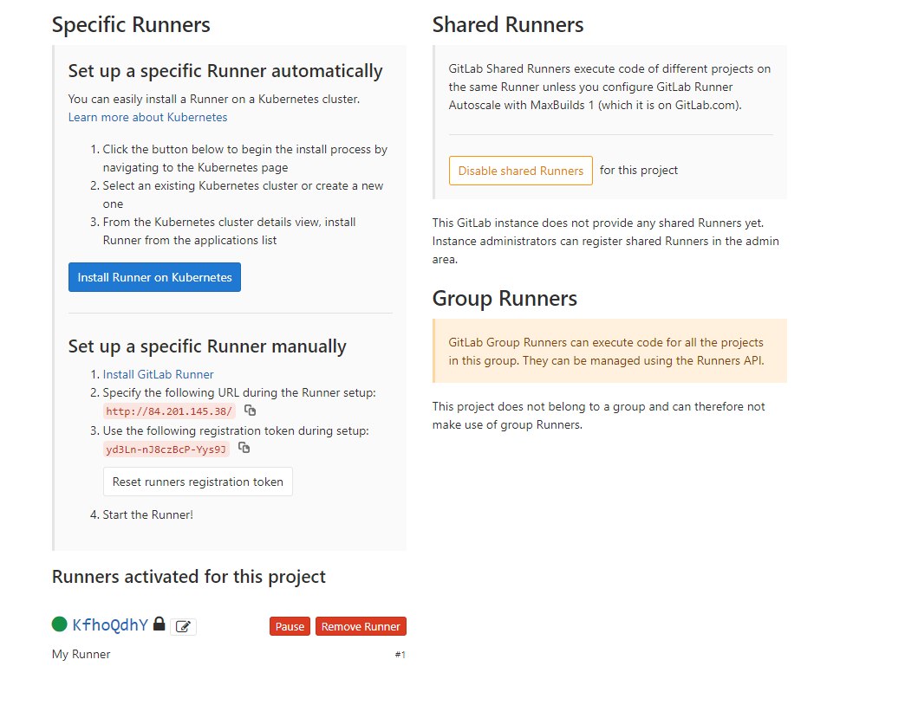
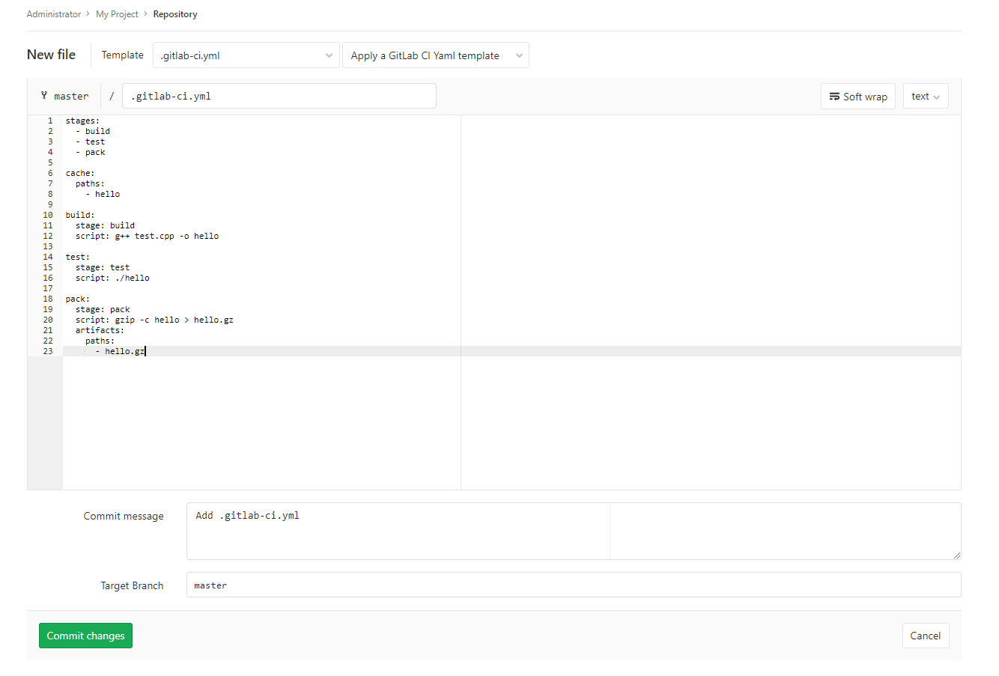

# GitLab - система управления репозиториями кода для Git.

[GitLab](https://ru.wikipedia.org/wiki/GitLab) - это сайт и система управления репозиториями кода для Git. GitLab используется для хранения исходного кода программ (и/или других документов) и совместной работы с ним несколькими людьми. Также GitLab позволяет разработчикам вести непрерывный процесс развертывания для тестирования, создания и развертывания кода, следить за ходом тестов.

В этой инструкции вы развернете и настроите GitLab. После этого вы создадите простой проект на языке C++, настроите для него сценарий тестирования и проверите его выполнение. В процессе настройки вы развернете виртуальную машину с предустановленным GitLab.

Чтобы развернуть и проверить проект, созданный в среде GitLab:

1. [Подготовьте облако к работе](#before-begin)
1. [Создайте виртуальную машину в облаке](#create-vm)
1. [Настройте GitLab](#conf-gitlab)
1. [Создайте проект](#do-pro)
1. [Настройте и запустите тестирование для проекта](#ci-cd)


## Подготовьте облако к работе {#before-begin}

Перед тем, как разворачивать сервер, нужно зарегистрироваться в Облаке и создать платежный аккаунт:



Если у вас есть активный платежный аккаунт, вы можете создать или выбрать каталог, в котором будет работать ваша виртуальная машина. Перейдите на [страницу облака](https://console.cloud.yandex.ru/cloud) и выберите или создайте каталог, в котором вы хотите создать ВМ для вашего сервера. [Подробнее об иерархии ресурсов Облака](../../resource-manager/concepts/resources-hierarchy.md).


### Необходимые платные ресурсы

В стоимость поддержки сервера для GitLab входит:

* плата за постоянно запущенную виртуальную машину (см. [тарифы {{ compute-full-name }}](../../compute/pricing.md));
* плата за использование динамического или статического внешнего IP-адреса (см. [тарифы {{ vpc-full-name }}](../../vpc/pricing.md));


## Создайте виртуальную машину в облаке {#create-vm}

Для того, чтобы создать виртуальную машину:

1. На странице каталога в [консоли управления]({{ link-console-main }}) нажмите кнопку **Создать ресурс** и выберите пункт **Виртуальная машина**.
1. В поле **Имя** введите имя виртуальной машины. Для наглядности примера укажите `gitlab`.

   

1. Выберите [зону доступности](../../overview/concepts/geo-scope.md), в которой должна находиться виртуальная машина.
1. В блоке **Публичные образы** нажмите кнопку **Выбрать**. Выберите публичный образ **GitLab**.
1. В блоке **Диски** выберите жесткий диск SSD размером 20 Гб.
1. В блоке **Вычислительные ресурсы**:
   - Выберите [платформу](../../compute/concepts/vm-platforms.md) виртуальной машины.
   - Укажите необходимое количество vCPU и объем RAM.

   Для корректной работы системы GitLab укажите конфигурацию:
    * **Платформа** - Intel Cascade Lake.
    * **Гарантированная доля vCPU** — 20%.
    * **vCPU** — 2.
    * **RAM** — 4 ГБ.

1. В блоке **Сетевые настройки**:
   - Выберите **Сеть** и **Подсеть**, к которым нужно подключить виртуальную машину. Если нужной сети или подсети еще нет, вы можете создать их прямо на странице создания ВМ.
   - В поле **Публичный адрес** оставьте значение **Автоматически**, чтобы назначить виртуальной машине случайный внешний IP-адрес из пула Яндекс.Облака, или выберите статический адрес из списка, если вы зарезервировали его заранее.

1. В блоке **Доступ** укажите данные для доступа к виртуальной машине:
   - В поле **Логин** введите предпочтительное имя пользователя, который будет создан на виртуальной машине. Для наглядности примера укажите `gitlab`.
   - В поле **SSH-ключ** скопируйте ваш открытый SSH-ключ. Пару ключей для подключения по SSH необходимо создать самостоятельно, см. [раздел о подключении к виртуальным машинам по SSH](../../compute/operations/vm-connect/ssh.md).

1. Нажмите кнопку **Создать ВМ**.

1. Подождите примерно пять минут, пока не будет создана виртуальная машина и на ней не запустятся все сервисы. После полного запуска всех сервисов, GitLab станет доступен через веб-интерфейс в браузере.


## Настройте GitLab {#conf-gitlab}

Для того, чтобы настроить GitLab:

1. Войдите в веб-интерфейс по публичному IP-адресу: `http://<публичный-IP-адрес-вашей-ВМ`.
1. Вы оказываетесь на стартовой странице, где система предлагает создать пароль администратора. Введите пароль.
1. Зайдите в систему по учетной записи администратора. Логин: `root`. Пароль: введенный на стартовой странице в предудущем пункте.


### Настройка приватности в GitLab

Если ваш система должна быть приватной, без возможности доступа посторонних людей, необходимо отключить возможность регистрации пользователей через страницу авторизации:

1. Нажмите на раздел **Configure GitLab**
1. В панели слева перейдите в **Settings** → **General**.
1. Нажмите кнопку **Expand** в разделе **Sign-up restrictions**.
1. Уберите галочку в строке **Sign-up enabled**.
1. Нажмите кнопку **Save changes**.

Теперь зарегистрировать новых пользователь может только администратор через вкладку **Overview** → **Users**.


## Создайте проект {#do-pro}

Для того, чтобы создать проект:

1. На главной странице выберите **Create a project**.
1. На открывшейся странице укажите:
   - Имя проекта. Например, `My Project`.
   - Группу и идентификатор проекта. Например, `root` и `my-project`.
   - При необходимости задайте описание и область видимости проекта.
1. Нажмите кнопку **Create project**.
   
1. После того, как проект будет создан, в панели слева перейдите в раздел **Settings** → **CI/CD**, нажмите кнопку **Expand** в разделе **Auto DevOps**, уберите галочку в **Default to Auto DevOps pipeline** и сохраните изменения.
   
1. Добавьте файл проекта.

   1. В панели слева перейдите в **Project** → **Details**.
   1. На странице проекта нажмите кнопку **New file**.
   1. Назовите файл `test.cpp`, и добавьте в него код программы, которая выводит `Hello World`, если выполняется проверка, что результат умножения 2 × 2 равен 4:

      ```cpp
      #include <iostream>
      #include <cassert>

      int main() {
        assert(2 * 2 == 4);
        std::cout << "Hello world!" << std::endl;
        return 0;
      }
      ```

      

   1. Укажите название коммита в поле **Commit message**.
   1. Нажмите кнопку **Commit changes**.


## Настройте и запустите тестирование для проекта {#ci-cd}

В процессе настройки тестирования вам нужно будет добавить runner. Runner - это специальная программа, которая осуществляет процесс тестирования проекта и сборки продукта в среде GitLab на основании заданных вами инструкций.


### Настройка и регистрация runner-а

Для начала установите и настройте ваш собственный runner. Для этого:

1. Зайдите по SSH на виртуальную машину и перейдите в режим администратора в консоли:
   ```bash
   sudo -i
   ```

1. Скачайте runner с официального сайта:
   ```bash
   curl -L --output /usr/local/bin/gitlab-runner https://gitlab-runner-downloads.s3.amazonaws.com/latest/binaries/gitlab-runner-linux-amd64
   ```

1. Сделайте скаченный runner-а исполняемым, чтобы его можно было запустить:
   ```bash
   chmod +x /usr/local/bin/gitlab-runner
   ```

1. Создайте отдельного пользователя для работы runner-а:
   ```bash
   useradd --comment 'GitLab Runner' --create-home gitlab-runner --shell /bin/bash
   ```

1. Установите и запустите runner как сервис
   ```bash
   gitlab-runner install --user=gitlab-runner --working-directory=/home/gitlab-runner
   gitlab-runner start
   ```

1. Зарегистрируйте runner в gitlab:

   1. Для начала регистрации выполните следующую команду: `gitlab-runner register`. После чего нужно будет ответить на ряд вопросов.
   1. Введите адрес вашего gitlab сервера. При запросе:
      ```
      Please enter the gitlab-ci coordinator URL (e.g. https://gitlab.com)
      ```
      введите `http://<публичный-IP-адрес-вашей-ВМ>`
   1. Введите регистрационный токен для runner-a. Чтобы его найти, нужно перейти в GitLab на страницу проекта, затем в меню слева выбрать **Settings** и подраздел **CI/CD**. После этого нажмите кнопку **Expand** в разделе **Runners**. В разделе **Set up a specific Runner manually** в третьем пункте скопируйте ваш токен на запрос:
         ```
         Please enter the gitlab-ci token for this runner
         <token>
         ```

      

   1. Добавьте текстовое описание вашего runner-a. На запрос:
         ```
         Please enter the gitlab-ci description for this runner
         ```
         Введите, например: `my-runner`

   1. В поле ввода тегов не указывайте никакие теги, просто нажмите **Enter**. Иначе по умолчанию runner не будет выполнять работу без указания соответствующих тегов для проекта.

   1. Укажите среду выполнения для runner-a. В нашем случае, на запрос:
      ```
      Please enter the executor: ssh, docker+machine, docker-ssh+machine, kubernetes, docker, parallels, virtualbox, docker-ssh, shell:
      ```
      Введите: `shell`

На этом установка и настойка runner-a выполнена. Если все сделано правильно, то на странице, где вы копировали регистрационный токен, должен появиться раздел **Runners activated for this project** (при необходимости, обновите страницу браузера) с вашим runner-ом и зеленым кругом рядом с его идентификатором, сигнализирующим, что runner доступен.



### Создание сценария тестирования

Теперь необходимо создать сценарий тестирования, который будет выполнять runner. Сценарий описывается в специальном файле `.gitlab-ci.yml`, который должен лежать в корне проекта. Сценарий будет заключаться в компиляции файла проекта в исполняемый файл, а затем выполнение этого файла.

Так как тестирование будет выполняться на самой системе, необходимо установить приложения, которые необходимы для тестирования. В частности, это `git`, чтобы клонировать проект из репозитория, и `g++` для компиляции проекта.

Для того, чтобы создать сценарий тестирования:

1. Установите необходимые приложения в консоли виртуальной машины:
   ```bash
   apt update
   apt install -y git g++
   ```

1. Добавьте сценарий тестирования:

   1. В веб-интерфейсе в панели слева перейдите на страницу проекта **Project** → **Details**.
   1. На открывшейся странице нажмите на **Set up CI&CD**.
   1. Откроется страница с предложением добавить новый файл `.gitlab-ci.yml`, в котором в формате [YAML](https://en.wikipedia.org/wiki/YAML) нужно описать сценарий. Добавьте соответствующий текст сценария:

      ```
      stages:
        - build
        - test
        - pack

      cache:
        paths:
          - hello

      build:
        stage: build
        script: g++ test.cpp -o hello

      test:
        stage: test
        script: ./hello

      pack:
        stage: pack
        script: gzip -c hello > hello.gz
        artifacts:
          paths:
            - hello.gz
      ```

      В данном сценарии указано, что работа разделена на три этапа, которые выполняются последовательно: `build`, `test` и `pack`:
         - На первом этапе выполняется компиляция проекта в исполняемый файл `hello`.
         - На втором запускается исполняемый файл.
         - На третьем этапе создается архив с исполняемым файлом, который можно будет скачать через веб-интерфейс после успешного прохождения всех этапов. Дополнительно мы указываем в разделе `artifacts` файлы, доступные для скачивания.

      Блок `cache` указывает какие файлы и директории необходимо передавать между этапами. Если его не указать, то на этапе `test` файл `hello` не будет доступен, и произойдет ошибка.

      

   1. Нажмите **Commit changes**

После коммита система автоматически начнет тестировать последний коммит. Процесс тестирования и результаты можно посмотреть, нажав на панели слева **CI&CD**. В результате должна появиться строчка с первым тестом и статусом `passed`. В правом столбце вы можете скачать артефакты (заархивированный исполняемый файл).

### Создание ошибки в исходных файлах проекта

Теперь сделайте так, чтобы в проекте произошла ошибка, которую runner должен помочь найти в процессе выполнения тестирования. Для этого:

1. Зайдите в репозиторий проекта (на панели слева) **Project** → **Details** и откройте файл `test.cpp`.
1. Нажмите **Edit**.
1. Укажите в проверке (assert), что результат выполнения умножения 2 на 2 должен быть равен 5. В этом случае при выполнении программы произойдет ошибка и она завершится некорректно.
   ```cpp
   assert(2 * 2 == 5);
   ```
1. Назовите коммит `Wrong assert in test.cpp`.
1. Нажмите **Commit Changes**.

Теперь перейдите в панели слева на **CI&CD**. Видно, что в результате выполнения теста был успешно пройден первый этап `build`, а на втором этапе `test` произошла ошибка. Третий этап `pack` был пропущен и итоговые артефакты не были сформированы.
Если нажать на статус выполнения `failed` и перейти на вкладку **Failed Jobs**, можно увидеть текст ошибки, где указано, что не выполнился assert:


## Как удалить созданные ресурсы {#clear-out}

Чтобы перестать платить за развернутый сервер, достаточно удалить созданную виртуальную машину.

Если вы зарезервировали статический публичный IP-адрес специально для этой ВМ:

1. Откройте сервис **Virtual Private Cloud** в вашем каталоге.
1. Перейдите на вкладку **IP-адреса**.
1. Найдите нужный адрес, нажмите значок  и выберите пункт **Удалить**.