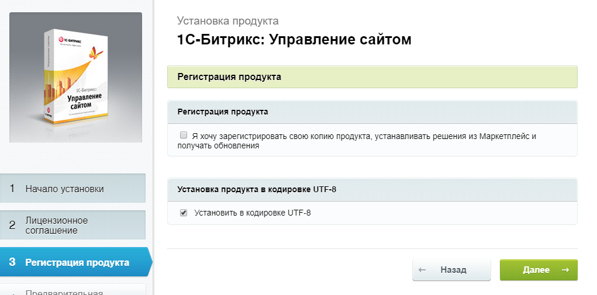
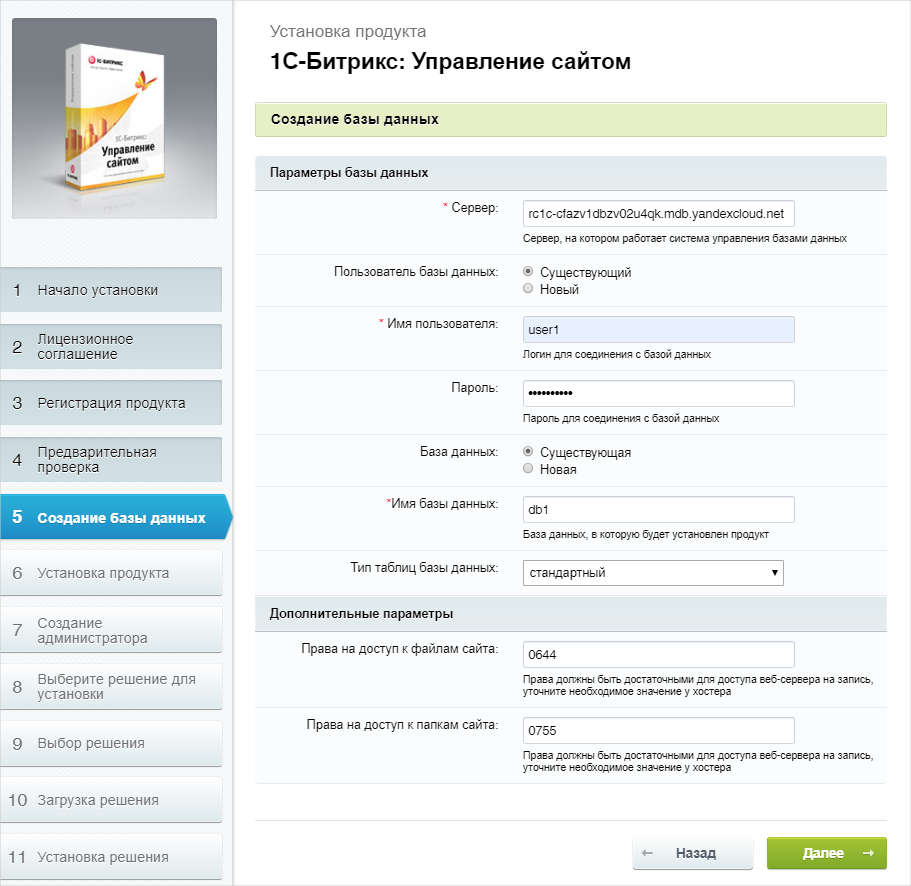
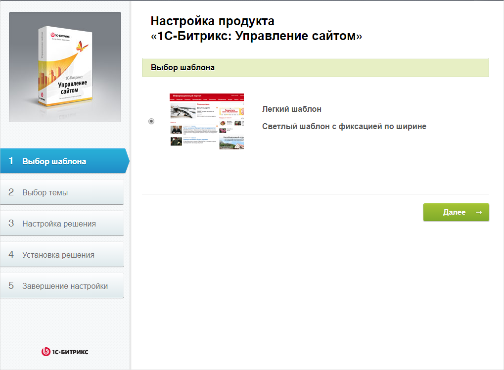

# Веб-сайт на базе 1С-Битрикс


[1С-Битрикс: Управление сайтом](https://www.1c-bitrix.ru/download/files/pdf/1c-bitrix-sitemanager-info.pdf) является системой управления веб-проектами от компании 1С-Битрикс. В состав входит множество инструментов и модулей. С его помощью вы можете создать интернет-магазин, корпоративный сайт, информационный портал, новостной портал, интернет сообщество и достаточно просто управлять структурой и содержимым вашего веб-сайта. Управлять сайтом так же просто, как работать с обычным текстовым редактором. Вам не нужно обладать специальными знаниями программирования и html-верстки. Техническую часть работы за вас выполнит «1С-Битрикс: Управление сайтом».

В этой инструкции вы развернете и настроите веб-сайт, используя шаблон Информационного портала на платформе 1С-Битрикс. В процессе настройки вы создадите виртуальную машину в инфраструктуре Яндекс.Облака, на которой развернете образ платформы 1С-Битрикс и требуемые для нее сервисы. В качестве базы данных вами будет развернут кластер управляемой базы данных MySQL с возможность обеспечения его отказоустойчивости.

Используемые ресурсы для правильной работы 1С-Битрикс:
* Виртуальная машина на базе Ubuntu 18.04 ltс с доступом во внешнюю сеть, на которой будет установлен 1С-Битрикс.
* Кластер MySQL, являющийся базой данных для  веб-сайта 1С-Битрикс.

Чтобы развернуть и настроить 1С-Битрикс:
1. [Подготовьте облако к работе](#before-begin)
1. [Создайте виртуальную машину в облаке](#create-vm)
1. [Создайте кластер баз данных MySQL](#create-mysql)
1. [Настройте сервер для работы с 1C-Битрикс](#configure-server)
1. [Настройте 1С-Битрикс](#configure-bitrix)


## Подготовьте облако к работе {#before-begin}

Перед тем, как разворачивать сервер, нужно зарегистрироваться в Облаке и создать платежный аккаунт:



Если у вас есть активный платежный аккаунт, вы можете создать или выбрать каталог, в котором будет работать ваша виртуальная машина. Перейдите на [страницу облака](https://console.cloud.yandex.ru/cloud) и выберите или создайте каталог, в котором вы хотите создать ВМ для вашего сервера. [Подробнее об иерархии ресурсов Облака](../../resource-manager/concepts/resources-hierarchy.md).


### Необходимые платные ресурсы

В стоимость поддержки сервера для 1С-Битрикс и базы данных входит:

* плата за постоянно запущенную виртуальную машину (см. [тарифы {{ compute-full-name }}](../../compute/pricing.md));
* плата за использование динамического или статического внешнего IP-адреса (см. [тарифы {{ vpc-full-name }}](../../vpc/pricing.md));
* плата за использование управляемой базы данных (см. [тарифы {{ mmy-name }}](../../managed-mysql/pricing.md));

Для текущего сценария используется пробная версия 1С-Битрикс с триальным периодом в 30 дней. Cтоимость электронных версий продукта вы можете уточнить на официальном ресурсе [«1С-Битрикс»](https://www.1c-bitrix.ru).  


## Создайте виртуальную машину в облаке {#create-vm}

Чтобы создать виртуальную машину:

1. На странице каталога **Дашборд каталога** в [консоли управления]({{ link-console-main }}) нажмите кнопку **Создать ресурс** и выберите пункт **Виртуальная машина**.
1. В поле **Имя** введите имя виртуальной машины. Для наглядности примера укажите `bitrixwebsite`.

   

1. Выберите [зону доступности](../../overview/concepts/geo-scope.md), в которой должна находиться виртуальная машина.
1. В блоке **Публичные образы** выберите образ операционной системы Ubuntu 18.04 lts.
1. В блоке **Диски** выберите жесткий диск SSD размером 13 Гб.

   

1. В блоке **Вычислительные ресурсы**:
   - Выберите [платформу](../../compute/concepts/vm-platforms.md) виртуальной машины.
   - Укажите необходимое количество vCPU и объем RAM.

   Для корректной работы системы 1С-Битрикс укажите конфигурацию:
   * **Платформа** - Intel Cascade Lake.
   * **Гарантированная доля vCPU** — 20%.
   * **vCPU** — 2.
   * **RAM** — 4 ГБ.

1. В блоке **Сетевые настройки**:
   - Выберите **Сеть** и **Подсеть**, к которым нужно подключить виртуальную машину. Если нужной сети или подсети еще нет, вы можете создать их прямо на странице создания ВМ.
   - В поле **Публичный адрес** оставьте значение **Автоматически**, чтобы назначить виртуальной машине случайный внешний IP-адрес из пула Яндекс.Облака, или выберите статический адрес из списка, если вы зарезервировали его заранее.

1. В блоке **Доступ** укажите данные для доступа к виртуальной машине:
   - В поле **Логин** введите предпочтительное имя пользователя, который будет создан на виртуальной машине. Для наглядности примера укажите ubuntu.
   - В поле **SSH-ключ** скопируйте ваш открытый SSH-ключ. Пару ключей для подключения по SSH необходимо создать самостоятельно, см. [раздел о подключении к виртуальным машинам по SSH](../../compute/operations/vm-connect/ssh.md).
      
   

1. Нажмите кнопку **Создать ВМ**.

В процессе работы вам может потребоваться сохранять [резервные копии диска](../../compute/operations/disk-control/create-snapshot.md)    виртуальной машины. Они содержат копию файловой системы виртуальной машины в момент создания. 
   Вы можете использовать снимки для различных целей, например:
   * перенос данных с одного диска на другой — например, на диск в другой зоне доступности;
   * создание резервной копии диска перед проведением операций, которые могут повлечь повреждение данных;
   * версионирование диска путем регулярного создания снимков диска.

## Создайте кластер баз данных MySQL {#create-mysql}

Чтобы создать кластер баз данных MySQL:

1. На странице каталога в [консоли управления]({{ link-console-main }}) нажмите кнопку **Создать ресурс** и выберите пункт **Кластер MySQL**.
1. В блоке **Класс Хоста** выберите **Тип** хоста `s2.micro`. Данных характеристик хватит для работы системы 1С-Битрикс.
1. В блоке **Размер хранилища** выберите тип хранилища — более гибкое сетевое (`network-hdd` или `network-ssd`) или более быстрое локальное SSD-хранилище (`local-ssd`). На текущем этапе оставьте `network-ssd` размером `10GB`. Такого объема вполне хватит для текущего примера. 

    
   
1. В блоке **База данных** укажите:
   - **Имя БД**. В этой инструкции оставьте значение по умолчанию `db1`.
   - **Имя пользователя**, которое является логином для подключения к базе данных. В этой инструкции оставьте значение по умолчанию `user1`.
   - **Пароль**, будет использоваться для доступа системой 1С-Битрикс к базе данных MySQL.
   
   

1. В блоке **Хосты**, при необходимости, поменяйте **Зону доступности**, в которой должна находиться база данных. Для этого кликните по пиктограмме карандаша справа от текущей выбранной зоны доступности и выберите из выпадающего списка ту, которая необходима.

   

   Рекомендуется выбрать ту же **Зону доступности**, которую вы выбрали при создании виртуальной машины. Это позволит уменьшить задержку (latency) между виртуальной машиной и базой данных.

   
   
   
   

1. Для обеспечения отказоустойчивости вы можете добавить дополнительные хосты для вашей базы данных. Для этого выберите **Добавить хост** и укажите, в какой **Зоне доступности** он будет размещен.

1. Остальные поля оставьте без изменений.
1. Нажмите на кнопку **Создать кластер**.

Создание кластера БД может занять несколько минут. Проверить доступность созданного кластера вы можете в **Дашборд каталога**, консоли управления Яндекс Облаком, выбрав **Managed Service for MySQL**. На вкладке **Кластеры**, статус кластера должен быть **Running**, состояние **Alive**. 


## Настройте сервер для работы с 1C-Битрикс {#configure-server}

Для настройки сервера для работы с 1С-Битрикс выполните следующие шаги:

1. Выполните вход на созданный сервер с помощью [SSH](../../compute/operations/vm-connect/ssh.md)

   ```bash
   $ ssh ubuntu@<публичный-IP-адрес-ВМ>
   ```

   

   ubuntu - имя пользователя в поле **Логин**, которое вы указывали при [создании виртуальной машины](#create-vm)

   Для того, чтобы узнать публичный IP-адрес вашей виртуальной машины на странице каталога в [консоли управления]({{ link-console-main }}):
      1. Выберите блок **Compute Cloud**;
      1. Кликните по имени вашей виртуальной машины (в данном примере имя виртуальной машины - **bitrixwebsite**);
      1. Откроется окно с общей информацией по вашей виртуальной машине. Публичный IP-адрес вы можете найти в блоке **Сеть** в строке **Публичный IPv4**.

   

1. Получите права администратора

   ```bash
   ubuntu@bitrixwebsite:~$ sudo -i
   root@bitrixwebsite:~#
   ```

1. Установите необходимое ПО

   ```bash
   root@bitrixwebsite:~# apt-get update
   root@bitrixwebsite:~# apt-get install -y apache2 libapache2-mod-php php-gd php-mbstring php-mysql
   ```

1. Перейдите в рабочий каталог проекта

   ```bash
   root@bitrixwebsite:~# cd /var/www/html/
   ```

1. Скачайте дистрибутив “1С-Битрикс: Управление сайтом”

   ```bash
   root@bitrixwebsite:/var/www/html# wget https://www.1c-bitrix.ru/download/standard_encode.tar.gz
   ``` 

1. Распакуйте полученный архив и после этого удалите ненужные файлы

   ```bash
   root@bitrixwebsite:/var/www/html# tar -zxf standard_encode.tar.gz
   root@bitrixwebsite:/var/www/html# rm -f index.html standard_encode.tar.gz
   ```

1. Назначьте пользователя `www-data` владельцем рабочего каталога проекта

   ```bash
   root@bitrixwebsite:/var/www/html# chown -R www-data:www-data /var/www/html
   root@bitrixwebsite:/var/www/html# ls -l
   total 76
   drwxrwxr-x 6 www-data www-data  4096 May 15 13:50 bitrix
   -rwxrwxr-x 1 www-data www-data  1378 May 15 13:50 index.php
   -rwxrwxr-x 1 www-data www-data   150 Mar 11  2013 install.config
   -rwxrwxr-x 1 www-data www-data 30741 Apr 10 14:36 license.html
   -rwxrwxr-x 1 www-data www-data   113 Nov 20  2012 license.php
   -rwxrwxr-x 1 www-data www-data 14054 Feb  6  2017 readme.html
   -rwxrwxr-x 1 www-data www-data   112 Mar 27  2013 readme.php
   drwxrwxr-x 2 www-data www-data  4096 May 15 13:50 upload
   -rwxrwxr-x 1 www-data www-data   691 Oct 27  2009 web.config
   ```

1. Настройте параметры PHP

   В соответствии с требованиями информационной системы необходимо отредактировать следующие переменные в файле конфигурации `/etc/php/7.2/apache2/php.ini`

   |Было                        | Стало                        |
   |:---------------------------| :----------------------------|
   |short_open_tag = Off        | short_open_tag = On          |
   |display_errors = Off        | display_errors = On          |
   |memory_limit = 128M         | memory_limit = 256M          |
   |;date.timezone =            | date.timezone = Europe/Moscow|
   |;opcache.revalidate_freq =2 | opcache.revalidate_freq =0   |
   |;mbstring.func_overload = 0 | mbstring.func_overload = 2   |

   Для редактирования файла, воспользуйтесь встроенным редактором `nano` или установите себе предпочитаемый редактор.
   Откройте файл php.ini в нужной категории с помощью следующей команды:
   
   ```bash
   root@bitrixwebsite:/var/www/html# sudo nano /etc/php/7.2/apache2/php.ini
   ```
   Поиск требуемого параметра в редакторе `nano` осуществляется с помощью комбинации клавиш `Ctrl+W`. Найдите требуемый параметр из    таблицы ниже, далее сохраните изменения при помощи комбинации клавиш `Ctrl+O`.  Выход из редактора `Ctrl+X`.

1. Настройте сервер Apache

   В соответствии с требованиями информационной системы необходимо отредактировать файл конфигурации `/etc/apache2/sites-enabled/000-default.conf`, добавив в него после строки `DocumentRoot /var/www/html` следующий блок:

   ```
   <Directory /var/www/html>
     Options Indexes FollowSymLinks
     AllowOverride All
     Require all granted
   ```
   Выполните следующую команду:
 
   ```bash
   root@bitrixwebsite:/var/www/html# sudo nano /etc/apache2/sites-enabled/000-default.conf
   ```  
   Добавьте после строки `DocumentRoot /var/www/html` блок указанный выше.
   
1. Перезапустите Web-сервер для того, чтобы все измененные настройки применились

   ```bash
   root@bitrixwebsite:/var/www/html# service apache2 restart
   ```

   После выполнения всех перечисленных выше команд серверная часть будет сконфигурирована для корректной работы 1С-Битрикс. Следующим шагом по созданию веб-сайта будет непосредственно настройка самой системы 1С-Битрикс.


## Настройте 1С-Битрикс {#configure-bitrix}

Далее вам необходимо провести настройку самого 1С-Битрикс. Чтобы сделать это:

1. Откройте Web-интерфейс 1С-Битрикс: Управление сайтом

   Для этого в браузере перейдите по адресу `http://<публичный-IP-адрес-ВМ>/`. Должна открыться страница с приглашением установить 1С-Битрикс.
   
1. Начало установки продукта

   Вы увидите стартовый экран начала установки. На данной странице ничего делать не нужно, просто нажмите кнопку **Далее**.

   

1. Лицензионное соглашение

   Ознакомьтесь с лицензионным соглашением и выберите **Я принимаю лицензионное соглашение**. Затем нажмите кнопку **Далее**.

   

1. Регистрация продукта

   На этом этапе необязательно регистрировать продукт, поэтому уберите соответствующую галочку, но оставьте **Установить в кодировке UTF-8** и нажмите кнопку  **Далее**.

   

1. Предварительная проверка

   В этом разделе установки система проверит, все ли верно сконфигурировано на стороне сервера. Просмотрите все параметры на данной странице и нажмите кнопку **Далее**.

   
   
1. Создание базы данных

   1. В поле **Сервер** укажите полное доменное имя созданной вами базы данных. Чтобы его узнать:
      1. Перейдите в новой вкладке браузера на страницу каталога в [консоли управления]({{ link-console-main }});
      1. Выберите раздел **Managed Service for MySQL**;
      1. В таблице выберите созданную вами базу данных; 
      1. В меню слева выберите вкладку **Хосты**;
      1. Подведите курсор к **Имени хоста** (например такого вида rc1c-cfazv1dbzv02u4qk) и скопируйте полное доменное имя базы данных, кликнув по появившейся справа пиктограмме. После нажатия на пиктограмму, к **Имени хоста** добавится **Полное доменное имя**, в результате поле **Сервер** будет иметь следующий вид **rc1c-cfazv1dbzv02u4qk.mdb.yandexcloud.net**.
   1. В полях **Имя пользователя** и **Пароль**. укажите соответствующие данные, которые вы указывали при создании базы данных в разделе {#create-mysql}.
   1. В поле **Имя базы данных** укажите имя созданной базы данных. По умолчанию в инструкции используется значение `db1`.
   1. Все остальные поля оставьте по умолчанию.
   1. После этого нажмите кнопку **Далее**.
   
   
   

1. Установка продукта

   На этом этапе будет инициализирована и заполнена необходимыми данными база данных MySQL. Дождитесь окончания процесса инициализации.

   

1. Создание администратора

   В данном меню предлагается создать пользователя, который сможет вносить изменения в вашу систему. Заполните все поля в соответствии с вашими персональными данными и нажмите кнопку **Далее**.

   

1. Выберите решение для установки

   На выбор предлагаются шаблоны для интерфейса системы. В данном примере выберите **Информационный портал** и нажмите кнопку **Далее**.

   

1. Выбор шаблона

   В данном меню предлагается только один шаблон для оформления, поэтому просто нажмите кнопку **Далее**.

   

1. Выбор темы

   В данном меню предлагается цветовое оформление выбранного ранее шаблона. Выберите оформление по вкусу и нажмите кнопку **Далее**.

   

1. Настройка и установка решения

   Заполните все поля в соответствии с требованиями к веб-сайту и нажмите кнопку **Установить**. Начнется установка и настройка всех компонентов системы. Дождитесь ее окончания.

   

1. Завершение настройки

   Через некоторое время появится страница, уведомляющее о том, что система установлена и настроена. Для начала работы с веб-сайтом нажмите кнопку **Перейти на сайт**.
   

1. Готовность к эксплуатации веб-сайта

   Вы попали в Web-интерфейс полностью готовой для дальнейшей эксплуатации системы и находитесь в режиме редактирования содержимого.

   

1. Проверка главной страницы сайта

   Для этого в браузере перейдите по адресу `http://<публичный-IP-адрес-ВМ>/`. После этого вы окажетесь на главной странице сайта и увидите ее глазами стороннего пользователя, посетившего ваш веб-сайт. Предварительно не забудьте **Выйти** из панели администрирования вашим сайтом, в правом верхнем углу страницы. Для того, чтобы вернуться обратно в режим редактирования, необходимо авторизоваться на сайте с теми учетными данными, которые вы создавали для администратора 1С-Битрикс.  

   

## Как удалить созданные ресурсы {#clear-out}

Чтобы перестать платить за развернутый сервер, достаточно удалить созданную виртуальную машину и кластер баз данных.

Если вы зарезервировали статический публичный IP-адрес специально для этой ВМ:

1. Откройте сервис **Virtual Private Cloud** в вашем каталоге.
1. Перейдите на вкладку **IP-адреса**.
1. Найдите нужный адрес, нажмите значок  и выберите пункт **Удалить**.
