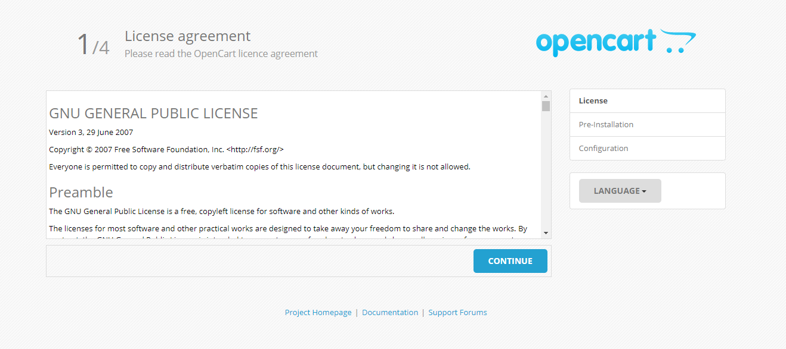
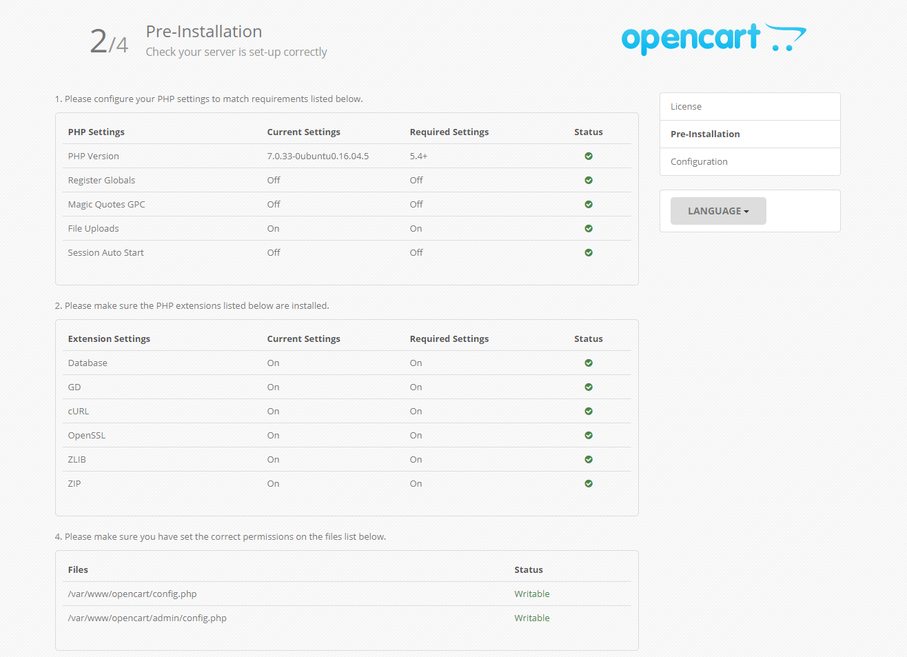
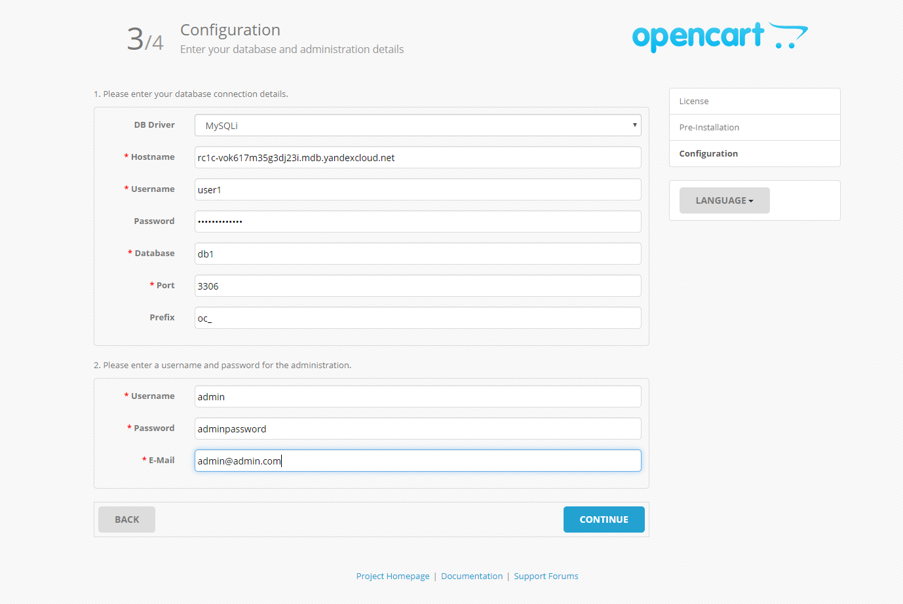
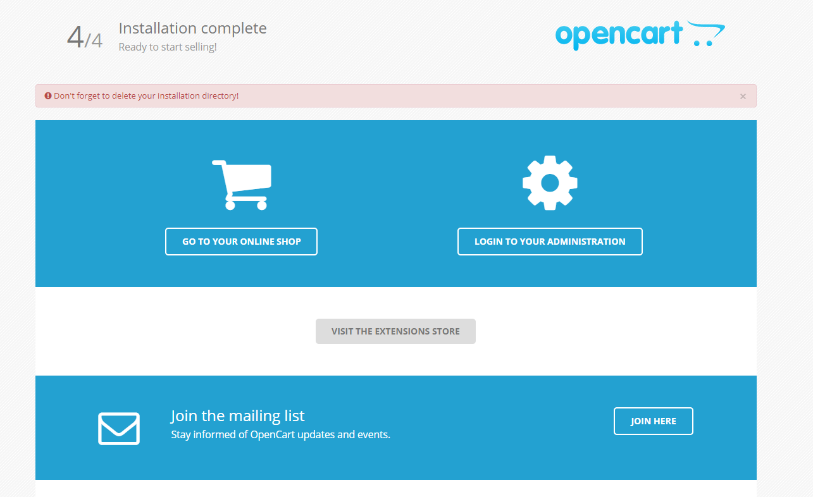
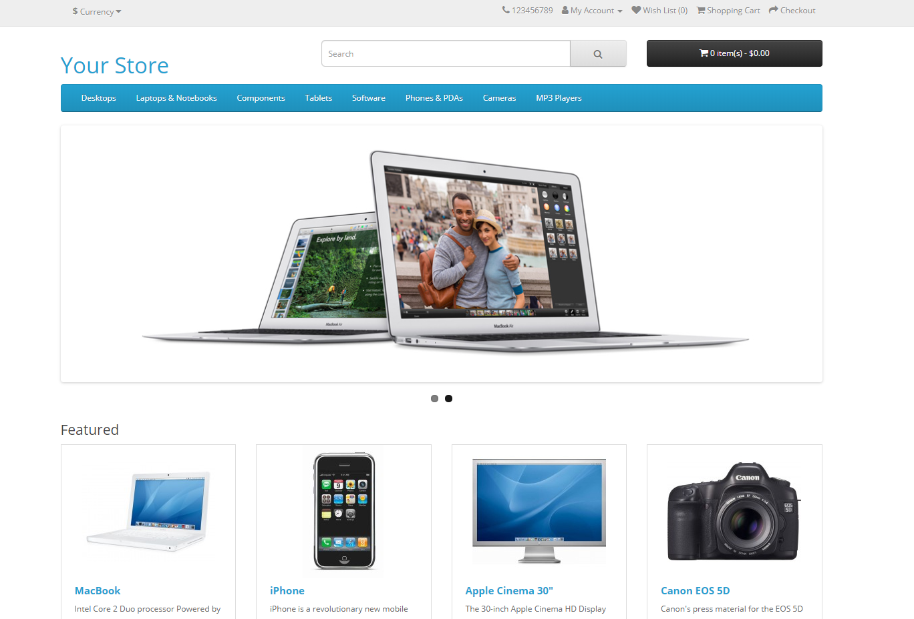

# Интернет-магазин на платформе OpenCart

[OpenCart](https://ru.wikipedia.org/wiki/OpenCart) является платформой, предназначенной для создания своего собственного интернет-магазина. Платформа является бесплатной и имеет открытый исходный код. На базе OpenCart можно создать интернет-магазин любой сложности с помощью большого количества доступных и поддерживаемых сообществом дополнений.

В этой инструкции будет создан и настроен интернет-магазин на базе OpenCart. В процессе настройки будет развернута виртуальная машина с предустановленной платформой OpenCart и требуемыми для ее работы программами. В качестве СУБД будет использоваться MySQL.

Чтобы настроить свой интернет-магазин на OpenCart:
1. [Подготовьте облако к работе](#before-begin)
1. [Создайте виртуальную машину с платформой OpenCart](#create-vm)
1. [Создайте кластер баз данных MySQL](#create-mysql)
1. [Настройте OpenCart](#configure-opencart)


## Подготовьте облако к работе {#before-begin}

Перед тем, как разворачивать сервер, нужно зарегистрироваться в Облаке и создать платежный аккаунт:



Если у вас есть активный платежный аккаунт, вы можете создать или выбрать каталог, в котором будет работать ваша виртуальная машина. Перейдите на [страницу облака](https://console.cloud.yandex.ru/cloud) и выберите или создайте каталог, в котором вы хотите создать ВМ для вашего сервера. [Подробнее об иерархии ресурсов Облака](../../resource-manager/concepts/resources-hierarchy.md).


### Необходимые платные ресурсы

В стоимость поддержки сервера для OpenCart входит:

* плата за постоянно запущенную виртуальную машину (см. [тарифы {{ compute-full-name }}](../../compute/pricing.md));
* плата за использование динамического или статического внешнего IP-адреса (см. [тарифы {{ vpc-full-name }}](../../vpc/pricing.md)).

Если планируется настройка базы данных в виде отдельной системы:

* плата за использование управляемой базы данных (см. [тарифы {{ mmy-name }}](../../managed-mysql/pricing.md)).


## Создайте виртуальную машину с платформой OpenCart {#create-vm}

Чтобы создать виртуальную машину:

1. На странице каталога в [консоли управления]({{ link-console-main }}) нажмите кнопку **Создать ресурс** и выберите пункт **Виртуальная машина**.
1. В поле **Имя** введите имя виртуальной машины. Для наглядности примера укажите `opencart`.

   

1. Выберите [зону доступности](../../overview/concepts/geo-scope.md), в которой должна находиться виртуальная машина.
1. В блоке **Публичные образы** нажмите кнопку **Выбрать**. Выберите публичный образ **OpenCart**.

   

   При выборе данного образа будет создана система с предустановленной платформой OpenCart и необходимыми для ее работы компонентами, включая PHP и MySQL.

   

1. В блоке **Диски** выберите жесткий диск SSD размером 13 ГБ.
1. В блоке **Вычислительные ресурсы**:
   - Выберите [платформу](../../compute/concepts/vm-platforms.md) виртуальной машины.
   - Укажите необходимое количество vCPU и объем RAM.

   Для корректной работы OpenCart укажите конфигурацию:
   * **Платформа** - Intel Cascade Lake.
   * **Гарантированная доля vCPU** — 20%.
   * **vCPU** — 2.
   * **RAM** — 4 ГБ.

1. В блоке **Сетевые настройки**:
   - Выберите сеть и подсеть, к которым нужно подключить виртуальную машину. Если нужной сети или подсети еще нет, вы можете создать их прямо на странице создания ВМ.
   - В поле **Публичный адрес** оставьте значение **Автоматически**, чтобы назначить виртуальной машине случайный внешний IP-адрес из пула Яндекс.Облака, или выберите статический адрес из списка, если вы зарезервировали его заранее.

1. В блоке **Доступ** укажите данные для доступа к виртуальной машине:
   - В поле **Логин** введите предпочтительное имя пользователя, который будет создан на виртуальной машине. Для наглядности примера укажите ubuntu.
   - В поле **SSH-ключ** скопируйте ваш открытый SSH-ключ. Пару ключей для подключения по SSH необходимо создать самостоятельно, см. [раздел о подключении к виртуальным машинам по SSH](../../compute/operations/vm-connect/ssh.md).

1. Нажмите кнопку **Создать ВМ**.


## Создайте кластер баз данных MySQL {#create-mysql}



Если вам не хватает возможностей СУБД, предустановленной в образе OpenCart, или вы рассчитываете на существенную нагрузку, рекомендуется создать СУБД в виде отдельного управляемого сервиса в Яндекс.Облаке. В этом случае вы будете иметь гибкие возможности по взаимодействию с базой данных, предоставляемые Яндекс.Облаком, включая мониторинг ее состояния и текущей активности, автоматическое создание резервных копий и легко настраиваемую отказоустойчивость.



Чтобы создать кластер баз данных MySQL:

1. На странице каталога в [консоли управления]({{ link-console-main }}) нажмите кнопку **Создать ресурс** и выберите пункт **Кластер MySQL**.
1. В блоке **Класс Хоста** выберите **Тип** хоста s2.micro. Данных характеристик хватит для работы системы без особых нагрузок.
1. В блоке **База данных** укажите:
   - **Имя БД**. В этой инструкции оставьте значение по умолчанию `db1`.
   - **Имя пользователя**, которое является логином для подключения к базе данных. В этой инструкции оставьте значение по умолчанию `user1`.
   - **Пароль**, который будет использоваться для доступа системой OpenCart к базе данных MySQL.

1. В блоке **Хосты**, при необходимости, поменяйте **Зону доступности**, в которой должна находиться база данных. Для этого кликните по пиктограмме карандаша справа от текущей выбранной зоны доступности и выберите из выпадающего списка ту, которая необходима.

   

   Рекомендуется выбрать ту же **Зону доступности**, которую вы выбрали при создании виртуальной машины. Это позволит уменьшить задержку (latency) между виртуальной машиной и базой данных.

   

   Для обеспечения отказоустойчивости вы можете добавить дополнительные хосты для вашей базы данных. Для этого выберите **Добавить хост** и укажите, в какой **Зоне доступности** он будет размещен.

1. Остальные поля оставьте без изменений.
1. Нажмите на кнопку **Создать кластер**.

Создание кластера БД может занять несколько минут.

## Настройте OpenCart {#configure-opencart}

1. Откройте Web-интерфейс интернет-магазина OpenCart

   Для этого в браузере перейдите по адресу `http://<публичный-IP-адрес-ВМ>/`. Должна открыться страница настройки OpenCart.

1. Лицензия

   Ознакомьтесь с лицензией и нажмите **Continue**.

   

1. Требования с системе

   Поскольку образ настроен под OpenCart, все строки с требованиями к системе должны быть с зелеными галочками. Убедитесь, что это так, и нажмите **Continue**.

   

1. Настройка доступа к базе данных и администраторского доступа

   Если вы не создавали отдельный кластер MySQL, необходимо получить имя базы данных и пароль, сгенерированные при конфигурации базы данных в виртуальной машине. Для этого:
      1. Зайдите по SSH на созданную виртуальную машину.
      1. Перейдите в режим администратора `sudo -i`.
      1. В домашней директории администратора находится файл `default_passwords.txt`. В нем содержатся сгенерированные настройки по базе данных. Откройте этот файл или выведите его в консоли.

         ```bash
         root@opencart:~# cat default_passwords.txt
         MYSQL_USER=opencart
         MYSQL_PASS=qDbvN1R6tA6ET
         MYSQL_ROOT_PASS=5DiVb80l1kXVz
         MYSQL_DB=opencart
         ```

      1. На странице конфигурирования OpenCart в первом разделе, конфигурации базы данных, введите соответствующие данные:
         - В поле **Username** значение переменной `MYSQL_USER`.
         - В поле **Database** значение переменной `MYSQL_DB`.
         - В поле **Password** значение переменной `MYSQL_PASS`.
         - Остальные поля из этого раздела оставьте без изменения.

   Если вы создали кластер MySQL, то введите те данные, которые вы использовали при создании кластера. В данном примере используйте такие значения:
      - В поле **Hostname** укажите полное доменное имя созданной базы данных. Чтобы его узнать:
         1. Перейдите в новой вкладке браузера на страницу каталога в [консоли управления]({{ link-console-main }}).
         1. Выберите раздел **Managed Service for MySQL**.
         1. В таблице выберите созданную вами базу данных.
         1. В меню слева выберите вкладку **Хосты**.
         1. Подведите курсор к **Имени хоста** (например такого вида rc1c-vok617m35g3dj23i) и скопируйте полное доменное имя базы данных, кликнув по появившейся справа пиктограмме.

      - В поле **Username** значение `user1`.
      - В поле **Database** значение `db1`.
      - В поле **Password** указанный вами пароль.
      - Остальные поля из этого раздела оставьте без изменения.

   Во втором разделе, настройки администратора, задайте имя администратора, его пароль и укажите ваш актуальный почтовый адрес. После этого нажмите **Continue**.

   

1. Завершение настройки

   После этого появится страница, уведомляющая о том, что система настроена. Для начала настройки содержимого интернет-магазина нажмите кнопку **Login to your administration** и введите логин и пароль для администраторского доступа.

   

1. Удаление ненужных установочных файлов

   После завершения установки зайдите по SSH на виртуальную машину и удалите установочные файлы:

   ```
   user@opencart:~$ sudo -i
   root@opencart:~# rm -rf /var/www/opencart/install/
   ```

1. Проверка главной страницы сайта

   Для этого в браузере перейдите по адресу `http://<публичный-IP-адрес-ВМ>/`. После этого вы окажетесь на главной странице сайта и увидите ее глазами пользователя, посетившего ваш интернет-магазин.

   


## Как удалить созданные ресурсы {#clear-out}

Чтобы перестать платить за развернутый сервер, достаточно удалить созданную виртуальную машину и базу данных, если вы ее тоже создавали.

Если вы зарезервировали статический публичный IP-адрес специально для этой ВМ:

1. Откройте сервис **Virtual Private Cloud** в вашем каталоге.
1. Перейдите на вкладку **IP-адреса**.
1. Найдите нужный адрес, нажмите значок  и выберите пункт **Удалить**.