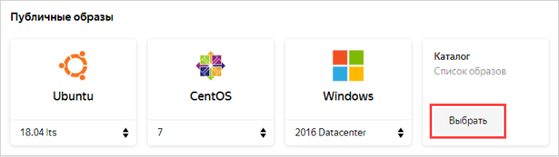
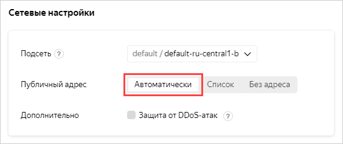
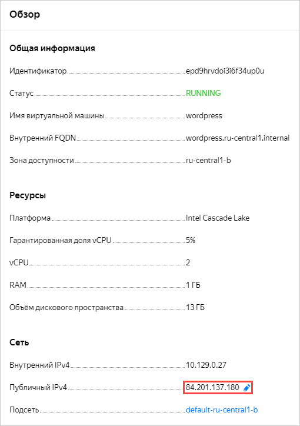

# Создание сайта на WordPress

Сценарий описывает создание и настройку веб-сайта на базе CMS WordPress с помощью специального образа виртуальной машины.

Чтобы настроить веб-сайт на WordPress:
1. [Создайте ВМ для WordPress](#create-vm).
1. [Настройте WordPress](#wordpress-setup).
1. [Настройте DNS](#configure-dns).

Если сайт вам больше не нужен, [удалите ВМ с ним](#clear-out).

## Подготовьте облако к работе {#before-you-begin}

Перед тем, как разворачивать сервер, нужно зарегистрироваться в {{ yandex-cloud }} и создать платежный аккаунт:



Если у вас есть активный платежный аккаунт, вы можете создать или выбрать каталог, в котором будет работать ваша ВМ, на [странице облака](https://console.cloud.yandex.ru/cloud).

[Подробнее об облаках и каталогах](../../resource-manager/concepts/resources-hierarchy.md).

Убедитесь, что в выбранном каталоге есть облачная сеть с подсетью хотя бы в одной зоне доступности. Для этого на странице каталога выберите сервис **Virtual Private Cloud**. Если в списке есть сеть — нажмите на нее, чтобы увидеть список подсетей. Если нужных подсетей или сети нет, [создайте их](../../vpc/quickstart.md).

### Необходимые платные ресурсы {#paid-resources}

В стоимость поддержки веб-сайта на WordPress входит:
* плата за постоянно запущенную ВМ (см. [тарифы {{ compute-full-name }}](../../compute/pricing.md));
* плата за использование динамического или статического внешнего IP-адреса (см. [тарифы {{ vpc-full-name }}](../../vpc/pricing.md)).

## Создание виртуальной машины для WordPress {#create-vm}

Чтобы создать ВМ:
1. На странице каталога в [консоли управления]({{ link-console-main }}) нажмите кнопку **Создать ресурс** и выберите **Виртуальная машина**.

   

1. В поле **Имя** введите имя ВМ: `wordpress`.

   

   

1. Выберите [зону доступности](../../overview/concepts/geo-scope.md), в которой будет находиться ВМ.
1. В блоке **Образы из {{ marketplace-name }}** нажмите кнопку **Выбрать**. Выберите публичный образ **WordPress**.

   

1. В блоке **Вычислительные ресурсы**:
   * Выберите [платформу](../../compute/concepts/vm-platforms.md).
   * Укажите необходимое количество vCPU и объем RAM.

   Для тестирования хватит минимальной конфигурации:
   * **Платформа** — Intel Cascade Lake.
   * **vCPU** — 2.
   * **Гарантированная доля vCPU** — 5%.
   * **RAM** — 1 ГБ.

1. В блоке **Сетевые настройки** выберите, к какой подсети необходимо подключить ВМ при создании.
1. В пункте **Публичный адрес** выберите **Автоматически**.

   

1. Укажите данные для доступа на ВМ:
   * В поле **Логин** введите имя пользователя.
   * В поле **SSH ключ** вставьте содержимое файла открытого ключа.

     Пару ключей для подключения по SSH необходимо создать самостоятельно. Подробнее см. [{#T}](../../compute/operations/vm-connect/ssh.md).

1. Нажмите кнопку **Создать ВМ**.

Создание ВМ может занять несколько минут. Когда ВМ перейдет в статус `RUNNING`, вы можете начать настраивать сайт.

При создании ВМ назначается публичный IP-адрес и имя хоста (FQDN). Эти данные можно использовать для доступа по SSH.

## Настройка WordPress {#wordpress-setup}

После того как ВМ `wordpress` перейдет в статус `RUNNING`, выполните:
1. В блоке **Сеть** на странице ВМ в [консоли управления]({{ link-console-main }}) найдите публичный IP-адрес ВМ.

   

1. Перейдите по адресу ВМ в браузере.
1. Выберите язык и нажмите кнопку **Продолжить**.

   

1. Заполните информацию для доступа к сайту:
   1. Укажите любое название сайта, например, `yc-wordpress`.
   1. Укажите имя пользователя, которое будет использоваться для входа в административную панель, например, `yc-user`.
   1. Укажите пароль, который будет использоваться для входа в административную панель.
   1. Укажите вашу электронную почту.

   

1. Нажмите кнопку **Установить WordPress**.
1. Если установка прошла успешно, нажмите кнопку **Войти**.

   

1. Войдите на сайт, используя указанные на прошлых шагах имя пользователя и пароль. После этого откроется административная панель, в которой можно приступать к работе с вашим сайтом.
1. Убедитесь, что сайт доступен, открыв публичный IP-адрес ВМ в браузере.

## Настройка DNS {#configure-dns}

Чтобы привязать сайт к домену, настройте DNS у вашего регистратора следующим образом:
* A-запись: поддомен `@`, в качестве адреса используйте публичный IP-адрес ВМ.
* CNAME-запись: поддомен `www`, в качестве канонического имени используйте домен с точкой на конце, например: `example.com.`.

## Как удалить созданные ресурсы {#clear-out}

Чтобы перестать платить за развернутый сервер, достаточно [удалить](../../compute/operations/vm-control/vm-delete.md) ВМ `wordpress`.

Если вы зарезервировали статический публичный IP-адрес специально для этой ВМ:
1. Откройте сервис **Virtual Private Cloud** в вашем каталоге.
1. Перейдите на вкладку **IP-адреса**.
1. Найдите нужный адрес, нажмите значок  и выберите пункт **Удалить**.