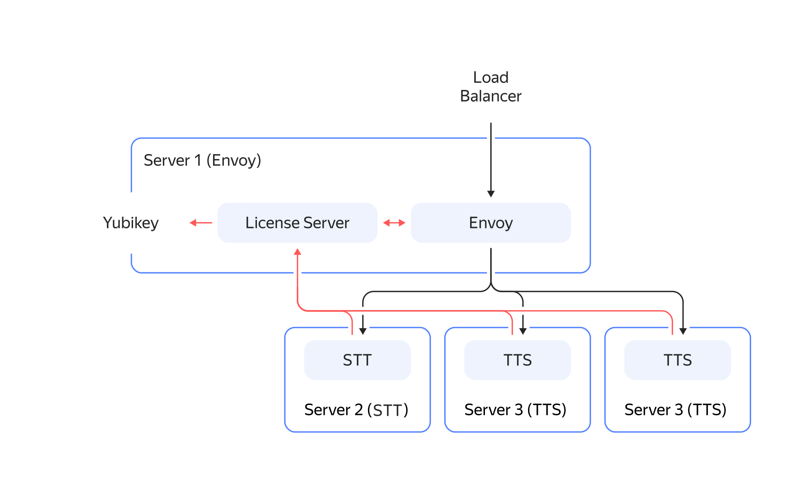
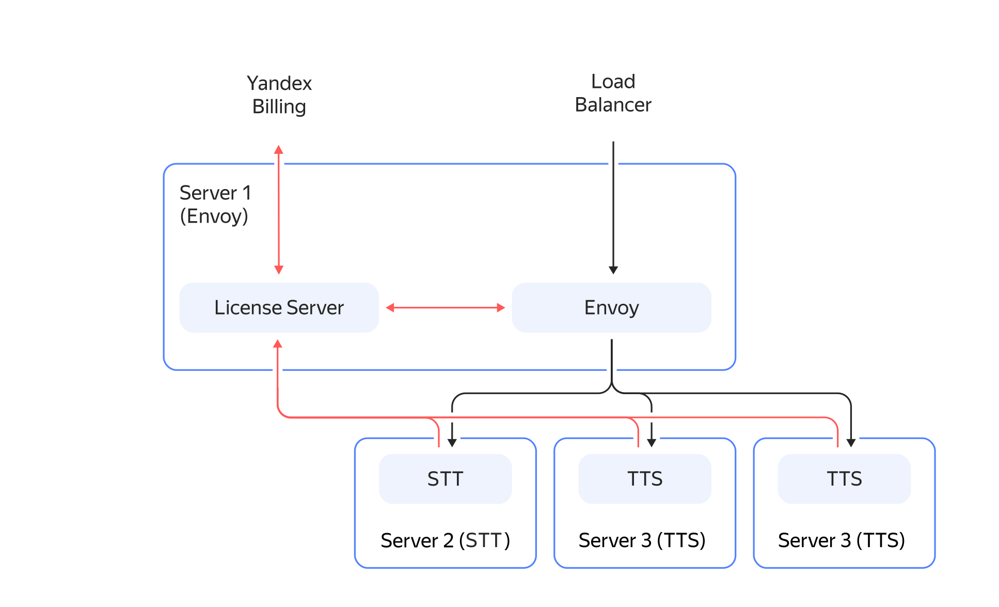

# Архитектура сервиса {{ sk-hybrid-name }}

Сервис {{ sk-hybrid-name }} состоит из следующих компонентов:

* **[Envoy](https://www.envoyproxy.io/docs)** — сервер маршрутизации, который получает входящие gRPC-запросы и определяет, какие компоненты {{ sk-hybrid-name }} ответственны за их обработку.
* **License server** – сервер динамической конфигурации Envoy для учета лицензий Yubikey или отправки данных для оплаты ресурсов.
* **Сервер STT** — сервер распознавания речи.
* **Сервер TTS** — сервер синтеза речи.

## Взаимосвязь компонентов {{ sk-hybrid-name }} {#components-interaction}

Схема связей между компонентами зависит от выбранной партнером модели лицензирования.

### Yubikey {#yubikey}

License server ограничивает максимальное число сессий для распознавания речи и максимальную производительность (request per seconds) для синтеза речи. Эти параметры считываются из [аппаратного ключа Yubikey](https://yubico.com). Чтобы увеличить значения этих параметров, приобретите дополнительные ключи Yubikey. Связи между компонентами отображены на схеме:

### Cloud Billing {#billing}

Отсутствуют ограничения на количество сессий и запросов в секунду. Сведения о каждом запросе к сервису отправляются в Yandex Billing. Итоговая плата за использование сервиса указывается в выставленном счете платежного аккаунта партнера. Связи между компонентами отображены на схеме:

