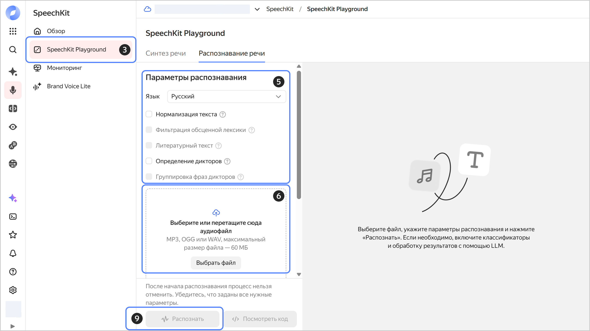

# Распознавание речи с помощью Playground

Чтобы распознать речь из аудиофайла через {{ speechkit-name }} Playground:



- Консоль управления {#console}

  1. В [консоли управления]({{ link-console-main }}) выберите [каталог](../../resource-manager/concepts/resources-hierarchy.md#folder), в котором вы будете работать с сервисом.
  1. [Перейдите](../../console/operations/select-service.md#select-service) в сервис **{{ ui-key.yacloud.iam.folder.dashboard.label_speechkit }}**.
  1. На панели слева выберите  **{{ ui-key.yacloud.speechkit.label_playground }}**.
  1. Перейдите на вкладку **{{ ui-key.yacloud.yagpt.speechkit.services.stt.title }}**.
  1. В блоке **{{ ui-key.yacloud.speechkit.speech-to-text-v2.recognition-params-section_title_1EDuy }}**:
  
     * **{{ ui-key.yacloud.speechkit.speech-to-text.field_language }}** — выберите нужный язык или оставьте значение `{{ ui-key.yacloud.speechkit.speech-to-text.label_language-auto }}`.
     * **{{ ui-key.yacloud.speechkit.speech-to-text.field_text-normalization }}** — представляет даты и время в цифровом формате, преобразовывает числа из словарного в цифровой формат и открывает доступ к дополнительным настройкам.
     * **{{ ui-key.yacloud.speechkit.speech-to-text.field_profanity-filter }}** — маскирует обсценную лексику.
     * **{{ ui-key.yacloud.speechkit.speech-to-text.field_literature-text }}** — добавляет заглавные буквы и знаки пунктуации.
     * **{{ ui-key.yacloud.speechkit.SpeechToTextFormV2.SpeakerLabelingForm.field_speaker-splitting_dqi2d }}** — размечает, какому из дикторов принадлежит каждая распознанная фраза.
     * **{{ ui-key.yacloud.speechkit.SpeechToTextFormV2.SpeakerLabelingForm.field_speaker-grouping_2eSt9 }}** — разделяет фразы на две группы по дикторам.
  
  1. Нажмите **Выбрать файл** или перетащите аудиофайл в зону загрузки.

     
   
     Заранее конвертируйте файл в поддерживаемый [аудиоформат](../formats.md): MP3, WAV или OGG с аудиокодеком OPUS. Максимальный размер файла — 60 МБ.
     
     

  1. **{{ ui-key.yacloud.speechkit.SpeechToTextFormV2.ClassificationField.classification-label_6C7VV }}** — находит в тексте фразы заданной категории, например, приветствие, негатив или мат. Работает только для русского языка.
  1. **{{ ui-key.yacloud.speechkit.SpeechToTextFormV2.SummarizationField.summarization-label_rm8oc }}** — обработка результатов с помощью LLM:
  
     * **Модель** — выберите модель для обработки. [Стоимость](../../ai-studio/pricing.md) обработки зависит от выбранной модели.
     * **{{ ui-key.yacloud.speechkit.SpeechToTextFormV2.InstructionField.label_htJqL }}**:
        * Напишите промпт в поле ввода или выберите готовый.
        * **{{ ui-key.yacloud.speechkit.SpeechToTextFormV2.InstructionField.type-select-label_cLWcs }}** — укажите предпочитаемый формат для результатов распознавания.
        *  **{{ ui-key.yacloud.speechkit.SpeechToTextFormV2.SummarizationField.add-instruction-button_kdko4 }}** — добавьте еще одну инструкцию. Всего можно добавить до пяти инструкций.
  
  1. Нажмите  **{{ ui-key.yacloud.speechkit.speech-to-text-v2.label_button_start-recognition }}**, чтобы распознать речь в аудиофайле.

     Распознавание может занять от нескольких секунд до нескольких минут в зависимости от размера аудиофайла.

  1. Нажмите  **Посмотреть код**, чтобы получить код запроса для Python REST или Python gRPC.

  
  
  {{ speechkit-name }} Playground предоставляет базовые возможности распознавания речи. Более гибкие настройки распознавания доступны только через [API](../stt/index.md).

