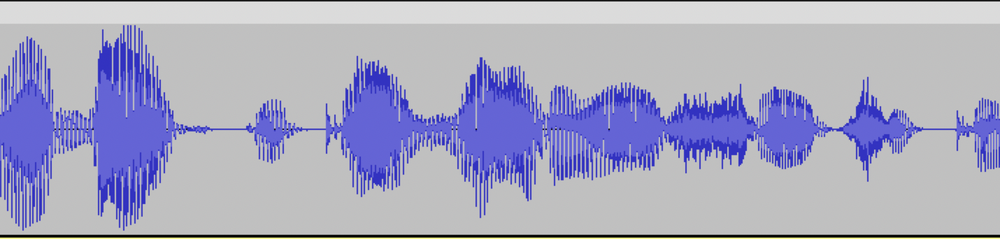

# Подготовка и загрузка данных для {{ brand-voice-core }}

С помощью сервиса [{{ brand-voice-core }}](index.md#ss) можно создать уникальный голос на основе записанных аудио. Голос можно использовать для синтеза речи на основе произвольного текста или [замены переменных в аудиошаблоне](../templates.md). Сервис {{ speechkit-name }} уже поддерживает голоса для русского и казахского языка. Если вы хотите создать голос для другого языка, [свяжитесь с нами](#contact-form) для уточнения деталей.



Чтобы подготовить модель {{ brand-voice-core }} по загруженным данным, требуется до 1 месяца.



## Какие данные нужны для обучения {#results}

Чтобы создать свой голос {{ brand-voice-core }}, необходимо подготовить и загрузить данные для обучения — записи аудио и соответствующие им тексты. Объем данных, необходимых для обучения модели, зависит от целей использования создаваемого голоса и особенностей дикции диктора. Так голос для озвучки художественной литературы потребует больше данных, чем голос для голосового робота. Пришлите нам образцы аудиозаписей голоса без музыки и обработки, чтобы получить конкретные рекомендации для записи и требования к объему данных.

Данные для обучения загружаются двумя файлами:

1. ZIP-архив аудиозаписей в формате WAV.
1. Таблица в формате [TSV](https://ru.wikipedia.org/wiki/TSV) в кодировке UTF-8, содержащей текстовые расшифровки аудиозаписей из архива. Таблица должна состоять из двух колонок:
  * имя файла с аудиозаписью, на которой диктор произносит текст
  * строка, содержащая дословную расшифровку аудиозаписи. Если текст описывает шаблон с переменной, переменная часть должна быть представлена в формате `{variable_name = variable_value}.`

Рекомендуется загружать данные порциями после каждой записи в студии. Если по какой-либо причине это невозможно, вы можете загрузить весь объем аудиоданных в одном архиве с соответствующей таблицей с расшифровками. Формат предоставляемых данных не меняется.



В каждой аудиозаписи должна быть полностью произнесенная фраза из одного или нескольких предложений длительностью не более 15 секунд. Текстовая расшифровка в таблице должна полностью совпадать с текстом на аудиозаписи.



В каждой аудиозаписи в начале и в конце должны присутствовать интервалы тишины, обрезанные звуки и слова недопустимы. Нельзя взять аудиозапись подкаста и нарезать ее на отрезки по 15 секунд: в этом случае границы аудиозаписей будут попадать на середину слова или фразы и не будут соответствовать логическим фразам. Обучить качественную модель на таких данных не получится.

> Пример правильно подготовленной аудиозаписи: в начале и в конце аудио есть несколько миллисекунд тишины, фраза произнесена полностью.

> Пример плохой аудиозаписи: в начале и в конце аудио нет интервалов тишины, начало и конец фразы обрезаны.

Такие аудиозаписи будут иметь искажения и не подойдут для обучения модели. 

### Пример подготовленных данных {#example}

1. _Архив recordings.zip_, содержащий файлы 1.wav, 2.wav, 3.wav..
1. _Таблица в формате TSV_, соотносящая аудиофайлы и их расшифровки:

   Заголовок таблицы приведен для наглядности, в файле для загрузки он должен отсутствовать.

   | recordings | text |
   |---|---|
   | 1.wav | Книги собирают жемчужины человеческой мысли и передают их потомству. |
   | 2.wav | Мы предлагаем вам замечательную книгу! |
   | 3.wav | Книга рекомендована школьникам от пяти лет. |

## Подготовьте данные {#prepare-dataset}

{{ brand-voice-core }} позволяет синтезировать как произвольный текст — _полнотекстовый синтез_, так и фразу на основе предварительно записанного аудиошаблона — _синтез по шаблону_. При синтезе по шаблону помимо текста передается аудиофайл, из которого {{ speechkit-name }} будет копировать конкретные интонации диктора.

Чтобы ваш голос мог работать для двух режимов синтеза, мы рекомендуем:

* Сначала записать аудио и соответствующие им тексты для полнотекстового синтеза: *1.wav Проверяем ваш заказ.* 
* Для поддержки синтеза по шаблонам **дополнительно** нужно будет записать аудио и загрузить соответствующие размеченные тексты с переменными: *1.wav Здравствуйте, {agent_name = Анастасия}! У нас есть уникальное предложение специально для вас. Хотите послушать?*

### Шаблоны для синтеза в {{ brand-voice-core }} {#templates}

Аудиошаблоны стоит использовать, когда нужно добиться особой интонационной выразительности и схожести с человеком.

> Например, диктор записывает аудио:
> *Здравствуйте, это Жанна! Я представляю компанию Интернетометр Один. Вам удобно разговаривать?*
>
> Вам нравится, как звучит эта фраза в исполнении диктора.  При этом использовать непосредственно это аудио не получится, поскольку часть слов должна меняться в зависимости от контекста. Тогда в текстовой расшифровке вы указываете, что часть текста — это переменные:
> *Здравствуйте, это Жанна! Я представляю компанию **{company_name=Интернетометр Один}**. Вам удобно разговаривать?*
>
> Используйте исходное аудио с нужными интонациями и оригинальный текст в качестве шаблона для синтеза, чтобы сохранить интонацию диктора, заменяя переменные части. Например, 
> *Здравствуйте, это Жанна! Я представляю компанию Трубы и трубопроводы. Вам удобно разговаривать?*

Старайтесь записывать аудиошаблоны, максимально приближенные к тому, что вы будете использовать при синтезе. Если на этапе подготовки данных это невозможно, вы сможете прислать их позднее или обучить модель вообще без них, при этому вы сможете использовать синтез по шаблонам. Однако чем раньше вы отдадите шаблоны в модель, тем лучше будет результат.



Исходный аудиошаблон для синтеза голосом {{ brand-voice-core }} должен быть записан тем же диктором, чей голос использовался для создания голоса.



### Тексты для обучения {#texts}

Команда {{ speechkit-name }} может помочь подготовить исходные тексты для обучения, если вы не планируете озвучивать созданным голосом книги, большое количество специальных терминов и перечислений. При этом вам самостоятельно необходимо будет добавить в обучающие тексты 500–1000 фраз, специфичных для вашей области использования. Перед записью вы можете прислать нам подготовленные тексты, чтобы проверить лингвистическое разнообразие обучающих данных. 

Исходные данные для шаблонов необходимо подготовить самостоятельно: только вы знаете, как и для чего будет использоваться создаваемый голос.

Как минимум 30% обучающих данных должны содержать вопросы, чтобы обученный голос мог синтезировать вопросительную интонацию в тексте.

#### Требования ко всем текстам {#text-technical-requirements}



Результат обучения голосовой модели {{ brand-voice-core }} напрямую зависит от обучающих данных. Выполняйте приведенные требования и рекомендации к текстам, чтобы получить качественный голос {{ brand-voice-core }}.



* Тексты в расшифровке должны полностью совпадать с озвученным в аудио.
* Рекомендуемая длина фразы — не более {{ tts-v3-count }}.
* Все фразы должны быть полными, без обрывов на полуслове.
  > "..ть Время! Разве такое ему может понравиться! Если б ты с ним не ссорилась, могла бы просить у него все, что хо." 
  
* Тексты не должны содержать грамматических ошибок.



#### Требования к шаблонам {#pattern-requirements}

* Максимальная длина фразы вместе с переменной частью — {{ tts-v3-count }}.
* Длина переменной части не должна превышать 25% от всей фразы.
* В шаблоне должна быть одна фраза и одна или несколько переменных для замены.
* Переменные должны быть размечены.

   > Фраза для шаблона: `Ваш рейс восьмого сентября по маршруту Москва Санкт-Петербург.`
   > Список переменных: `variable_name = '{date}', variable_value = 'восьмого сентября'`.
   > Размеченный текст шаблона должен выглядеть так: `Ваш рейс {date = 'восьмого сентября'} по маршруту Москва Санкт-Петербург.`
* Имена переменных не должны меняться в рамках одного шаблона.

## Запишите аудиофайлы {#record-audio}

### Общие рекомендации для записи аудио {#audiotips}



### Требования к аудиозаписям {#requirements-audio}

| Требование | Значение |
| --- | --- |
| Частота дискретизации | 48 кГц |
| Глубина аудио (audio bit depth) |  16 бит PCM |
| Количество каналов |  1 (моно) |
| Формат | [WAV](https://ru.wikipedia.org/wiki/WAV) |
| Продолжительность | ≤15 секунд |
| Тишина в начале и в конце | 100–200 миллисекунд |

Сохраните все аудиозаписи в ZIP-архив для загрузки.

## Загрузите данные {#upload}

Текстовые данные и аудиофайлы загружаются через интерфейс [{{ ml-platform-full-name }}](../../../datasphere/index.yaml). Для получения подробной инструкции по загрузке [заполните форму](#contact-form), обратитесь к своему менеджеру или в [техническую поддержку]({{ link-console-support }}).

## Часто задаваемые вопросы {#faq}

#### Можно ли загрузить аудиоданные с другими характеристиками? {#audio-non-standard}

Аудиоданные, не соответствующие [требованиям](#requirements-audio), загрузить нельзя.

#### Где будет доступен голос? {#where-to-get-voice}

В {{ yandex-cloud }} по заранее предоставленному `voice_id`. Голос может быть предоставлен в формате решения {{ sk-hybrid-name }}.
