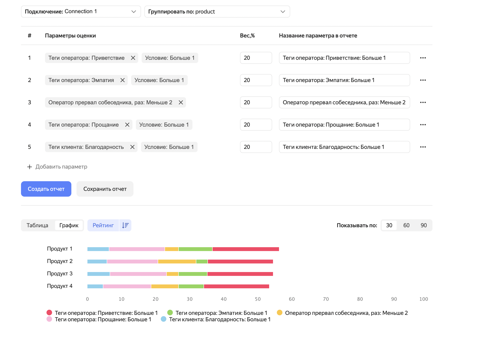

# Отчеты в {{ speechsense-name }}

С помощью отчетов в {{ speechsense-name }} вы можете проанализировать работу операторов и оценить ее качество. Отчеты строятся на основе [загруженных в сервис записей разговоров](../operations/data/upload-data.md), где операторы общаются с клиентами. Примеры данных, которые можно получить с помощью отчетов:

* как операторы работают в рамках различных продуктов;
* как часто операторы общаются с клиентами неформально;
* как часто затягивается пауза в разговоре;
* как часто поступает негативная обратная связь от клиентов во время разговора;
* как часто встречаются нарушения в разговорах, выбранные в отчете.

## Как формируется отчет {#form}

Отчет создается на основе настроек:

* [Параметры](#parameters) — определяют список критериев для оценки работы оператора.
* [Вес](#weight) — показывает, насколько параметр критичен для оценки работы.
* [Фильтры](#filters) — применяются к диалогам в отчете.

После того как вы задали основные настройки, можно [построить отчет](../operations/data/manage-reports.md). Он показывает значения параметров в виде [графика и таблицы](#display). Пример:

Значение каждого параметра в отчете рассчитывается по формуле:

$value = criterion / filters * weight$

Где:

* `value` — значение параметра.
* `criterion` — количество отфильтрованных диалогов, для которых условие в параметре выполнилось.
* `filters` — количество всех отфильтрованных диалогов.
* `weight` — вес параметра в процентах.

> Пример. Даны исходные данные:
>
> * Выставлен параметр **Теги клиента: Благодарность**. Для него задано условие, что клиент поблагодарил оператора минимум три раза в течение разговора.
> * Вес параметра — 60%.
> * Количество отфильтрованных диалогов, в которых клиент поблагодарил оператора от трех раз, — семь.
> * Количество всех отфильтрованных диалогов — четырнадцать.
>
> В результате в построенном отчете для параметра отображается значение:
>
> $7 / 14 * 60 = 30$

### Параметры оценки {#parameters}

_Параметры оценки_ — это критерии, по которым вы можете оценить работу операторов. Для каждого параметра задается значение или диапазон значений. Сервис {{ speechsense-name }} анализирует диалог оператора и клиента на наличие указанных в отчете параметров. Если диалог попадает под критерий, указанный в параметре, данные об этом диалоге добавляются в отчет.

> Например, в отчете выставлен параметр **Оператор прервал собеседника, раз**. Для него указан диапазон значений от двух раз. {{ speechsense-name }} анализирует запись разговора и определяет, сколько раз оператор перебил клиента. Если оператор перебил минимум два раза, информация об этом отображается в отчете.

Параметры делятся на четыре типа:

* **Оператор** — критерии качества работы оператора. Например, какая скорость речи у оператора, прерывал ли он клиента.

* **Клиент** — особенности поведения клиента во время разговора. Например, какая скорость речи у клиента, прерывал ли он оператора.

* **Общие метаданные** — данные о записанном разговоре, которые были собраны с помощью АТС. Метаданные загружаются в {{ speechsense-name }} вместе с записью разговора и содержат его основные характеристики. Например, имя оператора, имя клиента, дата звонка, язык, на котором велся диалог.

* **Теги клиента** и **Теги оператора** — классификаторы, которые применяются к результатам распознавания разговора. {{ speechsense-name }} определяет, что в разговоре встретились определенные ключевые слова, фразы или интонации, классифицирует разговор и добавляет к нему тег. В {{ speechsense-name }} есть предустановленный набор тегов. Например, с их помощью можно определить, было ли в разговоре неформальное приветствие или прощание, поблагодарил ли оператор клиента за ожидание, обращается ли клиент в службу поддержки повторно.

### Вес параметра {#weight}

_Вес параметра_ — это настройка, которая показывает, насколько параметр критичен в оценке работы оператора. Вы выставляете вес в процентах для каждого параметра. В сумме вес всех параметров должен быть равен 100%. Вес влияет на [формулу](#form), по которой рассчитывается значение каждого параметра.

> Например, в отчете выставлены два параметра: **Скорость речи оператора** и **Скорость речи клиента**. Оператор и клиент разговаривали с одинаковой скоростью, но вес у первого параметра — 70%, а у второго — 30%. Тогда в отчете отображается большее значение для параметра **Скорость речи оператора**.

Вы можете выставлять различный вес для нескольких параметров с одинаковым названием, но различными значениями. Например, добавлено два параметра **Доля тишины в диалоге** с диапазонами от `0,1` до `0,3` и от `0,3`. Каждому из диапазонов можно выставить различный вес. Граничное значение `0,3` попадает в оба диапазона и отображается в отчете по обоим параметрам.

### Фильтрация в отчете {#filters}

С помощью фильтрации вы можете отобрать нужные диалоги для отчета. Чтобы их отфильтровать, используются настройки:

* **Фильтры** — для них используется такой же набор полей, что и для параметров.

* **Подключение** — в него загружаются записи диалогов. Если у вас несколько подключений и в каждом из них различные записи, вы можете выбрать подключение с нужным набором записей.

* **Группировка** — вы выбираете, по какому принципу группируются данные в отчете. Группировать можно только по полям метаданных.

В результате вы получите различные срезы данных. Например, можно:

* указать период, за который надо проанализировать диалоги;
* сгруппировать данные по операторам, чтобы изучить качество работы каждого оператора;
* сгруппировать данные по продуктам, чтобы узнать, в разговорах о каких продуктах операторы совершают меньше ошибок.

Срезы данных зависят от метаданных записей. Например, если вы хотите отфильтровать или сгруппировать данные по продуктам, соответствующее поле должно быть в [файле метаданных](../quickstart.md#set-space). Если вам нужен новый набор метаданных, подготовьте записи диалогов с нужными метаданными и [загрузите эти записи](../operations/data/upload-data.md).

## Отображение данных в отчете и взаимодействие с ними {#display}

Отчет показывает количественные характеристики работы операторов. Он доступен только в веб-интерфейсе {{ speechsense-name }} в виде графика и таблицы:

* **График** позволяет визуально оценить, какие операторы по каким продуктам совершают меньше ошибок.

   Если вы хотите получить детали по какому-либо параметру, [перейдите из графика к списку диалогов](../operations/data/manage-reports.md#go-to-a-dialog). Так можно проанализировать ошибку, которая отобразилась в отчете.

* **Таблица** показывает численные значения параметров. Для каждого из этих параметров отображаются два числа:

   * количество диалогов, которые удовлетворяют заданному параметру;
   * процент этих диалогов от всех отфильтрованных диалогов.

   
   Пример таблицы:

   

Подписи к параметрам на графике и названия столбцов в таблице соответствуют значению поля **Название параметра в отчете**.
