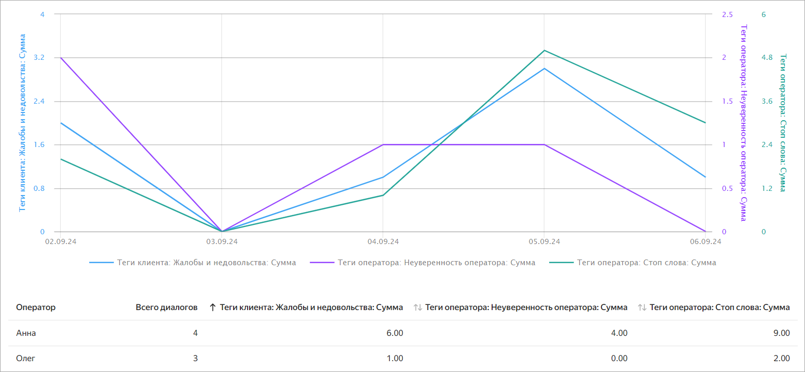

# Отчет «Сравнение» в {{ speechsense-name }}

Отчет **{{ ui-key.yc-ui-talkanalytics.reports.comparison-key-value }}** позволяет вывести на одном графике несколько параметров и посмотреть их взаимосвязь. Например, можно построить отчет, который покажет, как недостатки в речи оператора (неуверенность, невнятность, молчание) влияют на отказ от предлагаемых услуги или товара. Для такого отчета в качестве параметров можно использовать системные теги: `Отказ от покупки`, `Неуверенность оператора`, `Стоп слова`, `Слова-паразиты` и другие.

## Как формируется отчет {#form}

Отчет **{{ ui-key.yc-ui-talkanalytics.reports.comparison-key-value }}** создается на основе настроек:

* [параметры оценки](#parameter) — изменение их значений отображается в отчете;
* [фильтры](#filters) — применяются к диалогам в отчете.

После того как вы задали настройки, можно [построить отчет](../../operations/data/manage-reports.md#build-a-comparison-report). Он показывает значения нескольких параметров оценки в виде [графика и таблицы](#display). Пример:

### Параметры оценки {#parameter}

_Параметры оценки_ — это параметры, изменение значений которых можно посмотреть в отчете. Учитываются только численные параметры. Если выбрать [тег](../tags.md), в качестве его значения используется число раз, когда тег был назначен на диалоги.

В отчете считается суммарное, среднее, минимальное или максимальное значение параметра оценки за выбранный период. Например, такие значения могут быть полезны в следующих случаях:

* сумма — сколько всего раз клиент просил вызвать начальство во время разговора;
* среднее — средняя продолжительность диалога в секундах;
* минимум или максимум — у кого из операторов меньше или больше всего нарушений.

В отчете можно выбрать параметры оценки одного из следующих типов:



### Фильтрация в отчете {#filters}



## Отображение данных в отчете и взаимодействие с ними {#display}

Отчет показывает количественные характеристики работы операторов. Он доступен в веб-интерфейсе {{ speechsense-name }} в виде графика и таблицы, также отчет можно скачать в формате CSV.

Форматы, в которых доступен отчет **{{ ui-key.yc-ui-talkanalytics.reports.comparison-key-value }}**:

* **{{ ui-key.yc-ui-talkanalytics.reports.barchart }}** — позволяет визуально оценить, какие значения принимают параметры оценки в разные моменты времени и как они зависят друг от друга. Для каждого параметра выводится своя шкала измерений. Чтобы детальнее изучить значения отдельного параметра, можно на легенде нажать на него — на графике отобразится только этот параметр. Повторное нажатие на легенду вернет все параметры на график.

    Помимо периода, за который строится отчет, на графике также настраивается масштаб детализации данных. В результате можно получить значения за разные интервалы: от часа до квартала.

* **{{ ui-key.yc-ui-talkanalytics.reports.table-key-value }}** — показывает численное значение параметра оценки за указанный период. Значения разбиты в соответствии с настроенной группировкой данных.
* **CSV-файл** — содержит такую же таблицу, как в веб-интерфейсе {{ speechsense-name }}. Используйте формат CSV, чтобы сохранить отчет локально.
