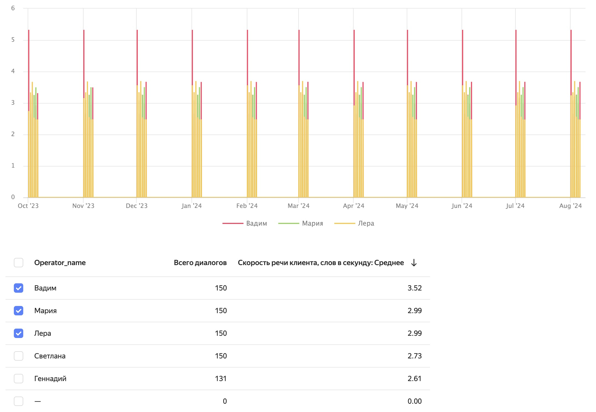

# Отчет «Детализация» в {{ speechsense-name }}

В отчете **Детализация** видно, как меняются значения параметра оценки во времени для каждого среза данных. Например, можно построить отчет по средней длительности диалогов, сгруппировать ее значения по подразделениям и указать период год. В результате отчет покажет, как менялась средняя длительность диалогов в течение года для каждого подразделения.

## Как формируется отчет {#form}

Отчет **Детализация** создается на основе настроек:

* [параметр оценки](#parameter) — изменение его значений отображается в отчете;
* [фильтры](#filters) — применяются к диалогам в отчете.

После того как вы задали настройки, можно [построить отчет](../../operations/data/manage-reports.md#build-a-details-report). Он показывает значения параметра оценки по нескольким срезам данных в виде [графика и таблицы](#display). Пример:

### Параметр оценки {#parameter}

_Параметр оценки_ — это параметр, изменение значений которого можно посмотреть в отчете. Учитываются только численные параметры. Если выбрать [тег](../tags.md), в качестве его значения используется число раз, когда тег был назначен на диалоги.

В отчете считается суммарное, среднее, минимальное или максимальное значение параметра оценки за выбранный период. Например, такие значения могут быть полезны в следующих случаях:

* сумма — сколько всего раз клиент просил вызвать начальство во время разговора;
* среднее — средняя продолжительность диалога;
* минимум или максимум — у кого из операторов меньше или больше всего нарушений.

В отчете можно выбрать параметр оценки одного из следующих типов:



### Фильтрация в отчете {#filters}



## Отображение данных в отчете и взаимодействие с ними {#display}

Отчет показывает количественные характеристики работы операторов. Он доступен в веб-интерфейсе {{ speechsense-name }} в виде графика и таблицы, также отчет можно скачать в формате CSV.

Форматы, в которых доступен отчет **Детализация**:

* **График** — позволяет визуально оценить, какие значения принимает параметр оценки в разные моменты времени. Помимо периода, за который строится отчет, на графике также настраивается масштаб детализации данных. В результате можно получить значения за разные интервалы: от часа до квартала.
* **Таблица** — показывает численное значение параметра оценки за указанный период. Значения разбиты в соответствии с настроенной группировкой данных.
* **CSV-файл** — содержит такую же таблицу, как в веб-интерфейсе {{ speechsense-name }}. Используйте формат CSV, чтобы сохранить отчет локально.
