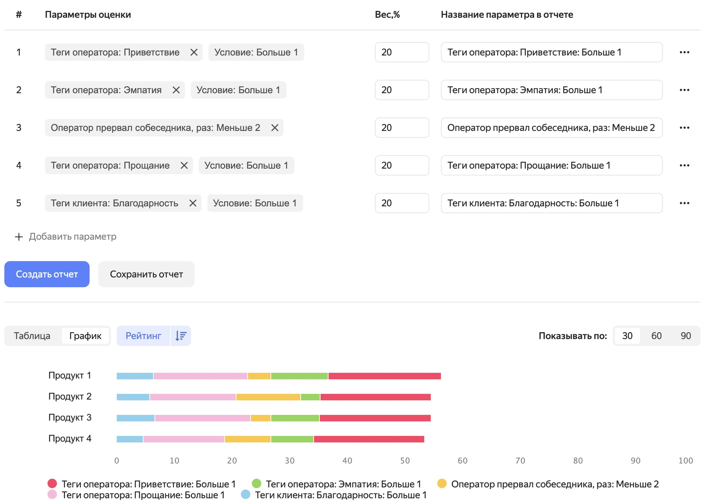
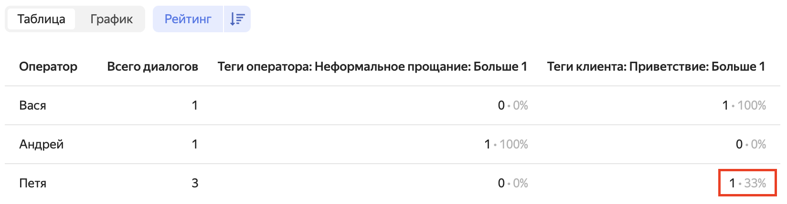

# Отчет «Форма оценки» в {{ speechsense-name }}

С помощью отчета **Форма оценки** в {{ speechsense-name }} вы можете проанализировать работу операторов и оценить ее качество. Отчеты строятся на основе загруженных в сервис [записей разговоров](../../operations/data/upload-data.md) или [текстовых сообщений из чатов](../../operations/data/upload-chat-text.md), где операторы общаются с клиентами. Примеры данных, которые можно получить с помощью отчетов:

* как операторы работают в рамках различных продуктов;
* как часто операторы общаются с клиентами неформально;
* как часто поступает негативная обратная связь от клиентов во время диалога;
* как часто в диалогах встречаются нарушения, выбранные в отчете.

## Как формируется отчет {#form}

Отчет **Форма оценки** создается на основе настроек:

* [Параметры оценки](#parameters) — определяют список критериев для оценки работы оператора.
* [Вес](#weight) — показывает, насколько параметр оценки критичен для оценки работы.
* [Фильтры](#filters) — применяются к диалогам в отчете.

После того как вы задали основные настройки, можно [построить отчет](../../operations/data/manage-reports.md#build-an-evaluation-form). Он показывает значения параметров оценки в виде [графика и таблицы](#display). Пример:

Значение каждого параметра оценки в отчете рассчитывается по формуле:

$value = criterion / filters * weight$

Где:

* `value` — значение параметра оценки.
* `criterion` — количество отфильтрованных диалогов, для которых условие в параметре оценки выполнилось.
* `filters` — количество всех отфильтрованных диалогов.
* `weight` — вес параметра оценки в процентах.

> Пример. Даны исходные данные:
>
> * Выставлен параметр оценки **Теги клиента: Благодарность**. Для него задано условие, что клиент поблагодарил оператора минимум три раза в течение разговора.
> * Вес параметра — 60%.
> * Количество отфильтрованных диалогов, в которых клиент поблагодарил оператора от трех раз, — семь.
> * Количество всех отфильтрованных диалогов — четырнадцать.
>
> В результате в построенном отчете для параметра оценки отображается значение:
>
> $7 / 14 * 60 = 30$

### Параметры оценки {#parameters}

_Параметры оценки_ — это критерии, по которым вы можете оценить работу операторов. Для каждого параметра оценки задается значение или диапазон значений. Сервис {{ speechsense-name }} анализирует диалог оператора и клиента на наличие указанных в отчете параметров. Если диалог попадает под критерий, указанный в параметре оценки, данные об этом диалоге добавляются в отчет.

> Например, в отчете выставлен параметр оценки **Оператор прервал собеседника, раз**. Для него указан диапазон значений от двух раз. {{ speechsense-name }} анализирует запись разговора и определяет, сколько раз оператор перебил клиента. Если оператор перебил минимум два раза, информация об этом отображается в отчете.

Параметры оценки делятся на несколько типов:



### Вес параметра оценки {#weight}

_Вес параметра оценки_ — это настройка, которая показывает, насколько параметр оценки критичен в оценке работы оператора. Вы выставляете вес в процентах для каждого параметра. В сумме вес всех параметров оценки должен быть равен 100%. Вес влияет на значение каждого параметра оценки, рассчитанное по [формуле](#form).

> Например, в отчете выставлены два параметра оценки: **Скорость речи оператора** и **Скорость речи клиента**. Оператор и клиент разговаривали с одинаковой скоростью, но вес у первого параметра — 70%, а у второго — 30%. Тогда в отчете отображается большее значение для параметра **Скорость речи оператора**.

Вы можете выставлять различный вес для нескольких параметров оценки с одинаковым названием, но различными значениями. Например, добавлено два параметра оценки **Доля тишины в диалоге** с диапазонами от `0,1` до `0,3` и от `0,3`. Каждому из диапазонов можно выставить различный вес. Граничное значение `0,3` попадает в оба диапазона и отображается в отчете по обоим параметрам.

### Фильтрация в отчете {#filters}



## Отображение данных в отчете и взаимодействие с ними {#display}

Отчет показывает количественные характеристики работы операторов. Он доступен в веб-интерфейсе {{ speechsense-name }} в виде графика и таблицы, также отчет можно скачать в формате CSV.

Форматы, в которых доступен отчет **Форма оценки**:

* **График** — позволяет визуально оценить, какие операторы по каким продуктам совершают меньше ошибок.

   Если вы хотите получить детали по какому-либо параметру оценки, [перейдите из графика к списку диалогов](../../operations/data/manage-reports.md#go-to-a-dialog). Так можно проанализировать ошибку, которая отобразилась в отчете.

* **Таблица** — показывает численные значения параметров оценки. Для каждого из этих параметров оценки отображаются два числа:

   * количество диалогов, которые удовлетворяют заданному параметру оценки;
   * процент этих диалогов от всех отфильтрованных диалогов.

   
   Пример таблицы:

   

* **CSV-файл** — содержит такую же таблицу, как в веб-интерфейсе {{ speechsense-name }}. Используйте формат CSV, чтобы сохранить отчет локально.

Подписи к параметрам оценки на графике и названия столбцов в таблице и CSV-файле соответствуют значению поля **Название параметра в отчете**.
