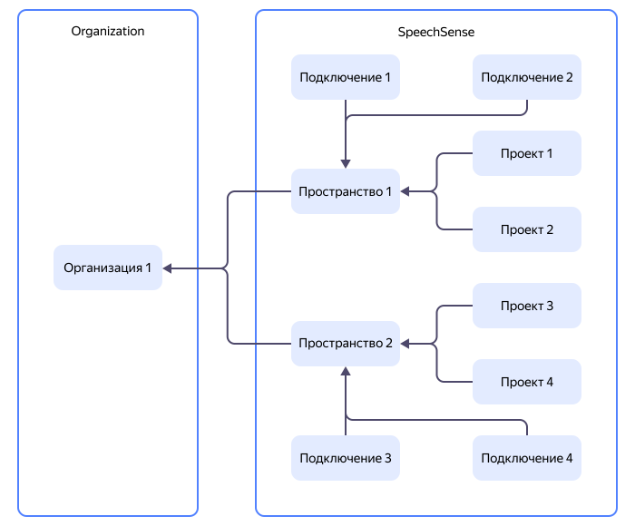

# Иерархия ресурсов {{ speechsense-name }}

Для организации работы с диалогами в {{ speechsense-name }} используются пространства, подключения и проекты. Иерархия ресурсов в {{ speechsense-name }} представлена на диаграмме:

Каждый проект и подключение принадлежат одному пространству. Не существует проектов и подключений вне пространства.

Пространства принадлежат организациям, при этом организации не взаимодействуют друг с другом. Ресурсы одной организации не могут взаимодействовать с ресурсами другой. Организациями управляет сервис [{{ org-full-name }}](../../organization/index.yaml).

[Настроить доступ](#access-rights-inheritance) в {{ speechsense-name }} можно на уровне пространства или проекта. По умолчанию новый участник организации не имеет доступа к ресурсам внутри организации. Права доступа ему выдаются явно.

## Ресурсы {{ speechsense-name }} {#resources}

### Пространство {#space}

_Пространство_ — это изолированная сущность {{ speechsense-name }}, в рамках которой создаются подключения и проекты. В [иерархии ресурсов](../../overview/roles-and-resources.md) {{ yandex-cloud }} пространства {{ speechsense-name }} находятся на одном уровне с [сообществами {{ ml-platform-name }}](../../datasphere/concepts/community.md) и [облаками](../../resource-manager/concepts/resources-hierarchy.md#cloud).

К каждому пространству [привязывается платежный аккаунт](../operations/space/link-ba.md). Вы можете использовать один аккаунт для [оплаты ресурсов](../pricing.md) в нескольких пространствах или к каждому пространству привязать отдельный аккаунт.

### Подключение {#connection}

_Подключение_ — это сущность {{ speechsense-name }}, которая содержит:

* [Загруженные записи разговоров](../operations/data/upload-data.md).
* Тип каждой записи: аудио или текстовые сообщения.
* Метаданные записей, полученные из АТС, CRM-систем или других источников.

   Метаданные представляют такие параметры, как имена и идентификаторы оператора и клиента, дату разговора, язык, на котором велся разговор. По метаданным можно проанализировать [отдельный диалог](dialogs.md) или группу диалогов с помощью [отчетов](reports.md).

Если несколько групп диалогов отличаются набором метаданных или типом записи, для каждой группы можно создать отдельное подключение.

### Проект {#project}

_Проект_ — это изолированная сущность {{ speechsense-name }}, в рамках которой ведется работа с диалогами. Например, в проекте можно [посмотреть диалог](../operations/data/manage-dialogs.md#view-dialog) или [построить отчет](../operations/data/manage-reports.md#build-a-report). В иерархии ресурсов {{ yandex-cloud }} проекты {{ speechsense-name }} находятся на одном уровне с [проектами {{ ml-platform-name }}](../../datasphere/concepts/project) и [каталогами](../../resource-manager/concepts/resources-hierarchy.md#folder).

Проект можно рассматривать как срез данных, загруженных в подключение. При [создании проекта](../operations/project/create.md) вы выбираете подключение и настраиваете [фильтры для диалогов](dialogs.md#filters). В результате в проект попадают отфильтрованные диалоги из подключения.

Используйте несколько проектов для группировки диалогов. Например, можно выделить отдельный проект для каждого клиента или продукта вашей компании.

## Наследование прав доступа {#access-rights-inheritance}

Когда пользователь выполняет какую-либо операцию в {{ speechsense-name }}, сервис [{{ iam-full-name }}](../../iam/index.yaml) проверяет права доступа пользователя. Эти права наследуются:

* Права на организацию распространяются на ресурсы организации, в том числе пространства, подключения и проекты.
* Права на пространство распространяются на все подключения и проекты внутри пространства.
* Права на проект распространяются на все диалоги и отчеты внутри проекта.

На подключения не выдаются права доступа. Для работы с подключениями применяются права на пространство. Подробнее о ролях, которые действуют в сервисе, см. в разделе [{#T}](../security/index.md).

> **Примеры**:
>
> * Если пользователю выдать роль `speech-sense.spaces.creator` на уровне организации, он сможет создать пространство.
> * Если пользователю выдать роль `speech-sense.viewer` (`{{ roles-speechsense-viewer }}` в {{ speechsense-name }}) на уровне пространства, он сможет просматривать данные пространства, а также вложенных в него подключений и проектов.
> * Если пользователю выдать роль `speech-sense.admin` (`{{ roles-speechsense-admin }}` в {{ speechsense-name }}) на уровне проекта, пользователь сможет выполнять любые действия только в рамках этого проекта.

У пользователя не будет доступа к пространству, если не предоставить права на уровне пространства или организации.
