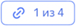

# Просмотр связанных диалогов

Из [связанного диалога](../../concepts/dialogs.md#related-dialogs) вы можете перейти на страницу связанных диалогов и посмотреть информацию о каждом из них. Со страницы связанных диалогов вы можете вернуться к просмотру отдельного диалога.

## Перейти к связанным диалогам {#list}

1. Откройте [главную страницу]({{ link-speechsense-main }}) {{ speechsense-name }}.
1. Перейдите в нужное пространство, затем выберите нужный проект.
1. На вкладке **Диалоги** [найдите](manage-dialogs.md#filters-dialogs) нужный диалог.
1. Перейдите к связанным диалогам одним из способов:

    * В списке диалогов нажмите на ссылку в поле с номером задачи.

        Если у диалога есть связанные диалоги, то откроется страница связанных диалогов. Если у диалога нет связанных диалогов, то откроется страница просмотра одного диалога.

    * [Перейдите](manage-dialogs.md#view-dialog) в диалог и справа от его заголовка нажмите кнопку вида .

        Если такая кнопка отсутствует, значит, для открытого диалога нет связанных диалогов.

## Посмотреть информацию о связанном диалоге {#view}

1. Перейдите к связанным диалогам.
1. Чтобы посмотреть метаданные о нужном диалоге (например, дату начала или направление диалога), нажмите на блок **Общие метаданные**.
1. Чтобы посмотреть метаданные клиента, оператора или бота, нажмите на нужный блок.
1. Чтобы посмотреть информацию по диалогу, выберите нужный.

    Внутри одного диалога доступны поиск по тексту и просмотр тегов диалога.

1. Чтобы посмотреть семантический анализ диалога, перейдите на вкладку **Анализ от {{ yagpt-name }}**.

## Перейти к просмотру отдельного диалога

Чтобы со страницы связанных диалогов перейти к просмотру отдельного диалога, нажмите кнопку  для нужного диалога на вкладках **Диалоги** или **Анализ от {{ yagpt-name }}**.
