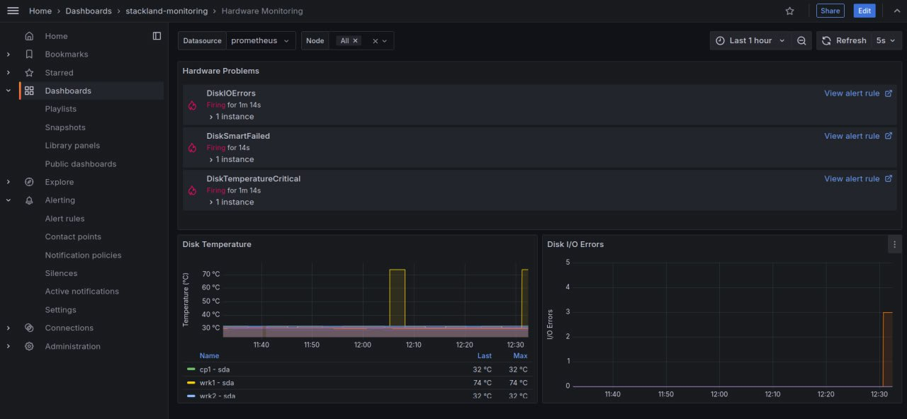

# Мониторинг оборудования

Некоторые ошибки системы могут быть связаны не с ошибками Kubernetes или других составляющих, а с отказом физического оборудования. Для мониторинга таких отказов {{ stackland-name }} предлагает готовое решение, которое собирает данные из различных источников: логов ядра, файловой системы sysfs, [SMART](https://github.com/Seagate/openSeaChest/wiki/Drive-Health-and-SMART)-данных дисков и других.

На этой странице вы узнаете, где можно просмотреть уведомления о состоянии оборудования и основные графики, а также получите информацию о том, при каких условиях срабатывают уведомления.

## Дашборд Grafana {#dashboard-grafana}

Мониторинг оборудования доступен на специальном дашборде:

Чтобы открыть дашборд с метриками мониторинга оборудования, перейдите по ссылке `grafana.sys.{{ cluster-domain }}` и откройте **Dashbords > stackland-monitoring > Hardware Monitoring**.

На дашборде в первом блоке возникают предупреждения о состоянии оборудования. Например, первое предупреждение на скриншоте — **DiskIOErrors**. Эта проверка отслеживает ошибки, возникающие при операциях чтения и записи данных на диск. Больше проверок можно увидеть [ниже](#list-of-checks-with-notifications).

На двух графиках дашборда можно наблюдать за температурой диска — график **Disk Temperature**, и за ошибками ввода-вывода — график **Disk I/O Errors**.

## Список проверок с уведомлениями {#list-of-checks-with-notifications}

На дашборде появляются уведомления, которые сообщают о результатах проверок:

#|
|| **Название проверки** | **Описание** | **Как это работает** ||
|| **DiskMissing** | Диск отсутствует |
Система сканирует доступные устройства хранения. Если ранее доступный диск не определяется системой, регистрируется ошибка DiskMissing.
||
|| **DiskIOErrors** | Ошибки чтения/записи на диске |
Во время операций чтения/записи система и дисковый контроллер обмениваются данными. Если возникают проблемы с чтением или записью, регистрируется ошибка DiskIOErrors.
||
|| **DiskSmartFailed** | Cбой SMART на диске |
Если один из атрибутов SMART достигает порогового значения, установленного производителем диска, регистрируется ошибка DiskSmartFailed.
||
|| **DiskSmartUnavailable** | Cбой SMART на диске |
Если технология SMART на диске не работает, и он больше не отправляет данных о состоянии оборудования, то регистрируется ошибка DiskSmartUnavailable.
||
|| **DiskConnection** | Проблемы с подключением |
Атрибут 199 в SMART показывает количество исправленных ошибок при передаче данных по SATA-шине. Его рост может указывать на проблемы с кабелем, подключением, контроллером или диском. Если значение атрибута выросло, регистрируется ошибка подключения DiskConnection.
||
|| **DiskTemperatureCritical** | Высокая температура диска |
Диски с поддержкой SMART отслеживают свою температуру и передают эти данные в систему. Если температура близка к максимальному предусмотренному значению, то регистрируется ошибка DiskTemperatureCritical.
||
|#
