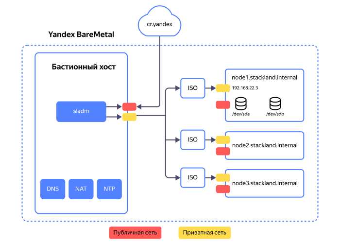
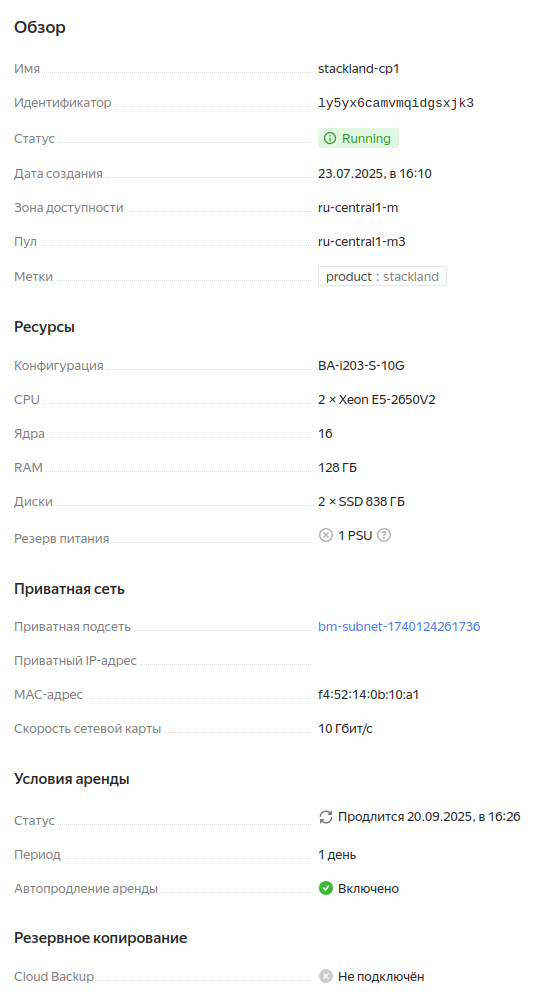
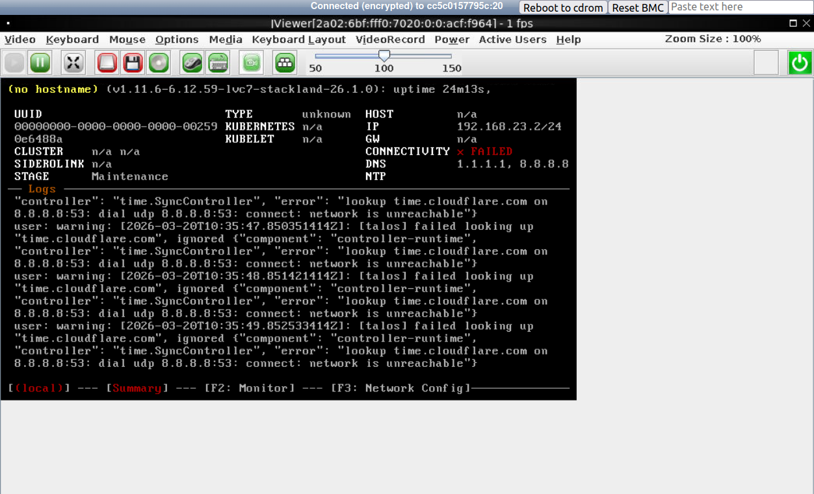

# Установка {{ stackland-name }} на {{ baremetal-full-name }}

[{{ baremetal-full-name }}](https://yandex.cloud/ru/services/baremetal) — это сервис по аренде выделенных физических серверов, все ресурсы которых доступны для решения только ваших задач. {{ stackland-full-name }} поддерживает {{ baremetal-full-name }} как одно из окружений для развертывания.

В данном руководстве вы узнаете, как арендовать сервера {{ baremetal-full-name }} и подготовить их к развертыванию {{ stackland-name }}, как подготовить конфигурационный файл для установки {{ stackland-name }} на арендованные сервера. Прочитать, как развернуть кластер {{ stackland-full-name }} на уже подготовленной инфраструктуре, можно в [Руководстве по установке](../quickstart.md).

Для настройки окружения в данном руководстве используется [Консоль управления Yandex Cloud](http://console.yandex.cloud). Чтобы воспользоваться другим интерфейсом {{ baremetal-full-name }}, обратитесь к [документации сервисa](https://yandex.cloud/ru/services/baremetal).

## Введение {#introduction}

Для развертывания {{ stackland-name }} потребуется минимум четыре сервера:

* Один бастион (также называемый jump host), с которого производится развертывание и последующее взаимодействие с кластером {{ stackland-name }}.

* Три сервера для будущего кластера {{ stackland-name }}, подключенные к одной приватной сети. Три сервера с ролью `combined` — это минимальная конфигурация {{ stackland-name }}.

Конфигурацию серверов лучше выбирать исходя из предполагаемых нагрузок для будущего кластера. Рекомендуемое количество ресурсов для кластера можно найти в [Руководстве по установке](../quickstart.md#infrastructure).

Общая схема инсталляции приведена ниже:



## Шаг 1. Создайте приватную подсеть {#create-private-subnet}

Для успешного развертывания все сервера должны находиться в одной приватной сети. Чтобы автоматически назначать IP-адреса серверам кластера, в этой сети удобно использовать DHCP.

Создайте приватную подсеть с DHCP-сервером:

1. Откройте форму создания приватной сети в сервисе {{ baremetal-full-name }} и активируйте переключатель **IP-адресация и маршрутизация**. Открыть форму можно по инструкции [Создать приватную подсеть](https://yandex.cloud/ru/docs/baremetal/operations/subnet-create).

1. В поле **Виртуальный сетевой сегмент (VRF)** нажмите кнопку **Создать**.

1. В открывшемся окне **Создание виртуального сетевого сегмента** нажмите кнопку **Создать VRF**.

1. Укажите CIDR для создаваемой подсети. Он может быть любым из диапазона [RFC1918](https://datatracker.ietf.org/doc/html/rfc1918), также рекомендуется использовать маску `/24`. Например, в поле CIDR можно указать `192.168.22.0/24`.

1. Укажите первый адрес из выбранного CIDR (т.е. `192.168.22.1`) в качестве шлюза по умолчанию.

1. Активируйте опцию **Назначение IP-адресов по DHCP**.

1. Укажите диапазон для IP-адресов, например `192.168.22.2` — `192.168.22.120`. Диапазон должен быть достаточно широким, чтобы вместить все узлы будущего кластера {{ stackland-name }} и еще один хост.



IP-адреса, назначенные серверам по DHCP, могут изменяться. Описание работы DHCP см. в [документации сервиса {{ baremetal-full-name }}](https://yandex.cloud/ru/docs/baremetal/concepts/dhcp#dhcp-private).

Перед началом установки лучше проверить, что адреса, назначенные серверам по DHCP, актуальны и совпадают с адресами, указанными в DNS-конфигурации на Шаге 5.



## Шаг 2. Аренда серверов {#lease-servers}

1. Арендуйте сервер для бастиона, как описано в [документации](https://yandex.cloud/ru/docs/baremetal/operations/servers/server-lease).

    В настройках:

      * Можно выбрать минимальную готовую конфигурацию для сервера, если она подходит под ваши задачи.
      * В качестве операционной системы выберите Ubuntu 24.04.
      * В поле **Приватная подсеть** выберите созданную на первом шаге подсеть.
      * Выделите бастиону **Публичный адрес** / **Из эфемерной подсети**, чтобы предоставить ему доступ в Интернет.
      * Задайте пароль для пользователя `root` и добавьте свой SSH-ключ.

    После создания бастиона запишите **Публичный IP-адрес** и **Приватный IP-адрес** бастиона — они потребуются вам в дальнейшем.

    В качестве бастиона можно использовать виртуальную машину, запущенную в Yandex Cloud. Настроить сетевую связность между виртуальной машиной и серверами {{ baremetal-name }} можно с помощью [инструкции в официальной документации](https://yandex.cloud/ru/docs/baremetal/tutorials/bm-vrf-and-vpc-interconnect).

    

    Установление приватного соединения между кластером {{ baremetal-name }} и облачными сетями может занять до 24 часов.

    

1. Арендуйте не менее трех серверов для будущего кластера {{ stackland-name }}.

    В настройках:

      * Выберите опцию **Без операционной системы**, поскольку {{ stackland-name }} поставляется со своей собственной ОС.
      * В поле **Приватная подсеть** выберите созданную на первом шаге подсеть.
      * Выберите опцию **Без адреса** для публичного адреса — все взаимодействия с кластером {{ stackland-name }} будет происходить через бастион.


Дождитесь, пока серверы будут арендованы. Далее, откройте поочередно вкладку **Обзор** каждого из серверов будущего кластера {{ stackland-name }} и запишите MAC-адрес, указанный в поле **Приватная сеть** / **MAC-адрес**:



Эта информация потребуется на шаге 6.

## Шаг 3. Настройка бастиона {#configure-bastion}

Бастион решает три основных задачи:

* Обеспечивает доступ к кластеру {{ stackland-name }} из внешних сетей, например, интернета или сети вашей организации;
* Обеспечивает доступ узлов кластера {{ stackland-name }} в интернет;
* Служит для размещения инфраструктурных сервисов, необходимых для функционирования {{ stackland-name }}, например, DNS и NTP. При развертывании в периметре компании эти сервисы предоставляются ее ИТ-инфраструктурой.

Перед началом настройки зайдите на бастион через SSH с помощью публичного IP-адреса, увеличенного на единицу.

### 3.1 Настройка сетевых доступов {#net-settings}

Для обеспечения внешнего доступа к кластеру {{ stackland-name }} рекомендуется установить VPN-сервер, например, [OpenVPN](http://www.openvpn.net) или [Wireguard](https://www.wireguard.com). Чтобы подключиться к виртуальной сети, можно адаптировать и применить инструкцию из документации [Yandex Cloud VPC](https://yandex.cloud/ru/docs/vpc/tutorials/openvpn).

После установки и настройки VPN-сервера следует настроить IPv4-маршрутизацию и NAT, поскольку бастион будет выполнять роль роутера для подключающихся по VPN-клиентов. Ряд VPN-серверов делает это автоматически. При необходимости настройте маршрутизацию на бастионе самостоятельно:

1. Установите `ufw`: `sudo apt install ufw`.

1. Включите IPv4-маршрутизацию: раскомментируйте строку `net.ipv4.ip_forward=1` в `/etc/sysctl.conf` и примените изменения командой `sudo sysctl -p`.

1. Отредактируйте `/etc/default/ufw` и измените `DEFAULT_FORWARD_POLICY` на `ACCEPT`.

1. Создайте файл `/etc/ufw/before.rules` следующего содержания:

    ```
    *nat
    :POSTROUTING ACCEPT [0:0]
    -A POSTROUTING -s <CIDR подсети, из которой выделяются адреса клиентов VPN> -j MASQUERADE
    -A POSTROUTING -s <CIDR приватной подсети, созданной на этапе 1> -j MASQUERADE
    COMMIT
    ```

    Первое правило с `-A POSTROUTING` в этом файле обеспечивает NAT-трансляцию для VPN-клиентов, второе отвечает за NAT-трансляцию для узлов кластера, выходящих в Интернет (например, для загрузки контейнерных образов). Поскольку подключение происходит через NAT, узлы кластера не будут доступны из Интернета напрямую. Например, если VPN-сервер настроен так, что адреса клиентов выделяются из диапазона 10.8.0.0/24, правила выше будут иметь вид:

    ```
    *nat
    :POSTROUTING ACCEPT [0:0]
    -A POSTROUTING -s 10.8.0.0/24 -j MASQUERADE
    -A POSTROUTING -s 192.168.22.0/24 -j MASQUERADE
    COMMIT
    ```

1. Примените изменения с помощью команд:

    ```bash
    sudo ufw disable
    sudo ufw allow 22/tcp comment 'SSH'
    sudo ufw allow 1194/udp comment 'OpenVPN'
    sudo ufw allow from 192.168.22.0/24 to any port 53,123 proto udp
    sudo ufw enable
    ```

1. Обеспечьте анонс маршрутов до приватной подсети, созданной на шаге 1, клиентам, подключающимся по VPN. Это необходимо, чтобы сервисы в кластере {{ stackland-name }} были доступны через VPN-подключение. За подробностями обращайтесь к документации выбранного VPN-сервера.

### 3.2 Установка дополнительных сервисов {#additional-services}

Помимо VPN-сервера на бастионе нужно установить:
- DNS-сервер. Рекомендуется [BIND](https://www.isc.org/bind/);
- NTP-сервер, например [Chrony](https://chrony-project.org/);
- [Интерфейс командной строки Yandex Cloud](https://yandex.cloud/ru/docs/cli/);
- Утилиту `unzip` для распаковки архива инсталлятора.

Чтобы закончить настройку бастиона:

1. Установите BIND, Chrony и unzip из репозиториев Ubuntu стандартным способом:

    ```bash
    sudo apt install bind9 bind9utils dnsutils chrony unzip -y
    ```

1. Настройте BIND в качестве системного кеширующего DNS-резолвера. Для этого отредактируйте файл `/etc/bind/named.conf.options` и добавьте в секцию `forwarders {}` IP-адреса публичных DNS-серверов, которые будут выполнять фактическое разрешение. Рекомендуем использовать сервера Yandex DNS: `77.88.8.8` и `77.88.8.1`. Кроме того, привяжите BIND к приватному IP-адресу бастиона (в примере ниже — `192.168.22.1`).

    ```
    ; /etc/bind/named.conf.options
    options {
        ...
        forwarders {
            77.88.8.8;
            77.88.8.1;
        };
        listen-on {
            192.168.22.1;
        };
        ...
    }
    ```

1. Укажите приватный IP-адрес бастиона как вышестоящий DNS-резолвер (параметр `DNS=`) в конфигурационном файле `/etc/systemd/resolved.conf` и перезагрузите настройки сервисов:

    ```bash
    sudo rndc reconfig
    sudo systemctl restart systemd-resolved
    ```

    Многие VPN-сервера предоставляют возможность менять настройки DNS на клиенте при подключении. Уточните, как это делается, в документации выбранного вами VPN-сервера, и выполните соответствующие настройки, чтобы иметь возможность обращаться к сервисам, развернутым в {{ stackland-name }}, извне кластера.

1. Настройте Chrony так, чтобы он принимал NTP-запросы на нужном сетевом интерфейсе. Отредактируйте файл `/etc/chrony/chrony.conf` и добавьте следующие строки:

    ```
    allow 192.168.22.0/24
    bindaddress 192.168.22.1
    ```

1. Замените `192.168.22.0/24` на CIDR вашей приватной подсети. Перезапустите Chrony:

    ```bash
    sudo systemctl restart chrony
    ```

## Шаг 4. Загрузка серверов с установочного ISO-образа {#boot-servers}

1. Перейдите в **BareMetal** / **Загрузочные образы** и создайте новый загрузочный образ {{ baremetal-name }}, указав `https://storage.yandexcloud.net/stackland-public/stackland/$version/images/stackland-amd64-$version.iso` в качестве **Ссылки на образ в Object Storage**. Вместо `$version` следует подставить актуальную версию Stackland. Этот процесс подробно описан в [документации {{ baremetal-full-name }}](https://yandex.cloud/ru/docs/baremetal/operations/image-upload).

Когда пользовательский ISO-образ будет создан, загрузите его поочередно на все сервера будущего кластера {{ stackland-name }}:

1. Подключитесь к [KVM-консоли](https://yandex.cloud/ru/docs/baremetal/operations/servers/server-kvm) каждого сервера.
1. Откройте меню **Media > Virtual Media Wizard**.
1. В разделе **CD/DVD Media** нажмите кнопку **Browse**.
1. В директории `user-iso` выберите ранее созданный загрузочный образ.
1. Нажмите **Connect** для подключения образа.
1. В правом верхнем углу нажмите кнопку **Reboot to cdrom** для загрузки с образа.

В настоящее время эту операцию можно проделать только вручную через консоль управления, поочередно на каждом сервере.

Загрузка сервера занимает несколько минут. После загрузки в KVM-консоли появится дашборд, аналогичный приведенному на иллюстрации ниже:



Если вы видите дашборд и на дашборде указан этап `Maintenance`, значит, загрузка установочного образа прошла успешно. Запишите IP-адрес, назначенный каждому узлу будущего кластера {{ stackland-name }} — он приведен в поле **IP** в правой колонке. Эта информация потребуется при подготовке конфигурационного файла.

## Шаг 5. Настройка DNS {#dns}

При развертывании {{ stackland-name }} в периметре компании можно использовать существующую инфраструктуру DNS. Поскольку в {{ baremetal-name }} такой инфраструктуры нет, ее необходимо настроить. В частности, нужно делегировать будущему кластеру {{ stackland-name }} некоторую DNS-зону, например, `stackland.internal`.

1. Создайте на бастионе файл родительской зоны (`/etc/bind/db.internal`) следующего содержания:

    ```
    ; /etc/bind/db.internal

    $TTL 1H
    @       IN      SOA     ns1.internal. admin.internal. (
                            2025091801      ; Serial
                                    3H      ; Refresh
                                   30M      ; Retry
                                    1W      ; Expire
                                    5M)     ; Negative Cache TTL
    ;
    @       IN      NS      ns1.internal.
    ;
    ns1.internal.           IN      A       192.168.22.1

    stackland.internal.     IN      NS      node1.baremetal.internal.
    stackland.internal.     IN      NS      node2.baremetal.internal.
    stackland.internal.     IN      NS      node3.baremetal.internal.
    ```
    Также создайте файл зоны для серверов — он будет использоваться при определении IP-адресов нод будущего кластера
    ```
    $TTL 15M
    @   IN  SOA  ns1.internal. admin.internal. (
                2025091801 3H 30M 1W 5M )
    @   IN  NS   ns1.internal.
    node1  IN  A  192.168.22.2
    node2  IN  A  192.168.22.3
    node3  IN  A  192.168.22.4
    ```

    В данном примере предполагается, что кластер будет развернут в зоне `stackland.internal`. Вместо 192.168.22.1 подставьте IP-адрес бастиона, вместо `node1`, `node2` и `node3` укажите имена, которые вы планируете назначить combined-нодам, а вместо `192.168.22.[2-4]` подставьте их IP-адреса, записанные на предыдущем шаге.

1. Отредактируйте `/etc/bind/named.conf.local` и добавьте только что созданную зону:

    ```
    ; /etc/bind/named.conf.local

    zone "internal" {
        type master;
        file "/etc/bind/db.internal";
        forwarders {};
    };

    zone "baremetal.internal" {
        type master;
        file "/etc/bind/db.baremetal.internal";
    };
    ```

1. Перезагрузите зоны BIND командой:

    ```bash
    sudo rndc reload
    ```

1. При отсутствии ошибок проверьте, что разрешение доменных имен работает ожидаемо:

    ```bash
    dig -x 192.168.22.1 -t a ns1.internal.  # 192.168.22.1
    host ns1.internal.  # 192.168.22.1
    ```

Более подробную информацию по делегированию зоны можно найти в [Руководстве по установке](../quickstart.md#dns).

## Шаг 6. Подготовка конфигурационного файла и установка {#download}

Конфигурационный файл для инсталлятора имеет формат, описанный в [Руководстве по установке](../quickstart.md#configuration). При развертывании на {{ baremetal-name }} следует обратить особое внимание на секцию сетевых настроек, поскольку сервера {{ baremetal-name }} имеют несколько сетевых адаптеров.

Конфигурация состоит из трех частей:

1. **Конфигурация кластера** (`StacklandClusterConfig`) — общие настройки кластера, включая платформу, подсети и балансировщик нагрузки.
2. **Конфигурация хостов** (`StacklandHostsList`) — настройки отдельных серверов, включая роли и сетевые интерфейсы.
3. **Секреты** (`StacklandSecretsConfig`) — секреты, например, лицензионный ключ или сертификат внутреннего CA.

Для кластера из трех нод, рассматриваемого выше в качестве примера, конфигурационный файл может иметь следующий вид:

```yaml
# Конфигурация кластера
apiVersion: v1alpha1
kind: StacklandClusterConfig
metadata:
  name: main
spec:
  platform:
    type: "baremetal"                            # Платформа развертывания
    loadBalancer:
      type: "cilium-l2"                          # Тип балансировщика нагрузки
      ipPools:
        - cidrs:
          - 192.168.22.128/25                    # Диапазон адресов для балансировщиков

  cluster:
    baseDomain: "stackland.internal"             # Домен кластера

    networking:
      hostsNetwork:
        - cidr: 192.168.22.0/25                  # Подсеть хостов кластера
      clusterNetwork:
        - cidr: 172.16.0.0/16                    # Подсеть подов кластера
      servicesNetwork:
        - cidr: 10.96.0.0/12                     # Подсеть сервисов кластера
      virtualIPs:
        api: 192.168.22.127                      # Виртуальный IP для API кластера

    storage:
      defaultStorageClass: "stackland-ssd"       # Класс хранения по умолчанию, отредактируйте в соответствии с конфигурацией серверов

  genericHostConfig:
    disksConfig:
      - installDisk:
          name: "/dev/sda"                     # Диск для установки системы
    networkConfig:
      addresses:
        - interface: "eth0"                    # Интерфейс будет выбран в StacklandHostsList для каждого хоста в отдельности
          dhcp: true                           # Использовать DHCP для получения IP-адреса
      routes:
        - to: "0.0.0.0/0"                      # Маршрут по умолчанию
          via: "192.168.22.1"
          iface: "eth0"
      resolvers:
        - "192.168.22.1"                       # Приватный IP-адрес бастиона
      timeservers:
        - "192.168.22.1"                       # Приватный IP-адрес бастиона

---
# Конфигурация хостов
apiVersion: v1alpha1
kind: StacklandHostsList
metadata:
  name: main
spec:
  hosts:
    - hostname: "node1.baremetal.internal"       # FQDN первого хоста
      role: "combined"                           # Роль хоста: combined, control-plane или worker

      networkConfig:
        interfaces:
          - macaddress: "06:2A:B7:15:DE:F1"      # MAC-адрес, записанный на шаге 2
            name: "eth0"                         # Имя интерфейса

    - hostname: "node2.baremetal.internal"
      role: "combined"

      networkConfig:
        interfaces:
          - macaddress: "0E:9D:6B:FC:42:88"
            name: "eth0"

    - hostname: "node3.baremetal.internal"
      role: "combined"

      networkConfig:
        interfaces:
          - macaddress: "02:5E:C3:A8:07:D9"
            name: "eth0"
```



В примере выше используется DHCP для автоматического назначения IP-адресов серверам. Убедитесь, что IP-адреса, назначенные по DHCP, совпадают с адресами, указанными в DNS-конфигурации на шаге 5.



Завершив редактирование, сохраните конфигурационные файлы в папке `config/` и сгенерируйте `StacklandSecretsConfig` командой:

```bash
sladm secrets add --out config/secrets.yaml --license-key key.json
```

Дальнейший процесс установки не отличается от описанного в [Руководстве по установке](../quickstart.md#installation).

## Шаг 7. Проверка работы кластера и дальнейшие шаги {#final-check}

Убедитесь, что:

- Разрешение DNS-имен кластера работает с бастионного хоста;

- Вы можете установить VPN-соединение с бастионным хостом;

- При установленном VPN-соединении вы можете разрешить DNS-имена кластера, и пинг до IP-адресов нод проходит успешно.

Полная процедура проверки работы кластера после установки описана в [Руководстве по установке](../quickstart.md#verification).

Если все перечисленные выше проверки проходят, кластер должен быть доступен с любой машины, установившей VPN-соединение с бастионом.

На этом процесс установки {{ stackland-name }} на {{ baremetal-full-name }} завершен. Описание дальнейших шагов по настройке кластера вы можете найти в соответствующих разделах [документации](../index.yaml).
