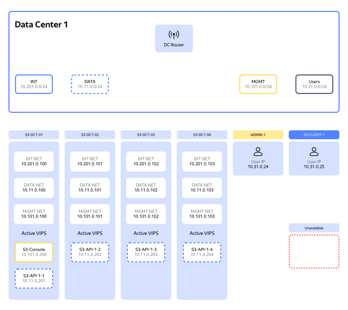
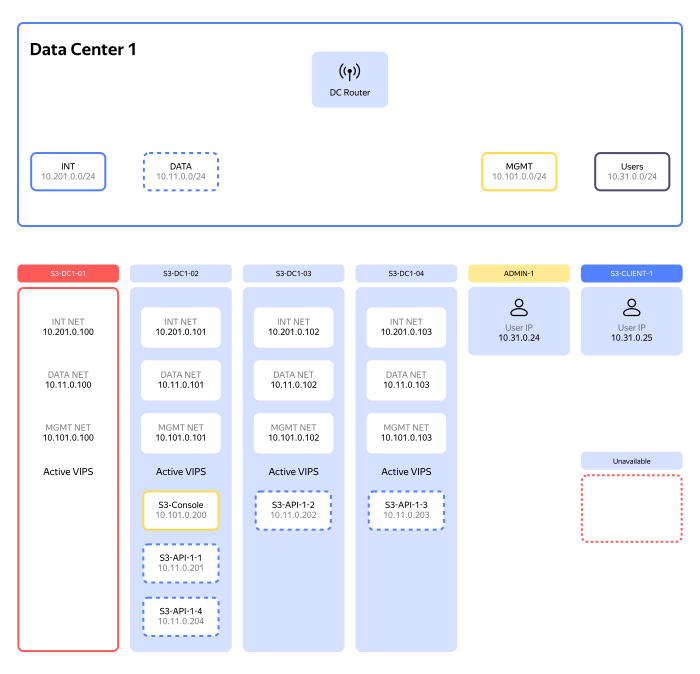
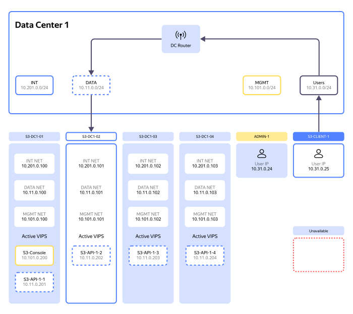
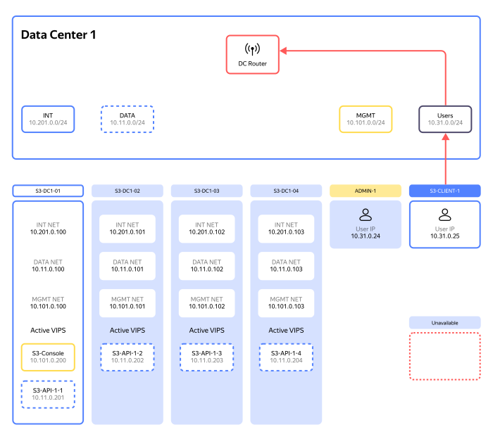
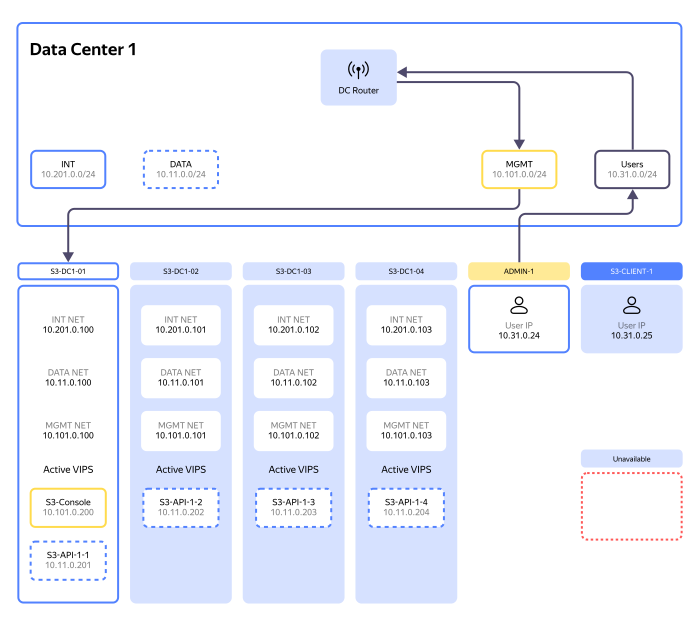
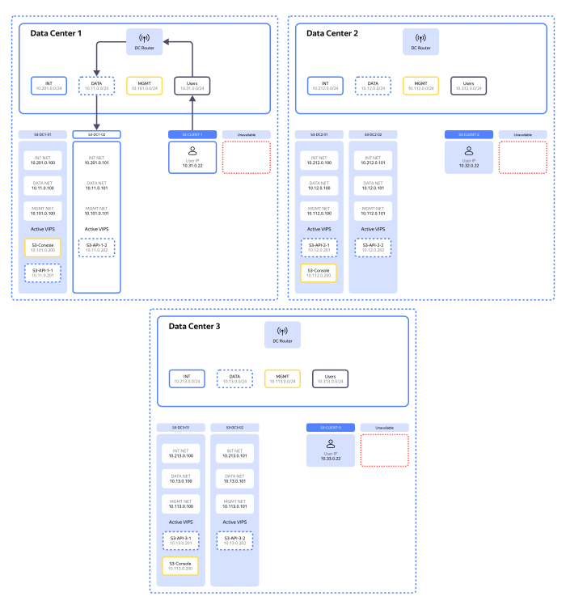
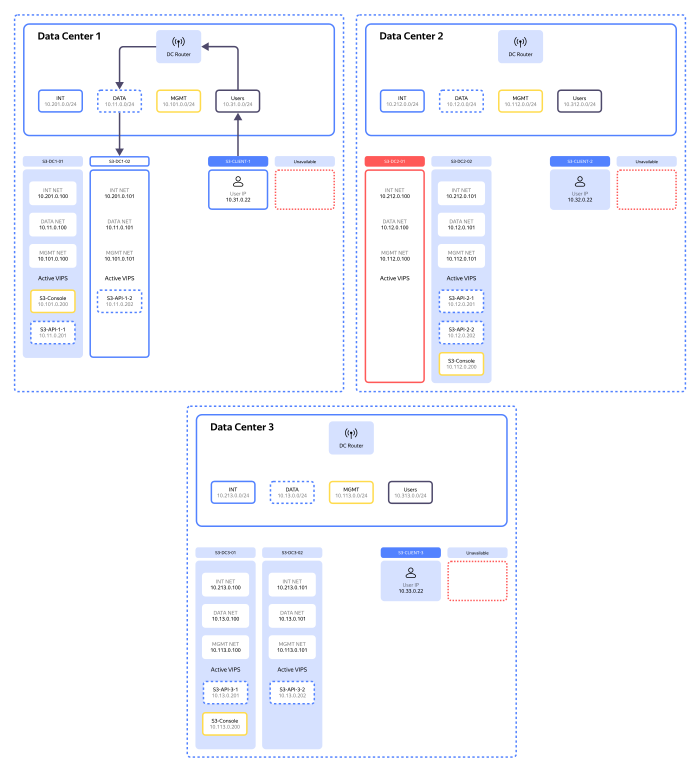
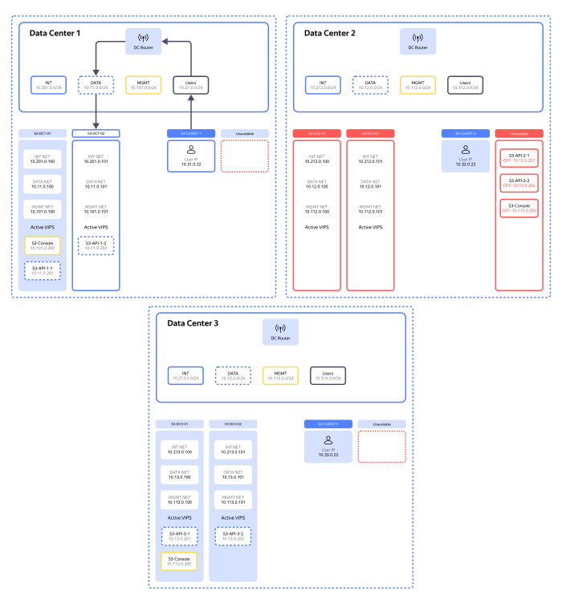

# Размещение в дата-центрах с L2-балансировщиком

## Пример размещения в одном дата-центре {#single-data-center}

* Используется четыре VIP-адреса для S3 API.
* Все четыре адреса должны быть в DNS.
* Для MGMT-адресов — по одному VIP (например, S3-Console).

### Отказ одного узла {#node-failure}

При отказе узла его VIP-адреса переезжают на любой из доступных узлов.

### Доступ к S3 API через отдельный L2-сегмент {#separate-l2-segment}

S3-client должен иметь доступ к DATA-сегменту, но не к MGMT.

## Доступ администратора {#admin-access}

Администратор должен иметь доступ к MGMT.

## Пример размещения в трех дата-центрах и с разделенным DNS {#three-data-centers}

* Шесть VIP-адресов для S3 API. По два на дата-центр.
* Три VIP-адреса для S3-Console, по одному на дата-центр.
* Split-horizon DNS. Клиенты в каждом дата-центре должны получать только адреса из этого дата-центра.

### Отказ одного дата-центра {#data-center-failure}

В случае отказа одного узла его VIP-адреса переедут на соседний узел в том же дата-центре.

### Отказ всех узлов в дата-центре {#dc-all-machines-failure}

В случае отказа всех узлов в дата-центре VIP-адреса в этом дата-центре станут недоступны — для продолжения работы потребуется внести изменения в DNS. Отказ дата-центра не повлияет на работу клиентов из других дата-центров.

