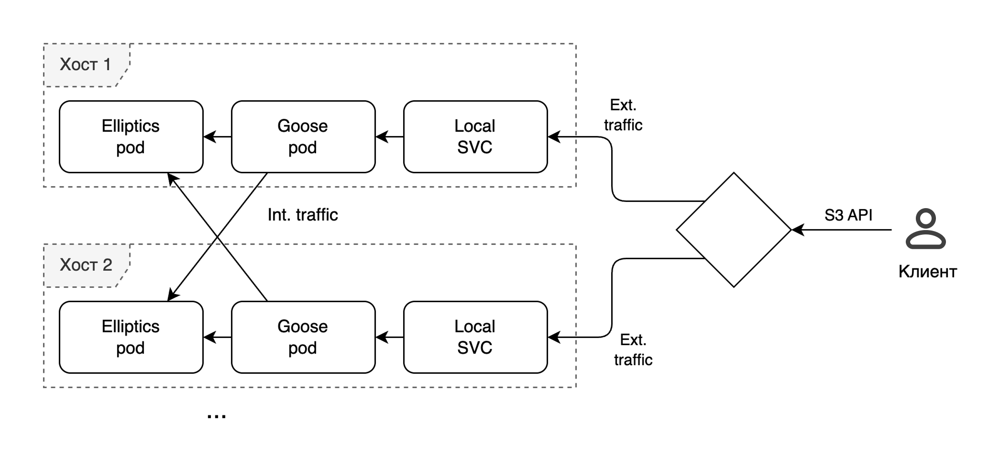

# Топология Goose и Elliptics

На рисунке ниже показана схема течения наиболее объемного трафика:

* Каждый под [Goose](goose.md) имеет отдельный внешний сервис {{ k8s }}, расположенный на том же хосте и ведущий трафик только к локальному Goose.
* Количество трафика внутри кластера превышает количество внешнего:
    * Goose не обязательно будет читать данные из локального [Elliptics](elliptics.md).
    * Запись с избыточностью создает дополнительный трафик к соседним хостам — как минимум x2 от внешнего при репликации x3.

* С точки зрения пропускной способности нет смысла располагать внешний LoadBalancer внутри кластера {{ k8s }} — в этом случае внешний трафик кластера будет ограничен сетевым интерфейсом одного хоста.

Для высокой пропускной способности рекомендуется:

* Иметь отдельные сетевые интерфейсы для слоя {{ k8s }} и внешних подключений.
* Обеспечивать балансировку внешних запросов между нодами кластера {{ k8s }}.

По умолчанию с каждого хоста будет анонсироваться по одному виртуальному IP-адресу для S3 API.

В случае отказа хоста соответствующий ему адрес будет анонсироваться с другого, что обеспечивается настройками MetalLB.

#### Полезные ссылки {#see-also}

* [{#T}](goose.md)
* [{#T}](goose-postgresql.md)
* [{#T}](elliptics.md)
