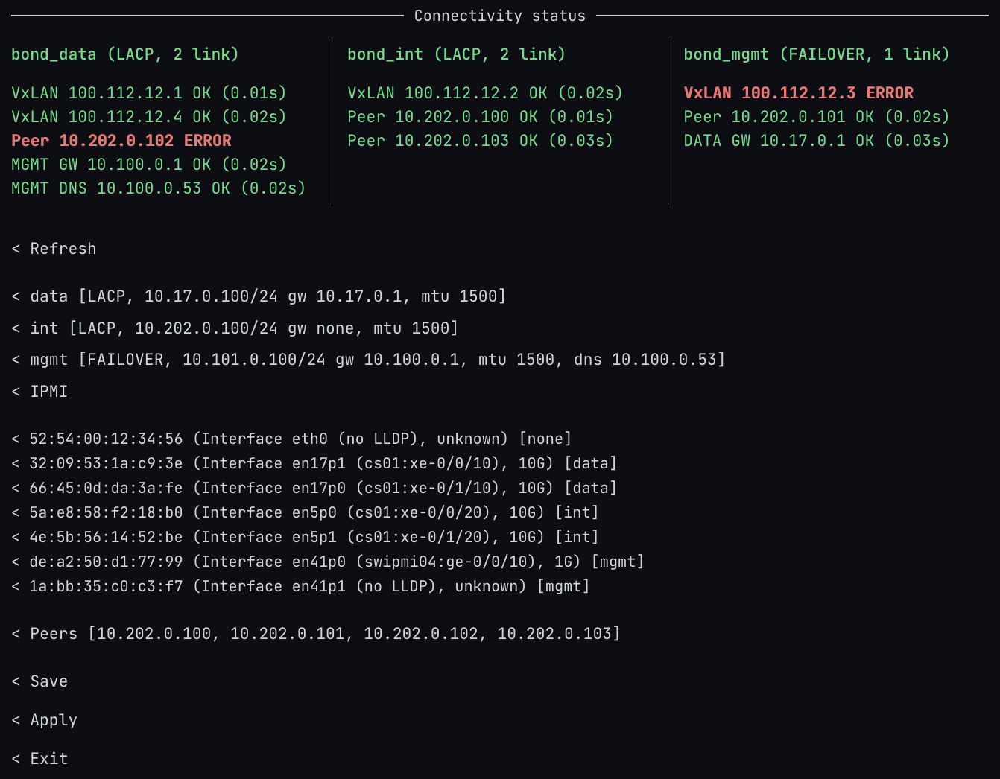

# Подготовка окружения

Здесь и далее рассматривается пример установки {{ objstorage-onprem-name }} на стенде с названием `my-onprem` со следующими параметрами:

* Четыре хоста, репликация с тремя копиями.
    Три хоста нужны для минимальной отказоустойчивости, а четвертый — для поддержки производительности при отказе одного из хостов.

* Internal-подсеть `10.0.0.0/24`.
    Эта сеть будет использоваться для доступа с установочного хоста.

* Data-подсеть `10.0.1.0/24`.
* Management-подсеть `10.0.2.0/24`.




## Установочный хост {#installation-host}

Установочный хост — машина, с которой запускается Ansible. Минимальные требования:

* Сетевой доступ к хостам стенда по SSH.
* Python 3.10 или выше.
* OpenSSL версии 3 или выше для генерации TLS-сертификатов.
* Доступ в интернет для скачивания `ansible-core`, `boto3` и коллекций Ansible при первом запуске.

Скопируйте на установочный хост каталог `ansible` с установочными файлами. Поместите архив `yc-storage-<версия>.tar.zst` в подкаталог `ansible/release/`. В примере используется локальный архив: Ansible скопирует и распакует его на первом мастер-хосте стенда.

Ansible и необходимые коллекции устанавливаются автоматически при первом запуске `run.sh` через скрипт `bootstrap.sh`.


## Хосты стенда {#booth-hosts}

Перед установкой выполните предварительную настройку хостов:

* Установите Ubuntu 22.04 на все серверы.
* Настройте доступ по SSH с установочного хоста с правами `root`. Если используется другой пользователь, настройте повышение привилегий Ansible с помощью `become: true`.
* Проверьте, что хосты подключены к internal-, data- и management-подсетям ([Требования к системе](../concepts/architecture/system-requirements.md)).
* Разметьте NVMe-диск: выделите отдельный раздел для метаданных хранилища ([Требования к системе](../concepts/architecture/system-requirements.md)).

Настройте сеть так, чтобы были выполнены следующие условия:

* Все серверы кластера должны быть связаны между собой так, чтобы можно было создать сеть на основе VxLAN mesh.
* Маршрутизация (routing и policy routing) должна быть настроена так, чтобы трафик из других интерфейсов не попадал во внутреннюю VxLAN-сеть.
* Ответы на запросы к адресам management и data (например, S3 API) должны отправляться с того же интерфейса, с которого поступил запрос, — независимо от таблицы маршрутизации. Для этого не требуется настраивать default-маршрут. Отсутствие default-маршрута не должно мешать корректной работе.

Если вы используете типовую схему с bonding (агрегация каналов через LACP/Failover) и разделением на три сегмента (internal, mgmt, data):

* Используйте TUI-утилиту lanconfig для настройки сети. Lanconfig отображает состояние каналов (link, LLDP, LACP), позволяет проверить доступность (ping, DNS), а также показывает состояние IPMI.
* Настройте IP-адреса, соберите bonding-интерфейсы, проверьте и настройте IPMI.

Обеспечьте стабильную связность между всеми серверами и корректную маршрутизацию в каждом из сегментов: internal, data и management.



Во время установки Ansible настроит VXLAN по [параметрам стенда](setup-install-params.md#host-config). В `vxlan.vxlan0_peers` укажите адреса физических internal-интерфейсов, а в `internal_ips` — адреса виртуальных интерфейсов, которые будут созданы при настройке VXLAN.

## Подготовка дисков для метаданных {#metadata-disks}

На каждом хосте создайте группу томов LVM `topolvm` на разделе NVMe-диска, выделенном для метаданных:

```bash
sudo pvcreate /dev/<раздел_nvme>
sudo vgcreate topolvm /dev/<раздел_nvme>
```

Где `<раздел_nvme>` — имя подготовленного раздела, например `nvme0n1p3`.

Проверьте, что группа томов создана:

```bash
sudo vgs topolvm
```

Плейбуки не создают `topolvm`: наличие группы проверяется перед установкой компонентов {{ objstorage-onprem-name }}. Подготовка HDD для данных выполняется отдельно. Перед ее запуском [проверьте план подготовки дисков](installation-steps.md#disk-plan) и убедитесь, что разделы для метаданных не будут отформатированы.


#### Что дальше? {#whats-next}

* [{#T}](setup-install-params.md)
* [{#T}](installation-steps.md)
* [{#T}](../troubleshooting/installation-errors.md)
