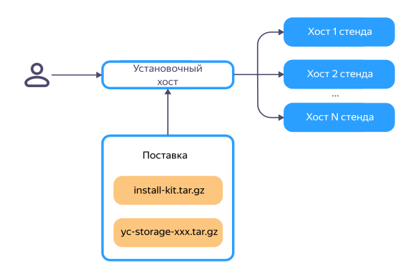

# Общее описание процесса установки

В поставку {{ objstorage-onprem-name }} включены два архива:

* `install-kit.tar.gz` — инструменты для первоначальной установки на пустые хосты;
* `yc-storage-<версия>.tar.gz` — ПО {{ objstorage-name }}, где `<версия>` — поставляемая версия.

Также предоставлены следующие значения, которые потребуются на этапе конфигурации:

* размер квоты хранилища;
* поставленные версии `yc-storage-operator` и {{ objstorage-name }}.

Для выполнения установки необходим установочный хост, соответствующий [минимальным требованиям](environment-preparation.md#installation-host).

На верхнем уровне процесс установки состоит из двух этапов:

1. Подготовка хостов стенда для установки {{ objstorage-name }}:
    * установка ОС, настройка сети и разметка NVMe;
    * развертывание кластера {{ k8s }} и локального OCI Registry;
    * наполнение OCI Registry требуемыми образами из поставки.

1. Установка {{ objstorage-name }} в развернутый кластер {{ k8s }}.

## Подробности об установке и настройке {#see-also}

* [{#T}](environment-preparation.md)
* [{#T}](setup-install-params.md)
* [{#T}](installation-steps.md)
* [{#T}](../troubleshooting/installation-errors.md)
* [{#T}](getting-started.md)