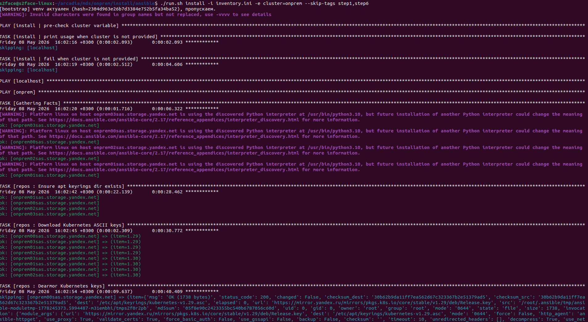
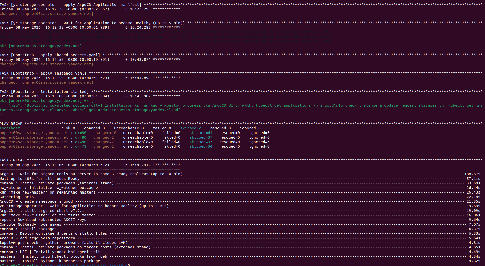

# Шаги установки



Перед запуском [подготовьте окружение](environment-preparation.md) и [настройте параметры инсталляции](setup-install-params.md). Команды `./run.sh` выполняйте на установочном хосте из каталога `ansible`.

В командах используется имя стенда `my-onprem`. Замените его на имя группы из своего `inventory.ini`.

## Проверьте готовность хостов {#validate-hosts}

Перед установкой рекомендуется запустить плейбук `validate`, чтобы проверить готовность всех хостов стенда:

```bash
./run.sh validate -i inventory.ini \
  -e cluster=my-onprem
```

Плейбук проверяет:

* Совпадение имен хостов с `inventory.ini`.
* Отключение swap.
* Синхронизацию времени по NTP.
* Размеры разделов `/` и `/var`, а также наличие и размер группы томов `topolvm`.
* Наличие HDD, соответствующих требованиям конфигурации.
* Режим управления частотой процессоров — `performance`.

Плейбук не изменяет настройки хостов. Если проверка завершилась с ошибкой, исправьте указанные в отчете проблемы и повторите проверку.

## Проверьте план подготовки дисков {#disk-plan}

До начала установки запустите плейбук подготовки дисков в режиме просмотра плана:

```bash
./run.sh playbooks/disk-prepare.yaml -i inventory.ini \
  -e cluster=my-onprem
```

При прямом запуске `disk-prepare.yaml` параметр `disk_prepare_apply` по умолчанию равен `no`: плейбук показывает план без форматирования и монтирования дисков.

Проверьте план на каждом хосте. В нем должны быть только HDD, выделенные для данных хранилища. Убедитесь, что системные диски и разделы с метаданными `topolvm` не выбраны для форматирования.



При запуске через `install.yaml` подготовка дисков применяется автоматически: `disk_prepare_apply` устанавливается в `yes`. Данные на дисках, выбранных для форматирования, будут удалены.



## Запустите установку {#run-installation}



При повторном запуске установки с уже созданными секретами добавьте к команде `--skip-tags step1`. Без этого параметра установка завершится ошибкой, если `vault.yaml` или `vault_yav.yaml` уже существует и не пуст.

Если существующие секреты больше не нужны, добавьте `-e replace_secrets=true` для [их пересоздания](../troubleshooting/installation-errors.md#replace-secrets).



Для первой установки выполните команду:

```bash
./run.sh install -i inventory.ini \
  -e cluster=my-onprem
```

Плейбук последовательно выполнит шаги с первого по тринадцатый, описанные ниже. Во время установки Ansible выводит текущую задачу и результат для каждого хоста.







Если установка прервалась, [устраните причину ошибки](../troubleshooting/installation-errors.md) и [продолжите с нужного шага](#tags).

## Шаг 1. Генерация секретов {#step-1}

Плейбук `generate_secrets.yaml` на установочном хосте генерирует пароли и TLS-сертификаты. Секреты записываются в `group_vars/my-onprem/vault.yaml` с правами `0600`.

Если `vault.yaml` или `vault_yav.yaml` уже существует и не пуст, генерация завершается ошибкой. Для продолжения установки с существующими секретами [пропустите этот шаг](#skip-steps).

## Шаги 2 и 3. Настройка хостов {#step-2}

Плейбук `setup-hosts.yaml` настраивает хосты стенда:

* Устанавливает `containerd`, настраивает параметры ядра, DNS-кеширование и VXLAN.
* Устанавливает и настраивает `hw-watcher` и `inspector-d`.
* Размещает `/opt/kubernetes/Makefile`, который используется для создания кластера {{ k8s }}.
* Устанавливает локальный OCI Registry zot на хостах из `zot.master_hostname` и `zot.mirror_hostnames`.
* Размещает конфигурацию мастер-хостов и настраивает HAProxy на worker-хостах.

## Шаги 4 и 5. Копирование и распаковка архива {#step-4}

Плейбук `setup-hosts.yaml` копирует архив из `ansible/release/` на первый мастер-хост и распаковывает его в `/opt/kubernetes/`. Имя архива задано в `release.version`.

В результате на первом мастер-хосте доступны `/opt/kubernetes/Makefile` и `/opt/kubernetes/argocd/`. Если эта версия архива уже распакована, повторный запуск пропускает распаковку.

## Шаг 6. Подготовка дисков {#step-6}

Плейбук `disk-prepare.yaml` подготавливает HDD на всех хостах стенда. Он форматирует новые диски, добавляет записи в `/etc/fstab` и монтирует диски в `/srv/angel/disks/<номер_диска>`. При `angelSlotTopology: true` используются точки монтирования `/srv/angel/<номер_слота>/disks/<номер_диска>`. Задайте параметр в [конфигурации хостов](setup-install-params.md#host-config).

Системный диск, диски в составе MD RAID и диски, уже смонтированные в `/srv/*`, исключаются из подготовки. Группу томов `topolvm` нужно [создать заранее](environment-preparation.md#metadata-disks).

## Шаги 7–10. Установка {{ k8s }} {#step-7}

Плейбук `init-k8s-cluster.yaml` последовательно:

1. Инициализирует кластер на первом мастер-хосте из `inventory.ini`.
1. Подключает остальные мастер-хосты.
1. Подключает worker-хосты.
1. Ожидает перехода всех узлов в статус `Ready`.

Если узлы не готовы, плейбук перезапускает зависшие поды `calico-node` и `csi-node-driver` и повторяет проверку. Если за шесть минут все узлы не перешли в `Ready`, установка завершается с ошибкой и списком проблемных узлов.

## Шаг 11. Установка ArgoCD {#step-11}

Плейбук `init-storage.yaml` проверяет наличие группы томов `topolvm` на всех хостах. Затем с первого мастер-хоста устанавливает ArgoCD в отказоустойчивой конфигурации и настраивает доступ к локальному OCI Registry через zot-proxy.

Плейбук ожидает готовности трех реплик `argocd-redis-ha-server` до десяти минут.

## Шаг 12. Установка yc-storage-operator {#step-12}

Плейбук `init-storage.yaml` создает пространство имен `yc-storage-operator`, копирует в него учетные данные ArgoCD и применяет манифест приложения `yc-storage-operator`.

Плейбук ожидает перехода приложения ArgoCD в статус `Healthy` до пяти минут. Версия оператора задается в `yc_storage_operator.helm_oci.targetRevision`.

## Шаг 13. Установка {{ objstorage-onprem-name }} {#step-13}

Плейбук `init-storage.yaml` применяет манифесты `shared-secrets.yaml` и `instance.yaml`. Создается ресурс `Instance`, после чего `yc-storage-operator` начинает установку компонентов {{ objstorage-name }} внутри кластера.

После этого Ansible завершает работу и выводит итоговый отчет. Установка компонентов внутри кластера продолжается: ее результат нужно [проверить отдельно](getting-started.md#check-installation).







## Шаг 14. Создание DNS-записей {#step-14}

В [конфигурации](setup-install-params.md#objstorage-config) заданы домены и IP-адреса. Добавьте соответствующие DNS-записи:

#|
|| **Назначение** | **Домены** | **IP-адреса** ||
|| S3 API | Из `s3.domains`. В примере первый домен содержит все IP-адреса для DNS-балансировки, остальные домены соответствуют отдельным IP-адресам. | Из `s3.ips`. ||
|| Веб-консоль | Из `console.ui.domain`, например `console.onprem.local`. | Из `console.ui.ip`. ||
|| gRPC API для CLI | Добавьте префикс `api-` к домену веб-консоли, например `api-console.onprem.local`. | Из `console.grpc.ip`. ||
|| Grafana и федеративный эндпоинт Prometheus | Используйте выбранные вами домены. | Из `metrics.grafana.ip` и `metrics.prometheusFederation.ip`. ||
|#

## Управление шагами через теги {#tags}

Чтобы выполнить часть установки, добавьте к команде параметр `--tags`. Чтобы пропустить шаги, используйте `--skip-tags`. Несколько тегов указывайте через запятую.

Теги соответствуют шагам установки:

#|
|| **Тег** | **Шаги** ||
|| `step1` или `secrets` | Генерация секретов. ||
|| `step2`, `step3` или `hosts` | Настройка хостов. Теги `step2` и `step3` запускают один и тот же этап. ||
|| `step4`, `step5` или `release` | Копирование и распаковка архива. Теги `step4` и `step5` запускают один и тот же этап. ||
|| `setup_hosts` | Все шаги со второго по пятый. ||
|| `step6` или `disks` | Подготовка HDD. ||
|| `step7` | Инициализация кластера {{ k8s }}. ||
|| `step8` | Подключение остальных мастер-хостов. ||
|| `step9` | Подключение worker-хостов. ||
|| `step10` | Ожидание готовности узлов. ||
|| `k8s` | Все шаги с седьмого по десятый. ||
|| `step11` или `argocd` | Установка ArgoCD. ||
|| `step12` или `yc-storage-operator` | Установка оператора. ||
|| `step13` или `bootstrap` | Запуск установки {{ objstorage-name }} внутри кластера. ||
|| `init_storage` | Все шаги с одиннадцатого по тринадцатый. ||
|#

### Пропуск выполненных шагов {#skip-steps}

Если секреты уже созданы, продолжите установку без их повторной генерации:

```bash
./run.sh install -i inventory.ini \
  -e cluster=my-onprem --skip-tags step1
```

Если секреты созданы, хосты и диски подготовлены, а архив распакован, начните с установки {{ k8s }}:

```bash
./run.sh install -i inventory.ini \
  -e cluster=my-onprem --skip-tags step1,setup_hosts,step6
```

### Запуск отдельных шагов {#run-step}

Если кластер {{ k8s }} уже готов, установите ArgoCD, оператор и компоненты {{ objstorage-name }}:

```bash
./run.sh install -i inventory.ini \
  -e cluster=my-onprem --tags init_storage
```

При выборе отдельных шагов сохраняйте зависимости: секреты нужны для последующих этапов; настройка хостов и распаковка архива — для создания кластера {{ k8s }}; готовый кластер и `topolvm` — для установки ArgoCD. Перед запуском `bootstrap` должны быть установлены ArgoCD и `yc-storage-operator`, а приложение оператора должно иметь статус `Healthy`.

#### Полезные ссылки {#see-also}

* [{#T}](getting-started.md)
* [{#T}](../troubleshooting/installation-errors.md)
