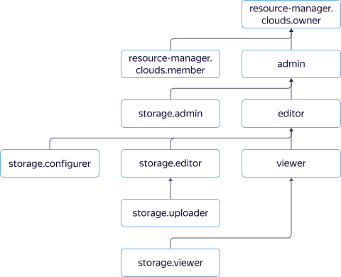

# Управление доступом с помощью {{ iam-full-name }}



В этом разделе вы узнаете:

* [на какие ресурсы можно назначить роль](#resources);
* [какие роли действуют в сервисе](#roles-list).



Назначать роли на ресурс могут пользователи, у которых на этот ресурс есть роль `storage.admin` или одна из следующих ролей:



## На какие ресурсы можно назначить роль {#resources}

В консоли {{ yandex-cloud }} или с помощью YC CLI вы можете назначить роль на [облако](../../resource-manager/concepts/resources-hierarchy.md#cloud), [каталог](../../resource-manager/concepts/resources-hierarchy.md#folder) или отдельный бакет. Назначенные роли будут действовать и на вложенные ресурсы.

О том, как управлять доступом к бакетам и объектам в них, см. раздел [{#T}](../concepts/acl.md).

## Какие роли действуют в сервисе {#roles-list}



### Сервисные роли {#service-roles}

#### storage.viewer {#storage-viewer}



#### storage.configViewer {#storage-config-viewer}



#### storage.configurer {#storage-configurer}



#### storage.uploader {#storage-uploader}



#### storage.editor {#storage-editor}



#### storage.admin {#storage-admin}



### Примитивные роли {#primitive-roles}



## См. также {#see-also}

* [{#T}](../operations/buckets/iam-access.md)
