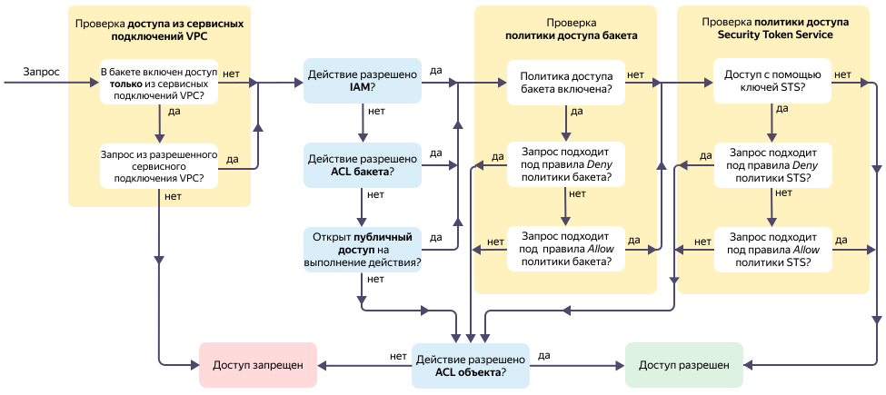

# Обзор способов управления доступом в {{ objstorage-name }}

В {{ objstorage-name }} реализовано несколько взаимосвязанных механизмов для управления доступом:
* [{{ iam-full-name }} ({{ iam-short-name }})](#iam).
* [Список управления доступом (ACL)](#acl).
* [Политика доступа (bucket policy)](#policy).
* [Публичный доступ](#anonymous).
* [{{ sts-name }}](#sts).
* [Подписанные (pre-signed) URL](#pre-signed).
* [Сервисные подключения {{ vpc-short-name }} (Private Endpoints)](#pe-vpc).

Также в {{ objstorage-name }} на доступ к бакетам и объектам может влиять включенное шифрование. Подробнее о работе с зашифрованными бакетами см. на странице [{#T}](../concepts/encryption.md).

На схеме показана взаимосвязь механизмов управления доступом в {{ objstorage-name }}. {#scheme}

Алгоритм проверок:

1. _IAM_ и _ACL бакета_:
    * Если запрос прошел проверку _IAM_ **или** _ACL бакета_, проверяется настроена ли _политика доступа для бакета_.
    * Если запрос не прошел проверки _IAM_ **и** _ACL бакета_, проверяется включен ли _публичный доступ_ к бакету.
1. _Публичный доступ_:
    * Если публичный доступ на выполнение действия открыт, проверяется настроена ли _политика доступа для бакета_.
    * Если публичный доступ на выполнение действия закрыт, то применяется проверка доступа через _ACL объекта_.
1. _Политика доступа для бакета_:
    * Если политика доступа настроена:
      1. Если запрос подошел хотя бы под одно из правил `Deny` политики бакета, то применяется проверка доступа через _ACL объекта_.
      1. Если запрос подошел хотя бы под одно из правил `Allow` политики бакета, проверяется осуществлен ли доступ через _{{ sts-name }}_.
      1. Если запрос не подошел ни под одно из правил политики бакета, то применяется проверка доступа через _ACL объекта_.
    * Если политика доступа не настроена, проверяется осуществлен ли доступ через _{{ sts-name }}_.
1. _{{ sts-name }}_:
    * Если запрос осуществлен с помощью {{ sts-name }}:
      1. Если запрос подошел хотя бы под одно из правил `Deny` политики для временного ключа, то применяется проверка доступа через _ACL объекта_.
      1. Если запрос подошел хотя бы под одно из правил `Allow` политики для временного ключа, доступ будет разрешен.
      1. Если запрос не подошел ни под одно из правил политики для временного ключа, то применяется проверка доступа через _ACL объекта_.
    * Если запрос осуществлен напрямую, доступ будет разрешен.
1. _ACL объекта_:
    * Если запрос прошел проверку _ACL объекта_, доступ будет разрешен.
    * Если запрос не прошел проверку _ACL объекта_, доступ будет запрещен.

## {{ iam-name }} {#iam}

[{{ iam-name }}](./index.md) — основной способ управления доступом в {{ yandex-cloud }} с помощью назначения ролей. Позволяет базово разграничить доступы, подробнее см. [{#T}](./index.md#roles-list).

Получатели доступа: 
* аккаунт на Яндексе;
* [сервисный аккаунт](../../iam/concepts/users/service-accounts.md);
* [федеративный пользователь](../../iam/concepts/federations.md);
* [системная группа](../../iam/concepts/access-control/system-group.md);
* [публичная группа](../../iam/concepts/access-control/public-group.md).

Доступ выдается на [облако](../../resource-manager/concepts/resources-hierarchy.md#cloud), [каталог](../../resource-manager/concepts/resources-hierarchy.md#folder) или [бакет](../concepts/bucket.md).

## Список управления доступом (ACL) {#acl}

[Список управления доступом (ACL)](./acl.md) — перечень разрешений на выполнение действий, хранящийся непосредственно в {{ objstorage-name }}. Позволяет базово разграничить доступы. Разрешения ACL для бакетов и объектов отличаются, подробнее см. [{#T}](./acl.md#permissions-types).



Если у вас нет необходимости разграничивать доступ к конкретным объектам, рекомендуем использовать {{ iam-name }}.



Получатели доступа: 
* аккаунт на Яндексе;
* [сервисный аккаунт](../../iam/concepts/users/service-accounts.md);
* [федеративный пользователь](../../iam/concepts/federations.md);
* [системная группа](../../iam/concepts/access-control/system-group.md);
* [публичная группа](../../iam/concepts/access-control/public-group.md).

Доступ выдается на [бакет](../concepts/bucket.md) или [объект](../concepts/object.md).

## Политика доступа (bucket policy) {#policy}

[Политика доступа (bucket policy)](./policy.md) — перечень правил, запрещающих или разрешающих [действия](../s3/api-ref/policy/actions.md) при выполнении определенных [условий](../s3/api-ref/policy/conditions.md). Позволяет гранулярно разграничить доступы к бакетам, объектам и группам объектов.

Получатели доступа: 
* аккаунт на Яндексе;
* [сервисный аккаунт](../../iam/concepts/users/service-accounts.md);
* [федеративный пользователь](../../iam/concepts/federations.md);
* анонимный пользователь.

Доступ выдается на [бакет](../concepts/bucket.md), [объект](../concepts/object.md) или группу объектов.

## Публичный доступ {#anonymous}

[Публичный доступ](./public-access.md) — разрешения на доступ к чтению объектов, списка объектов и настроек бакета для анонимных пользователей.

Доступ выдается на [бакет](../concepts/bucket.md).



## {{ sts-name }} {#sts}

[{{ sts-name }}](./sts.md) — компонент сервиса {{ iam-name }} для получения временных ключей доступа, совместимых с [AWS S3 API](../s3/index.md).

С помощью временных ключей вы можете гранулярно разграничить доступы в бакеты для множества пользователей, используя для этого всего один сервисный аккаунт.

## Подписанные (pre-signed) URL {#pre-signed}

[Подписанные (pre-signed) URL](./pre-signed-urls.md) — способ предоставления анонимным пользователям временного доступа к определенным действиям в {{ objstorage-name }} с помощью URL, содержащих в своих параметрах данные для авторизации запроса.

Доступ выдается на [бакет](../concepts/bucket.md) или [объект](../concepts/object.md).

## Сервисные подключения {{ vpc-short-name }} (Private Endpoints) {#pe-vpc}





В {{ objstorage-name }} есть возможность настроить бакет так, чтобы доступ в него был возможен только через сервисные подключения {{ vpc-short-name }}. Предусмотрены следующие механизмы:
* **Ограничение доступа в бакет на уровне политики** — доступ в бакет разрешается из сервисных подключений {{ vpc-short-name }} с идентификаторами, указанными в [политике](#policy). Однако, согласно [схеме](#scheme), все еще остается возможность доступа в бакет из публичной сети, например с помощью [ACL](#acl) объекта или при наличии другого разрешающего правила в политике. Также при такой настройке остается возможность [копирования объектов на стороне сервера (Server Side Copy)](../operations/objects/copy.md) в такой бакет и из него. Подробнее см. на странице [Настройте политику для доступа из сервисных подключений](../operations/buckets/access-via-vpc.md#setup-policy).
* **Ограничение доступа в бакет на уровне сервиса** — доступ в бакет разрешается только из сервисных подключений {{ vpc-short-name }}. Нужно указать конкретные названия подключений. При этом доступ в бакет из публичной сети будет невозможен. В текущей реализации этой функциональности также будет невозможен доступ в бакет с помощью [консоли управления]({{ link-console-main }}). Подробнее см. на странице [Настройте ограничение для доступа только из сервисных подключений](../operations/buckets/access-via-vpc.md#setup-service-restriction).



## См. также {#see-also}

* [{#T}](../operations/buckets/iam-access.md)
* [{#T}](../operations/buckets/edit-acl.md)
* [{#T}](../operations/objects/edit-acl.md)
* [{#T}](../operations/buckets/policy.md)
* [{#T}](../operations/buckets/bucket-availability.md)
* [{#T}](../operations/buckets/create-sts-key.md)
* [{#T}](../operations/buckets/access-via-vpc.md)