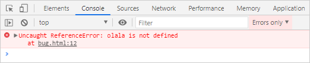
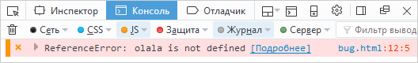
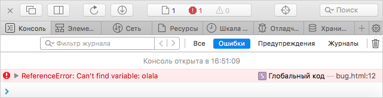

# Копирование ошибок из консоли браузера

Если при работе со страницами и интерактивными элементами [консоли управления]({{ link-console-main }}) {{ yandex-cloud }} возникла проблема, причину поломки поможет определить информация из консоли браузера. Скопируйте сообщение из консоли ошибок и передайте его в [техническую поддержку]({{ link-console-support }}).



- Яндекс Браузер {#yandex}

  

- Google Chrome {#chrome}

  1. На странице с ошибкой нажмите сочетание клавиш **Ctrl** + **Shift** + **J** (или **⌥** + **⌘** + **J** для macOS).

      

      Откройте меню  → **Дополнительные инструменты** → **Инструменты разработчика** и перейдите на вкладку **Console**.

      

  1. Справа от поля **Filter** в списке **Default levels** отключите все опции, кроме **Errors**.

      

  1. Обновите страницу или повторите действия, которые приводят к ошибке.
  1. Скопируйте сообщения:

      * Сделайте скриншот. Если для просмотра сообщений требуется прокрутка по вертикали, сделайте несколько скриншотов.
      * Сохраните лог ошибок в текстовый файл: нажмите правой кнопкой мыши на любое сообщение и выберите **Save as**.

  1. Приложите лог ошибок или скриншоты к сообщению в [техническую поддержку]({{ link-console-support }}).

  Для получения дополнительной информации сделайте скриншот содержимого вкладки **Network**.

- Opera {#opera}

  1. На странице с ошибкой нажмите сочетание клавиш **Ctrl** + **Shift** + **J**.

      

      В левом верхнем углу нажмите кнопку **Opera**, выберите в меню пункт **Разработка** → **Инструменты разработчика** и перейдите на вкладку **Console**.

      

  1. Справа от поля **Filter** в списке **Default levels** отключите все опции, кроме **Errors**.

      

  1. Обновите страницу или повторите действия, которые приводят к ошибке.
  1. Скопируйте сообщения:

      - Сделайте скриншот. Если для просмотра сообщений требуется прокрутка по вертикали, сделайте несколько скриншотов.
      - Сохраните лог ошибок в текстовый файл: нажмите правой кнопкой мыши на любое сообщение и выберите **Save as**.

  1. Приложите лог ошибок или скриншоты к сообщению в [техническую поддержку]({{ link-console-support }}).

  Для получения дополнительной информации сделайте скриншот содержимого вкладки **Network**.

- Mozilla Firefox {#firefox}

  1. На странице с ошибкой нажмите сочетание клавиш **Ctrl** + **Shift** + **J**.

      

      * Откройте меню  → **Веб-разработка** → **Веб-консоль**.
      * Нажмите правой кнопкой мыши в любой области страницы, выберите пункт **Исследовать элемент** и перейдите на вкладку **Консоль**.

      

  1. Убедитесь, что во всех фильтрах («Сеть», «CSS», «JS», «Защита», «Журнал», «Сервер») отмечен только один пункт — **Ошибки**. Для этого рядом с каждым фильтром нажмите значок .

      

      Если вместо значка  нажать название фильтра, проверка ошибок будет отключена.

      

      

  1. Обновите страницу или повторите действия, которые приводят к ошибке.
  1. Скопируйте сообщения:

      * Сделайте скриншот. Если для просмотра сообщений требуется прокрутка по вертикали, сделайте несколько скриншотов.
      * Сохраните лог ошибок в текстовый файл: нажмите правой кнопкой мыши на любое сообщение и выберите **Экспортировать видимые сообщения в** → **Файл**.

  1. Приложите лог ошибок или скриншоты к сообщению в [техническую поддержку]({{ link-console-support }}).

- Microsoft Edge {#edge}

  1. На странице с ошибкой нажмите сочетание клавиш **Ctrl** + **Shift** + **J**.

      

      * Откройте меню  → **Другие инструменты** → **Средства разработчика**.
      * Нажмите правой кнопкой мыши в любой области страницы, выберите пункт **Проверить** и перейдите на вкладку **Console**.

      

  1. Справа от поля **Filter** в списке **Default levels** отключите все опции, кроме **Errors**.

      

  1. Обновите страницу или повторите действия, которые приводят к ошибке.
  1. Скопируйте сообщения:

      * Сделайте скриншот. Если для просмотра сообщений требуется прокрутка по вертикали, сделайте несколько скриншотов.
      * Сохраните лог ошибок в текстовый файл: нажмите правой кнопкой мыши на любое сообщение и выберите **Save as**.

  1. Приложите лог ошибок или скриншоты к сообщению в [техническую поддержку]({{ link-console-support }}).

  Для получения дополнительной информации сделайте скриншот содержимого вкладки **Network**.

- Safari {#safari}

  1. Активируйте консоль ошибок: в меню выберите **Safari** → **Настройки** → **Дополнения** и включите опцию **Показывать меню «Разработка»** в строке меню.
  1. На странице с ошибкой нажмите сочетание клавиш **⌥** + **⌘** + **C**.

     

     * Выберите в меню **Разработка** → **Показать консоль JavaScript**.
     * Нажмите правой кнопкой мыши в любой области страницы, выберите пункт **Проверить объект** и перейдите на вкладку **Консоль**.

     

  1. Перейдите на вкладку **Консоль** и включите фильтр **Ошибки**. В узком окне название фильтра может быть скрыто: разверните окно.

      

  1. Обновите страницу или повторите действия, которые приводят к ошибке.
  1. Скопируйте сообщения:

      * Сделайте скриншот. Если для просмотра сообщений требуется прокрутка по вертикали, сделайте несколько скриншотов.
      * Сохраните лог ошибок в текстовый файл.

  1. Приложите лог ошибок или скриншоты к сообщению в [техническую поддержку]({{ link-console-support }}).

  Для получения дополнительной информации сделайте скриншот содержимого вкладки **Сеть**.


