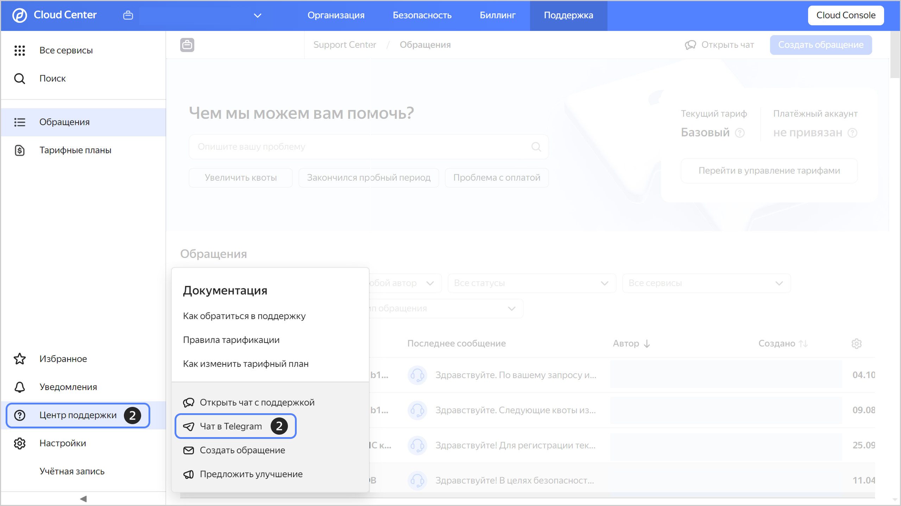

# Чат с поддержкой {{ yandex-cloud }} в Telegram

Пользователи, которым доступен чат с поддержкой, могут получать ответы на свои вопросы по работе c {{ yandex-cloud }} в Telegram-чате. Вам ответят на простые вопросы или заведут обращение, если решение вопроса потребует времени.

Чтобы начать общение с технической поддержкой в чате Telegram:

1. Перейдите в [консоль управления]({{ link-console-main }}) или на [главную страницу поддержки]({{ link-console-support }}) в {{ support-center-name }}.
1. В левом нижнем углу нажмите  и выберите **Чат в Telegram**.

    

1. Выберите [организацию](../organization/quickstart.md) для работы с технической поддержкой.
1. Следуйте указаниям в окне **Введите код из Telegram**: подтвердите полученный токен и перейдите по ссылке в Telegram-чат.
1. Для работы с чатом доступны команды:

    * `/start` — запускает чат;
    * `/help` — выводит общую информацию о работе с чатом;
    * `/lang` — позволяет изменить язык взаимодействия в чате;
    * `/org` — показывает организацию, выбранную для работы с технической поддержкой, и позволяет выбрать другую организацию;
    * `/feedback` — предлагает поделиться впечатлениями и пожеланиями по работе с чатом.

    Чтобы посмотреть полный список команд, нажмите **Menu**.

1. Для начала работы введите команду `/start`.
1. В чате появится сообщение о необходимости привязать ваш Telegram-аккаунт в {{ support-center-name }}. В поддержку будет передана информация о вашем имени, публичной ссылке на аккаунт в Telegram и фотографии. Нажмите **Привязать**.
1. Напишите сообщение, содержащее не более 1024 символов, с описанием вашей проблемы или вопроса. Вы также можете отправить файл (видео, фото или текст), не превышающий 20 МБ.

    

    Если в процессе работы истечет срок действия токена, в чате появится сообщение о необходимости привязать новый токен.

    

1. Если поддержка не сможет быстро ответить на ваш вопрос, в чате появится ссылка на обращение в {{ support-center-name }}. Перейдите по ссылке: в этом обращении вы сможете получить помощь специалистов.
