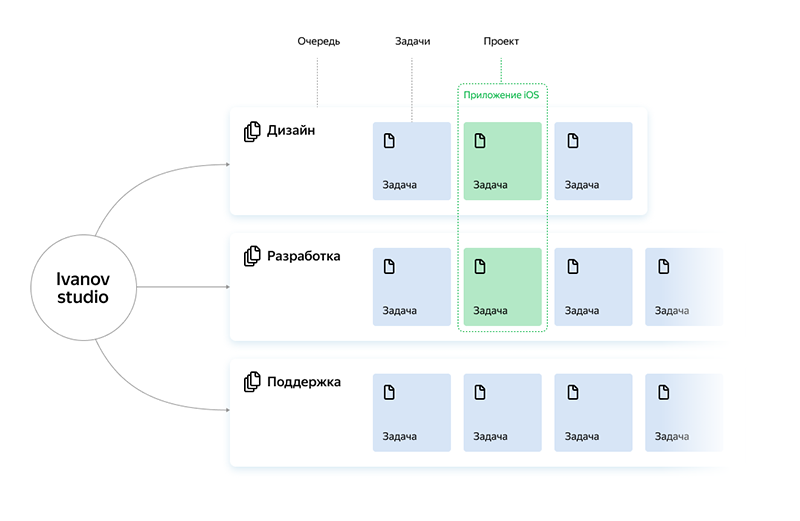
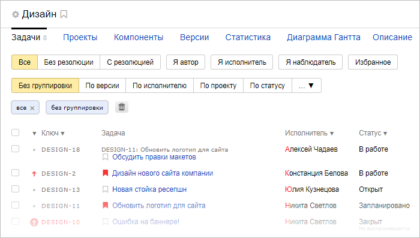
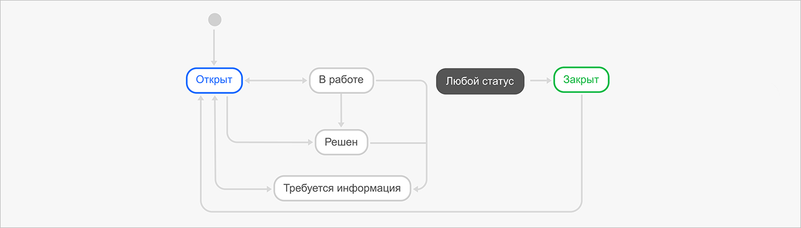
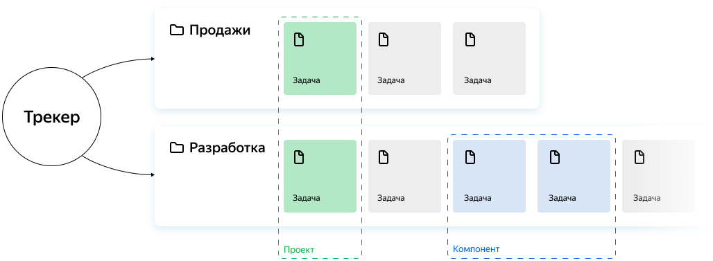
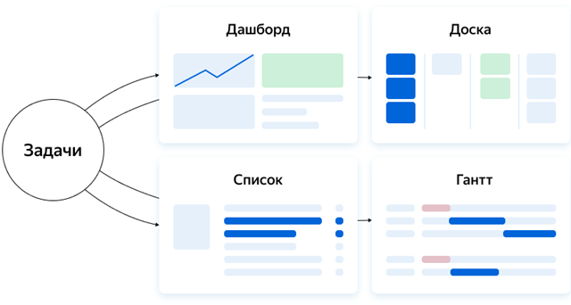

# Как устроен {{ tracker-name }}

Из этого раздела вы узнаете, как организована работа в {{ tracker-name }} и как адаптировать {{ tracker-name }} под ваши процессы.

Инструкцию по настройке {{ tracker-name }} перед началом работы можно найти в разделе [{#T}](quick-start.md).

## Структура {{ tracker-name }} {#blocks}

Чтобы организовать работу команды в {{ tracker-name }}, обязательно потребуются два элемента — _задачи_ и _очередь_. Задачи описывают работу, которую требуется выполнить, а очередь задает правила работы с задачами.

Дополнительные элементы, такие как компоненты, доски задач и дашборды помогают управлять задачами, следить за их статусом и контролировать результаты. Обзор этих возможностей можно найти ниже на этой странице.

#### Задача

Чтобы управлять работой вашей команды с помощью {{ tracker-name }}, нужно разбить ее на небольшие части — задачи. Такими задачами могут быть добавление новой функции в приложение, обращение клиента в службу поддержки, разработка нового логотипа, заявка на командировку.

У задачи есть название, исполнитель, сроки и другие параметры. Задачи могут быть связаны между собой или подчинены друг другу.

Если вы хотите поручить сотруднику вашей команды какую-либо работу, создайте задачу и назначьте этого сотрудника исполнителем.

#### Очередь

Очередь объединяет задачи с общей темой (процессом, продуктом и так далее) и позволяет настроить для этих задач [рабочий процесс](#process). В каждой очереди можно настроить этапы работы с задачами, правила автоматизированной обработки задач, права доступа к задачам.

Как правило, у каждой команды свой рабочий процесс, поэтому мы рекомендуем создавать отдельные очереди задач для команд или подразделений компании. Вы можете создать очереди для отдела разработки, группы дизайна и юридического департамента. Тогда очередь станет потоком задач, которые выполняет определенная команда. Например, если вам нужно разработать новый дизайн логотипа, создайте задачу в очереди дизайнеров.

## Как организовать рабочий процесс в {{ tracker-name }} {#process}

Как правило, процесс выполнения задачи состоит из нескольких этапов. Например: создание задачи, ее выполнение, согласование результатов и завершение работы.

В {{ tracker-name }} каждому этапу выполнения задачи соответствует свой _статус_. Например: «Открыт», «В работе», «Тестируется», «Закрыт». Чтобы перенести рабочий процесс в {{ tracker-name }}, нужно настроить _воркфлоу_ — набор статусов, через которые проходит задача на пути от создания до решения, и правила перехода между статусами.

Воркфлоу привязан к очереди задач. Если вам нужно настроить несколько рабочих процессов для разных команд, вы можете [создать для них отдельные очереди](manager/create-queue.md). Также вы можете добавить в одну очередь несколько [типов задач](manager/add-ticket-type.md), и для каждого типа выбрать свой воркфлоу.

В {{ tracker-name }} есть [шаблоны очередей](manager/workflows.md) с готовыми воркфлоу для различных процессов, которые помогут вам начать работу. Универсальный воркфлоу выглядит так:

Вы сможете [создавать уникальные воркфлоу](manager/add-workflow.md), подходящие именно для ваших задач. Старайтесь не перегружать их лишними статусами — чем проще воркфлоу, тем легче с ним работать.

Помимо воркфлоу, в очереди можно настроить [права доступа к задачам](manager/queue-access.md), [автоматизированную обработку задач](./automation.md), интеграцию с [почтой](manager/queue-mail.md) и [{{ forms-full-name }}](manager/forms-integration.md) и так далее. Эти возможности позволяют гибко настроить очередь под задачи вашей команды.

Примеры настройки рабочих процессов в {{ tracker-name }} можно найти в разделах:

- [{#T}](dev-process.md)
- [{#T}](support-process.md)

## Как группировать и упорядочивать задачи {#group}

Группировать задачи полезно, например, чтобы определить объем работы на разных этапах проекта или обозначить зоны ответственности команд и отдельных сотрудников.

В {{ tracker-name }} есть возможности для группировки задач по различным признакам:

- [Компоненты](manager/components.md) помогают группировать задачи очереди, относящиеся к одной тематике. Для задач с компонентами можно настроить исполнителя по умолчанию и [права доступа](manager/queue-access.md#access-components).
    Например, с помощью компонентов можно [классифицировать обращения в службу поддержки](support-process-group.md).
- [Версии](manager/versions.md) помогают группировать задачи очереди, относящиеся к одной версии продукта.
    Например, чтобы запланировать исправление ошибки в определенном релизе продукта, можно указать версию в поле **Исправить в версиях**.
- Тег — это произвольная метка, которую можно добавить к задаче. С помощью тегов удобно группировать задачи по любому признаку, а затем искать задачи с определенными тегами. Чтобы добавить теги к задаче, [отредактируйте параметр **Теги**](user/edit-ticket.md#edit-fields).

## Как планировать работу {#in-order}

Чтобы планировать работу с помощью {{ tracker-name }}, можно использовать несколько методов:
- [Создавать проекты](#in-order-create-project)
- [Декомпозировать задачи](#in-order-decompose-task)
- [Делить работу на спринты](#in-order-divide-work)
- [Планировать сроки на диаграмме Ганта](#in-order-gantt)

#### Создавать проекты {#in-order-create-project}

Проектом можно назвать любую деятельность с фиксированными целями и временными рамками.

[Используйте проекты в {{ tracker-name }}](manager/project-new.md), чтобы объединить задачи, которые направлены на достижение общего результата в заданный срок. Для проекта можно назначить дедлайн и ответственного сотрудника. В проект могут входить задачи из разных очередей.

#### Декомпозировать задачи {#in-order-decompose-task}

Чтобы определить объем работы, который нужно выполнить для реализации проекта или для создания новой версии продукта, используйте декомпозицию задач.

Декомпозиция — это разделение крупных частей проекта на отдельные задачи и подзадачи. Когда работа разбита на небольшие задачи, гораздо проще оценить их сложность, необходимые ресурсы, распределить задачи по исполнителям и запланировать сроки. В {{ tracker-name }} можно декомпозировать задачи с помощью [связей](user/links.md). Например, для реализации новой возможности продукта нужно выполнить несколько небольших задач. Тогда можно создать родительскую задачу типа <q>Новая возможность</q> и привязывать к ней подзадачи.

#### Делить работу на спринты {#in-order-divide-work}
Если вы занимаетесь долгосрочным развитием продукта или проекта, и у вас нет фиксированного объема работы и конечного срока, вы можете планировать работу с помощью спринтов.

В методологии [Скрам]({{ link-wiki-scrum }}) спринты — это небольшие итерации разработки, которые длятся 1–4 недели. В начале спринта команда оценивает трудоемкость задач из [бэклога](glossary.md#rus-b) и выбирает задачи, которые требуется выполнить в текущем спринте. Короткие итерации позволяют точнее прогнозировать сроки работы и при необходимости быстро менять приоритеты.

Чтобы использовать этот метод планирования, [создайте доску задач <q>Скрам</q>](manager/create-agile-board.md). На доске вам будет доступно [управление спринтами](manager/create-agile-sprint.md), [оценка задач с помощью покера](manager/planning-poker.md) и [диаграмма сгорания задач](manager/burndown.md).

#### Планировать сроки на диаграмме Ганта {#in-order-gantt}

Используйте [диаграмму Ганта](manager/gantt.md), чтобы планировать и отслеживать сроки выполнения нескольких задач на одной странице. Например, когда задачи нужно выполнять в определенной последовательности или когда несколько задач выполняет один сотрудник.

Диаграмму Ганта можно построить для проекта, для очереди или для списка задач, найденных с помощью фильтра. Даты начала и окончания работы показаны на диаграмме горизонтальными линиями, их можно задать или изменить прямо на диаграмме.

## Как контролировать результаты {#control}

В {{ tracker-name }} есть несколько инструментов, которые позволяют быстро и наглядно получать информацию о задачах, чтобы следить за ходом работы и контролировать результаты.

#### Дашборды {#dash}
Дашборд — это страница, на которой удобно отслеживать состояние важных задач и статистику. Вы можете настроить дашборд и добавить на него [виджеты](glossary.md#rus-v) с информацией, за которой хотите следить. Виджеты автоматически получают данные о задачах и отображают ее в виде списков задач, таблиц или графиков.

Пример настройки дашборда можно найти в разделе [{#T}](support-process-dashboards.md).

#### Доски задач {#boards}
На [доске задач](manager/create-agile-board.md) удобно следить за задачами вашей команды. Задачи отображаются на доске в виде карточек с основными параметрами задач. Карточки расположены в столбцах, которые соответствуют статусам задач.

Доску можно использовать для любых задач, не обязательно связанных с разработкой программ. Если вы не работаете по методологии [Скрам]({{ link-wiki-scrum }}) или [Канбан]({{ link-wiki-kanban }}), попробуйте использовать простую доску задач.

#### Подписки и уведомления {#subscriptios}
По умолчанию {{ tracker-name }} отправляет вам уведомления об изменениях в ваших задачах. Вы можете [настроить список событий](user/notification-settings.md), о которых хотите получать уведомления.

Чтобы не пропустить изменения в очереди, компоненте или в задачах других пользователей, вы можете [подписаться на уведомления](user/subscribe.md).

#### Поиск задач {#search}
Найти задачи по любым парамерам и их сочетаниям можно с помощью фильтров.

В {{ tracker-name }} есть системные фильтры, которые помогут [найти ваши задачи](user/default-filters.md).

Если вам часто нужно искать задачи с определенными параметрами, вы можете [создать и сохранить свой фильтр](user/create-filter.md). Например, с помощью фильтра можно найти все задачи в заданной очереди, у которых вы автор или исполнитель.