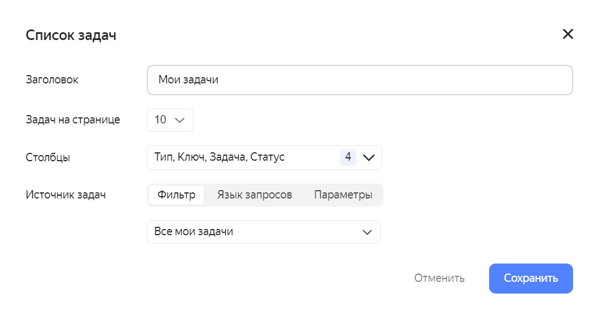

# История изменений в {{ tracker-full-name }} в октябре 2022

* [Управление группами пользователей](#admin-groups)
* [Страница управления пользователями](#users-page)
* [Фильтр "Мои задачи" в виджете на стартовой странице](#widget-my-issues)
* [Фильтрация задач в мобильном приложении {{ tracker-name }}](#filters-in-mobile-app)
* [Обновления в диаграммах Ганта](#gantt-news)
* [Возможность выбрать стартовую страницу](#custom-startpage)
* [Иконка для перехода на стартовую "Мою страницу"](#startpage-mypage)

## Управление группами пользователей {#admin-groups}

Администраторы могут настраивать доступы для групп пользователей из Яндекс 360. Теперь необязательно вручную назначать права доступа каждому отдельному пользователю.

Настройка групп доступна в разделе [**Администрирование** → **Группы**](https://tracker.yandex.ru/admin/groups).

## Страница управления пользователями {#users-page}

У администраторов появилась [страница](https://tracker.yandex.ru/admin/users) со списком всех пользователей и дополнительной информацией о них:
* принадлежность к [группам](../access.md#group-access);
* принадлежность к [организациям](../add-users.md#invite_user);
* дата последнего входа в {{ tracker-full-name }};
* [доступы](../role-model.md#roles).

Страница доступна в разделе **Администрирование** → **Пользователи**.

## Фильтр "Мои задачи" в виджете на стартовой странице {#widget-my-issues}

Настраивая на [стартовой странице](../user/startpage.md#tasks) виджет с задачами, вы сможете использовать фильтр **Мои задачи**. В нем содержатся задачи, в которых вы автор, исполнитель, наблюдатель или те, в которых вас призвали в комментарии и ждут вашего ответа.

## Фильтрация задач в мобильном приложении {{ tracker-name }} {#filters-in-mobile-app}

Теперь фильтрация задач доступна и в мобильном приложении {{ tracker-full-name }}. С помощью фильтрации вы сможете выбрать задачи по любым параметрам, например:
* с указанной доски;
* из проекта;
* по исполнителю;
* по дедлайну, и т.д.

Кроме того, в списке фильтров в приложении вы сможете найти свои сохраненные фильтры, которые создавали в интерфейсе {{ tracker-name }}.

## Обновления в диаграммах Ганта {#gantt-news}

При скролле диаграммы Ганта для проекта, списка проектов или фильтра задач скрывается шапка страницы.



   - Диаграмма Ганта для задач проекта

      1. Появилась настройка **Скрыть связи**: она скрывает блокирующие связи между задачами.
      1. При обновлении страницы в диаграмме сохраняется выбранный масштаб (недели, месяцы или кварталы).
      1. На диаграмме Ганта проекта появилась возможность настроить столбцы таблицы слева от диаграммы. Можно добавить туда любые поля, например, статус, ключ и другие. Для этого нужно нажать .
      1. На диаграмме у столбцов можно менять ширину, причем новое форматирование сохраняется и при обновлении страницы.
     
   - Диаграмма Ганта для списка проектов

      1. В списке проектов и на диаграмме Ганта для списка проектов появилась сортировка по параметрам проекта: по статусу, дате начала и завершения, ответственному.
      1. При нажатии на проект из диаграммы Ганта справа открывается его карточка.

   - Диаграмма Ганта для задач очереди

      Добавили переключение в режим Ганта на странице очереди — при этом на диаграмме отобразятся задачи очереди.



## Возможность выбрать стартовую страницу {#custom-startpage}

Пользователи {{ tracker-name }} могут по своему усмотрению выбрать стартовую страницу. Чтобы выбрать тип стартовой страницы, откройте **Настройки** → **Интерфейс** и в поле **Стартовая страница** выберите:

* Моя страница;
* Сохранённый фильтр;
* Доска задач;
* Дашборд.

## Иконка для перехода на стартовую "Мою страницу" {#startpage-mypage}

Для пользователей, у которых в качестве стартовой выбрана не **Моя страница**, доступна иконка  для быстрого перехода к этой странице.

