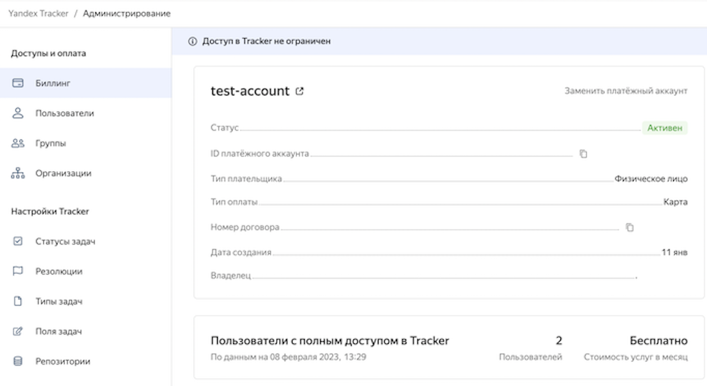

# История изменений в {{ tracker-full-name }} в январе 2023

* [Смена платежного аккаунта](#ba-change)
* [Сохранение настроек диаграммы Ганта](#gantt-diagram)
* [Обновление диаграммы Ганта для списка проектов](#gantt-for-projects)
* [Выбор палитры для диаграммы Ганта](#gantt-colors)

## Смена платежного аккаунта {#ba-change}

Теперь [платежный аккаунт](../billing-account.md) можно сменить на любой из созданных ранее или добавить новый. Переключение на новый платежный аккаунт произойдет после окончания расчетного периода, то есть в начале следующего месяца. До конца месяца деньги будут списываться из средств текущего платежного аккаунта.



## Сохранение настроек диаграммы Ганта {#gantt-diagram}

Для [диаграммы Ганта](../manager/gantt.md) по фильтру и очереди при закрытии или обновлении страницы сохраняются настройки:

* выбранный масштаб диаграммы;
* показ названия задач;
* показ исполнителя задачи;
* показ связей между задачами на диаграмме;
* показ просроченных дедлайнов;
* автоматический сдвиг зависимых задач при сдвиге задачи-блокера.

Для диаграммы Ганта [по списку проектов](../manager/gantt-project.md) сохраняется только масштаб диаграммы.

## Обновление диаграммы Ганта для списка проектов {#gantt-for-projects}

Временная шкала и список задач для диаграммы Ганта обновляются, когда:
* сроки задач изменены;
* задача добавлена в проект;
* задача удалена из проекта;
* порядок порядок задач в режиме ранжирования изменен;
* название тикета изменено;
* значения полей задачи изменены.

При изменении параметров задачи ее положение в списке изменится автоматически.



## Выбор палитры для диаграммы Ганта {#gantt-colors}

Появилась возможность настраивать цвета задач в диаграммах Ганта c помощью HTTP-запросов к [REST API](https://cloud.yandex.ru/docs/glossary/rest-api). Выбор цвета доступен для задач очереди и для задач фильтра. Настройки сохраняются для отдельного проекта или пользователя. Палитра по умолчанию — однотонная; можно назначить цвета по типам статусов или параметрам задачи, а также выбрать цвет отдельной задачи.



Перед выполнением запроса получите [доступ к {{ tracker-full-name }} API](https://cloud.yandex.ru/docs/tracker/concepts/access).



Чтобы задать цвет, укажите в параметре `data.ganttColoringSettings.coloringType` значение из списка:

* `byStatus`;
* `manual`;
* `parameterized`;
* `none`.

Чтобы задать новый цвет, используйте метод `PATCH`:

```
PATCH /front/charts/gantt/project/{projectId}/coloringSettings

{
	"coloringType": "none",
	"defaultParameter": "priority"
}
```
