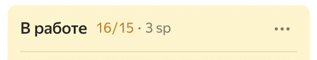
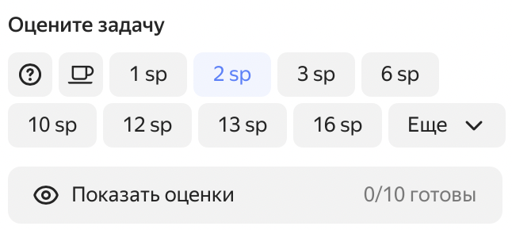

# История изменений в {{ tracker-full-name }} в апреле 2023

* [Обновления](#top-news)
* [Исправления и улучшения](#fixes)

## Обновления {#top-news}

### Выбор цвета для задач на диаграмме Ганта для проекта {#issues-colors}

Теперь на [диаграмме Ганта для проектов](../gantt/project.md) можно назначить цвет задачам в зависимости от выбранного параметра (очередь, статус, и др.). Для этого на странице с диаграммой Ганта нажмите **Настройки диаграммы** и в разделе **Цвет задач** выберите **по параметрам задачи**.

Список значений можно редактировать: добавлять или удалять значения, а также выбирать для них цвет.

Если в задаче два и более цветных компонента, итоговый цвет будет выбран по приоритету в списке значений.

### Сохранение настроек для диаграммы Ганта по фильтру {#save-the-columns}

Настройки [диаграммы Ганта по фильтру](../gantt/search.md) и параметры задач в списке слева от диаграммы сохраняются и не сбрасываются после обновления страницы.

### Создать задачу из комментария {#task-from-comment}

В меню  **Действия над комментарием** появился пункт **Создать задачу из комментария**. Будет создана связанная задача с текстом комментария в описании. При необходимости описание можно редактировать.

### Ограничение количества задач в колонке {#column-limits}

На [новых досках](../manager/agile-new.md) можно установить ограничение на количество задач в колонке. Количество задач и заданное ограничение отображаются рядом с названием колонки. Если количество задач превысит лимит, цвет колонки станет желтым, но задачи можно продолжать добавлять. 

Установить ограничение можно в настройках колонки  → **Редактировать** → **Максимальное количество задач**

### Настройка перехода из статуса "Любой статус" {#meta-transition}

В новом редакторе рабочих процессов у статусов есть настройка **Разрешить переходы из любого статуса**. При этом на схему добавляется статус с названием **Любой статус**. Раньше переход из статуса **Любой статус** был недоступен для редактирования, а сейчас для него можно настраивать автоматизацию, условия и экраны перехода так же, как и для любого другого перехода на схеме.

### Отмена последнего действия в редакторе рабочих процессов {#hot-keys}

В редакторе рабочих процессов для отмены последнего действия и его восстановления можно использовать сочетания клавиш.
* Windows: **Ctrl** + **Z** для отмены действия, **Ctrl** + **Shift** + **Z** — для восстановления отмененного действия.
* Mac OS: **⌘** + **Z** для отмены действия, **⌘** + **Shift** + **Z** — для восстановления отмененного действия.

## Исправления и улучшения {#fixes}

### Фильтр задач для диаграммы Ганта по списку проектов

На [диаграмме Ганта для списка проектов](../gantt/project.md) можно настроить дополнительный фильтр по задачам.

### Призывы в комментарии к проектам {#bell-summons}

Можно призывать пользователей в комментарии к проектам. Оповещения о призыве приходят на почту.

### Выбор цвета для статуса задачи {#statuses-color}

Статус задачи дополнительно выделен цветом, в зависимости от типа статуса:
* 
* 
* 
* 
* 

### Обновление покера планирования на досках {#new-poker-ui}

На [новых досках](../manager/agile-new.md) **Покер планирования** открывается на всю высоту доски, а перетащить задачу можно на любую часть открытой вкладки.
Оценивать задачи стало удобнее: вместо выпадающего списка появились кнопки с оценками, счетчик проголосовавших и кнопка для просмотра выставленных оценок.  

