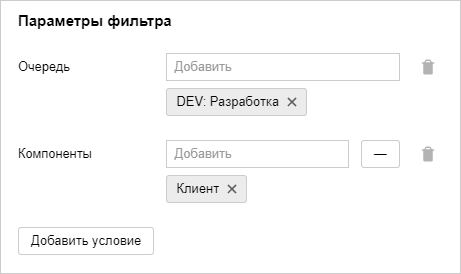

# Использовать гибкие методологии (Agile)

Если работа вашей команды организована на основе [гибких методологий разработки (Agile)]({{ link-wiki-agile }}), попробуйте использовать доски задач в {{ tracker-name }}. На доске удобно отслеживать текущие задачи команды, например во время ежедневных собраний. Задачи отображаются на доске в виде карточек, которые распределены по колонкам в зависимости от статуса.

Если [при создании очереди](dev-process-create-queue.md) вы выбрали шаблоны <q>Базовая разработка</q>, <q>Скрам</q> или <q>Канбан</q>, автоматически будет создана доска задач с таким же названием, как у очереди. На доске будут отображаться все задачи вашей очереди.

Вы можете [создать несколько досок задач](manager/create-agile-board.md), например для разных рабочих групп или для задач разного типа:

1. На панели слева выберите &nbsp;**Доски задач**, затем нажмите **Создать доску**.

1. Выберите [тип доски](#board_types).

1. В блоке **Добавить задачи** включите опцию **автоматически** и задайте условия фильтра, чтобы отображать на доске задачи с определенными параметрами.

    Например, вы можете настроить фильтр, чтобы на доску попадали все задачи из вашей очереди, задачи с указанными [компонентами](manager/components.md), задачи указанных сотрудников и так далее.

    

### Типы досок в {{ tracker-name }} {#board_types}

В {{ tracker-name }} можно использовать несколько типов досок:

- <q>Простая</q> — доска с минимальными возможностями, отображает задачи команды и их статус.

- <q>Канбан</q> — похожа на простую доску, но все задачи в статусе **Открыт** автоматически попадают в колонку [**Бэклог**](manager/agile.md#dlen_backlog).

- <q>Скрам</q> — помимо отображения статусов задач, позволяет управлять [спринтами](manager/agile.md#dlen_sprint), [оценивать задачи](manager/planning-poker.md) и смотреть [диаграмму сгорания задач](manager/agile.md#dlen_burndown).

### Инструменты на Скрам-доске

На доске <q>Скрам</q> доступны инструменты, которые помогут организовать работу по методологии [Скрам]({{ link-wiki-scrum }}):

- **Спринты**

    В методологии Скрам работа выполняется небольшими итерациями — спринтами. Обычно спринт длится одну или две недели. Старайтесь планировать спринты так, чтобы за время спринта команда успела выполнить все намеченные задачи. Чтобы понимать объем запланированной работы, предварительно оцените задачи с помощью [покера планирования](#poker).

    Чтобы [запланировать спринт в {{ tracker-name }}](manager/create-agile-sprint.md):

    - На доске задач в правом верхнем углу нажмите кнопку **Спринты**.

    - [Создайте спринт](manager/create-agile-sprint.md#create_sprint) и задайте даты его начала и конца.

    - Добавьте в спринт задачи: перетащите задачи из столбца **Бэклог** в список задач спринта или на странице задачи укажите спринт в поле **Agile** → **Спринт**.

    Чтобы отобразить на доске задачи определенного спринта, выберите спринт вверху страницы. Чтобы следить за скоростью выполнения задач, запланированных в спринте, используйте [диаграмму сгорания](#burndown).

- **Покер планирования** {#poker}

    Чтобы точно спланировать объем работы в следующем спринте, нужно оценить трудоемкость задач. Для этого в методологии Скрам используется [покер планирования (Planning Poker)]({{ link-wiki-poker }}). Этот метод позволяет получить независимые оценки задачи от всех участников команды, обсудить их и сформировать итоговую оценку. Обычно для оценки используют относительную единицу трудоемкости задач [Story Point](manager/agile.md#dlen_sp).

    Вы можете [использовать покер планирования в {{ tracker-name }}](manager/planning-poker.md):

    - Чтобы [провести оценку](manager/planning-poker.md#section_estimate), попросите участников команды перейти на страницу покера. Для этого на доске задач в правом верхнем углу нужно нажать кнопку **Покер**.

    - В настройках доски можно [настроить шкалу оценки задач](manager/planning-poker.md#section_scale) и [правила вычисления итоговой оценки](manager/planning-poker.md#section_calc). 

- **Диаграмма сгорания** {#burndown}

    Диаграмма сгорания задач показывает скорость выполнения задач и оставшийся объем работы в течение [спринта](manager/agile.md#dlen_sprint). По диаграмме сгорания можно спрогнозировать, успеет ли команда выполнить запланированные задачи.

    На диаграмме по вертикальной оси отмечен суммарный объем оставшейся работы в единицах [Story Point](manager/agile.md#dlen_sp), по горизонтальной оси отмечено время. Идеальная диаграмма сгорания должна быть близка к прямой линии, которая начинается в точке с максимальным объемом работы (общий объем задач в спринте) в первый день спринта и заканчивается в нулевой точке в последний день спринта.

    Чтобы [посмотреть диаграмму сгорания в {{ tracker-name }}](manager/burndown.md), на доске задач в правом верхнем углу нажмите кнопку **Диаграмма сгорания задач**.

### Декомпозиция задач

В гибких методологиях разработки задачи декомпозируют следующим образом:

- Крупные задачи, которые невозможно выполнить в течение одной итерации (спринта), называют эпиками (Epics). 

- Эпики разбивают на <q>пользовательские истории</q> (User Stories) — законченные возможности продукта, которые можно реализовать за один спринт.

- Истории разбивают на отдельные задачи, например дизайн интерфейса, разработка бэкенда и разработка фронтенда.

Чтобы использовать такую систему декомпозиции задач, в [шаблоне очереди <q>Скрам</q>](manager/workflows.md#sec_scrum) предусмотрены типы задач Epic и Story. Если [при создании очереди](dev-process-create-queue.md) вы выбрали шаблон, в котором нет типов задач Epic и Story, вы можете [добавить их в настройках очереди](manager/add-ticket-type.md).