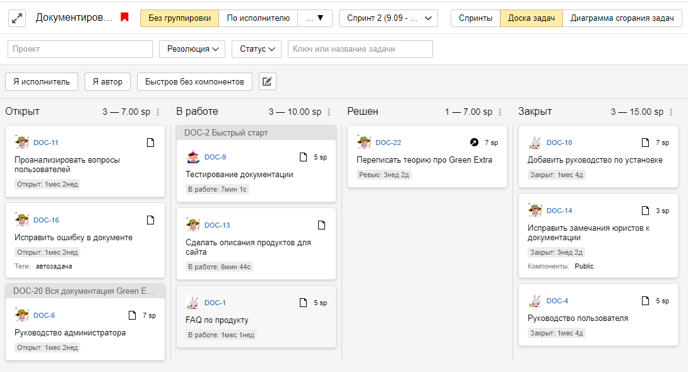

# Пример: как настроить {{ tracker-name }} для команды разработки

{{ tracker-full-name }} — инструмент совместной работы, который подходит для управления разработкой программ и приложений. В {{ tracker-name }} предусмотрено множество инструментов для разработчиков:

- Гибкое управление задачами: настраиваемые типы, статусы и параметры задач, шаблоны, [возможность декомпозиции и структурирования задач с помощью связей](#manage_tickets).

- Инструменты для [работы по гибким методологиям (Agile)](#agile).

- [Автоматизация рутинных действий](#automation), которая экономит время разработчиков.



- [Подключение репозиториев исходного кода](#repo) и [возможность интеграции с другими системами](#api).



- [Возможность интеграции с другими системами](#api).



Рассмотрим пример, как настроить в {{ tracker-name }} рабочий процесс для команды разработки.

## Создать очередь для команды разработки {#create}

У каждой команды есть сложившийся процесс планирования работы, выполнения задач, выпуска версий продукта. Чтобы настроить привычный рабочий процесс в {{ tracker-name }}, используйте [очередь задач](queue-intro.md). Очередь — это пространство для задач, объединенных общим процессом или продуктом.

Для каждой команды разработки рекомендуется создавать отдельную очередь. Вы можете создать несколько очередей, если хотите разделить работу на несколько потоков. Например, если в вашей команде несколько рабочих групп, которые занимаются независимыми друг от друга задачами, можно создать отдельную очередь для каждой группы.

Чтобы создать очередь для команды разработки:



1. Если ваша организация еще не работает в {{ tracker-name }}, [подключите {{ tracker-name }}](enable-tracker.md).

1. Убедитесь, что все участники команды разработки имеют [полный доступ в {{ tracker-name }}](enable-tracker.md#add-users).
<!--1. В Яндекс.Коннекте [создайте команду](https://yandex.ru/support/connect/teams.html#teams__section_q3z_wkm_5gb)(https://yandex.com/support/connect/teams.html#teams__section_q3z_wkm_5gb) и добавьте в нее сотрудников, которые будут работать над вашим продуктом. Команду можно будет призвать в комментарии к задаче и создать для нее почтовую рассылку (если у вашей организации есть [почтовый домен](https://yandex.ru/support/connect/domains.html)(https://yandex.com/support/connect/domains.html)).-->



1. [Создайте очередь задач.](manager/create-queue.md) Для очереди выберите [шаблон](manager/workflows.md) с типами задач и статусами, которые лучше подходят для вашего рабочего процесса:

    - <q>Базовая разработка</q> — этот шаблон содержит типы задач и статусы, которые часто используют при разработке программ и приложений. При выборе этого шаблона автоматически создается [простая доска задач](#board_types).

    - <q>Разработка на заказ</q> — в этом шаблоне предусмотрен тип задач <q>Проект</q> и статус для согласования результатов работы с заказчиком. 

    - <q>Скрам</q> — этот шаблон подходит для команд, которые работают по методологии [Скрам]({{ link-wiki-scrum }}). При выборе этого шаблона автоматически создается [доска задач <q>Скрам</q>](#board_types).

    - <q>Канбан</q> — этот шаблон подходит для команд, которые работают по методологии [Канбан]({{ link-wiki-kanban }}). При выборе этого шаблона автоматически создается [простая доска задач <q>Канбан</q>](#board_types).

    

    Если вы выбрали шаблон очереди без доски задач, доску можно [создать позже](manager/create-agile-board.md).

    

1. Если вы хотите изменить возможные статусы задач в вашей очереди, в настройках очереди скопируйте [базовый воркфлоу](manager/add-workflow.md) и [отредактируйте его](manager/workflow-status-edit.md).

1. Добавьте сотрудников, которые будут работать над вашим продуктом, в [команду очереди](manager/queue-team.md). 

1. Если требуется, настройте [права доступа к очереди](manager/queue-access.md). Например, определенным группам пользователей можно запретить создавать или просматривать задачи в очереди.

## Структурировать задачи {#manage_tickets}

В {{ tracker-name }} есть несколько способов структурировать задачи. Вы можете использовать их по отдельности или сочетать.

#### Типы задач

В очереди можно использовать несколько [типов задач](manager/add-ticket-type.md) с разными рабочими процессами. Например, в шаблоне очереди <q>Базовая разработка</q> по умолчанию заданы типы <q>Задача</q>, <q>Улучшение</q>, <q>Ошибка</q> и <q>Релиз</q>.

Если требуется, вы можете добавить в очередь новые типы задач и [настроить для них отдельный воркфлоу](manager/add-workflow.md) — набор статусов и правила перехода между ними.

#### Связи

В {{ tracker-name }} можно [связывать задачи друг с другом](user/ticket-links.md). Список связей со ссылками отображается на странице задачи. С помощью связей вы можете:

- Декомпозировать задачи — разбивать крупные части проекта на отдельные задачи и подзадачи.

    Например, для реализации новой возможности продукта нужно выполнить несколько небольших задач. Тогда можно создать родительскую задачу типа <q>Новая возможность</q> и привязывать к ней подзадачи.

- Показать зависимости между задачами — если выполнить задачу можно только после того, как будет закончена блокирующая задача.

- Добавлять ссылки на задачи с общей темой.

#### Компоненты

[Компоненты](manager/components.md) помогают группировать задачи очереди, относящиеся к одной тематике. Для задач с компонентами можно настроить исполнителя по умолчанию и [права доступа](manager/queue-access.md#section_tbh_cs5_qbb).

#### Версии

[Версии](manager/versions.md) помогают группировать задачи очереди, относящиеся к одной версии продукта.

#### Проекты

В [проект](manager/projects.md) можно объединять задачи, у которых есть общий дедлайн и ответственный сотрудник. В проект могут входить задачи из разных очередей.

## Использовать гибкие методологии (Agile) {#agile}

Если работа вашей команды организована на основе [гибких методологий разработки (Agile)](https://ru.wikipedia.org/wiki/Гибкая_методология_разработки)(https://en.wikipedia.org/wiki/Agile_software_development), попробуйте использовать доски задач в {{ tracker-name }}. На доске удобно отслеживать текущие задачи команды, например во время ежедневных собраний. Задачи отображаются на доске в виде карточек, которые распределены по колонкам в зависимости от статуса.










Если [при создании очереди](#create) вы выбрали шаблоны <q>Базовая разработка</q>, <q>Скрам</q> или <q>Канбан</q>, автоматически будет создана доска задач с таким же названием, как у очереди. На доске будут отображаться все задачи вашей очереди.

Вы можете [создать несколько досок задач](manager/create-agile-board.md), например для разных рабочих групп или для задач разного типа:

1. На верхней панели {{ tracker-name }} выберите **Доски** → **Создать доску**.

1. Выберите [тип доски](#board_types).

1. Включите опцию **Добавлять задачи автоматически** и задайте условия фильтра, чтобы отображать на доске задачи с определенными параметрами.

    Например, вы можете настроить фильтр, чтобы на доску попадали все задачи из вашей очереди, задачи с указанными [компонентами](manager/components.md), задачи указанных сотрудников и так далее.

    

#### Типы досок в {{ tracker-name }} {#board_types}

В {{ tracker-name }} можно использовать несколько типов досок:

- <q>Простая</q> — доска с минимальными возможностями, отображает задачи команды и их статус.

- <q>Канбан</q> — похожа на простую доску, но все задачи в статусе **Открыт** автоматически попадают в колонку [**Бэклог**](manager/agile.md#dlen_backlog).

- <q>Скрам</q> — помимо отображения статусов задач, позволяет управлять [спринтами](manager/agile.md#dlen_sprint), [оценивать задачи](manager/planning-poker.md) и смотреть [диаграмму сгорания задач](manager/agile.md#dlen_burndown).

#### Инструменты на Скрам-доске

На доске <q>Скрам</q> доступны инструменты, которые помогут организовать работу по методологии [Скрам]({{ link-wiki-scrum }}):

- **Спринты**

    В методологии Скрам работа выполняется небольшими итерациями — спринтами. Обычно спринт длится одну или две недели. Старайтесь планировать спринты так, чтобы за время спринта команда успела выполнить все намеченные задачи. Чтобы понимать объем запланированной работы, предварительно оцените задачи с помощью [покера планирования](#poker).

    Чтобы [запланировать спринт в {{ tracker-name }}](manager/create-agile-sprint.md):

    - На доске задач в правом верхнем углу нажмите кнопку **Спринты**.

    - [Создайте спринт](manager/create-agile-sprint.md#create_sprint) и задайте даты его начала и конца.

    - Добавьте в спринт задачи: перетащите задачи из столбца **Бэклог** в список задач спринта или на странице задачи укажите спринт в поле **Agile** → **Спринт**.

    Чтобы отобразить на доске задачи определенного спринта, выберите спринт вверху страницы. Чтобы следить за скоростью выполнения задач, запланированных в спринте, используйте [диаграмму сгорания](#burndown).

- **Покер планирования** {#poker}

    Чтобы точно спланировать объем работы в следующем спринте, нужно оценить трудоемкость задач. Для этого в методологии Скрам используется [покер планирования (Planning Poker)](https://ru.wikipedia.org/wiki/Покер_планирования)(https://en.wikipedia.org/wiki/Planning_poker). Этот метод позволяет получить независимые оценки задачи от всех участников команды, обсудить их и сформировать итоговую оценку. Обычно для оценки используют относительную единицу трудоемкости задач [Strory Point](manager/agile.md#dlen_sp).

    Вы можете [использовать покер планирования в {{ tracker-name }}](manager/planning-poker.md):

    - Чтобы [провести оценку](manager/planning-poker.md#section_estimate), попросите участников команды перейти на страницу покера. Для этого на доске задач в правом верхнем углу нужно нажать кнопку **Покер**.

    - В настройках доски можно [настроить шкалу оценки задач](manager/planning-poker.md#section_estimate) и [правила вычисления итоговой оценки](manager/planning-poker.md#section_calc). 

- **Диаграмма сгорания** {#burndown}

    Диаграмма сгорания задач показывает скорость выполнения задач и оставшийся объем работы в течение [спринта](manager/agile.md#dlen_sprint). По диаграмме сгорания можно спрогнозировать, успеет ли команда выполнить запланированные задачи.

    На диаграмме по вертикальной оси отмечен суммарный объем оставшейся работы в единицах [Story Point](manager/agile.md#dlen_sp), по горизонтальной оси отмечено время. Идеальная диаграмма сгорания должна быть близка к прямой линии, которая начинается в точке с максимальным объемом работы (общий объем задач в спринте) в первый день спринта и заканчивается в нулевой точке в последний день спринта.

    Чтобы [посмотреть диаграмму сгорания в {{ tracker-name }}](manager/burndown.md), на доске задач в правом верхнем углу нажмите кнопку **Диаграмма сгорания задач**.

#### Декомпозиция задач

В гибких методологиях разработки задачи декомопозируют следующим образом:

- Крупные задачи, которые невозможно выполнить в течение одной итерации (спринта), называют эпиками (Epics). 

- Эпики разбивают на <q>пользовательские истории</q> (User Stories) — законченные возможности продукта, которые можно реализовать за один спринт.

- Истории разбивают на отдельные задачи, например дизайн интерфейса, разработка бэкенда и разработка фронтенда.

Чтобы использовать такую систему декомпозиции задач, в [шаблоне очереди <q>Скрам</q>](manager/workflows.md#sec_scrum) предусмотрены типы задач Epic и Story. Если [при создании очереди](#create) вы выбрали шаблон, в котором нет типов задач Epic и Story, вы можете [добавить их в настройках очереди](manager/add-ticket-type.md).

## Настроить шаблоны задач {#templates}

Используйте [шаблоны](user/ticket-template.md), чтобы упростить создание типовых задач, например ошибок или задач на тестирование. В шаблоне можно задать известные заранее параметры задачи и добавить подсказки для описания задачи, чтобы пользователи не забывали указать необходимую информацию.

Чтобы создать шаблон задачи для вашей очереди и разрешить использовать его участникам команды:

1. На верхней панели {{ tracker-name }} нажмите  → **Управление шаблонами**.

    На верхней панели {{ tracker-name }} нажмите ваш портрет и выберите **Персональные настройки**. Затем нажмите кнопку **Управление шаблонами**.

1. Выберите опцию **Задачи** и нажмите кнопку **Создать шаблон**.

1. Задайте название о описание шаблона.

1. Чтобы шаблон можно было использовать только в вашей очереди, укажите ключ или название очереди в поле **Привязка к очереди**. В этом случае участники команды очереди автоматически получат доступ к шаблону на чтение.

1. Заполните поля шаблона и сохраните его. Заданные значения полей будут автоматически подставляться в задачи, созданные с помощью шаблона.

1. Чтобы настроить доступ к шаблону, рядом с шаблоном нажмите кнопку **Права доступа** и добавьте нужные группы или пользователей.

1. Чтобы участники вашей команды могли использовать шаблон для создания задач:

    - У сотрудников должен быть доступ к шаблону на чтение.

    - Сотрудники должны подключить шаблон. Для этого нужно перейти на страницу управления шаблонами и включить шаблон с помощью переключателя.

Если вам нужен шаблон задачи, который по умолчанию смогут использовать все пользователи, [настройте форму для создания задачи](manager/forms-integration.md) в сервисе Яндекс.Формы. Созданную [форму можно использовать вместо стандартной страницы создания задачи](manager/attach-form.md) в вашей очереди.



## Подключить репозиторий {#repo}

Если вы используете облачные сервисы GitHub, GitLab или Bitbucket, вы можете подключить ваши репозитории к {{ tracker-name }} и привязывать коммиты к задачам. Это позволит при необходимости найти изменения в коде, связанные с определенной задачей.



К {{ tracker-name }} нельзя подключить Git-репозитории, размещенные на вашем собственном сервере.



Чтобы подключить репозиторий:

1. Убедитесь, что вы авторизованы как администратор организации.

1. В настройках {{ tracker-name }} перейдите на вкладку [Репозитории]({{ link-repositories }}) и нажмите кнопку **Подключить репозиторий**.

1. Выберите сервис, в котором расположен репозиторий, и укажите данные для подключения:

    - Ссылку на репозиторий.

    - Для закрытых репозиториев GitHub и GitLab — токен. Для публичных репозиториев указывать токен не нужно.

    - Для репозитория Bitbucket — ваш логин на Bitbucket и специально созданный пароль для {{ tracker-name }}.

    Подробнее о параметрах подключения читайте в разделе [{#T}](manager/add-repository.md).

1. Чтобы на странице задачи отображались связанные коммиты, в [настройках вашей очереди](manager/edit-queue-general.md#integration) включите опцию **Отображать вкладку Коммиты**.

Чтобы связать коммит с задачей в {{ tracker-name }}, в комментарии к коммиту укажите [ключ задачи](user/create-ticket.md#key).



## Автоматизировать рутинные действия {#automation}

Типовые действия с задачами в {{ tracker-name }} можно автоматизировать с помощью [триггеров, автодействий и макросов](automation.md). Вы можете изменять параметры задачи при наступлении определенных событий, периодически или по команде, а также создавать новые задачи по расписанию.

Рассмотрим несколько примеров автоматизации в {{ tracker-name }}:

#### Автоматически назначать исполнителя задачи {#auto-assign-executor}

Если задача относится к области ответственности определенного сотрудника, можно автоматически назначить его исполнителем задачи с помощью [триггера](user/trigger.md). Триггер срабатывает при заданных условиях и автоматически меняет параметры задачи.

Например, тестировщик должен приступать к тестированию новой функции продукта, когда разработчик перевел задачу в статус <q>Можно тестировать</q>. Чтобы автоматически назначать тестировщика исполнителем задачи, настройте триггер следующим образом:

- Условия срабатывания: задача изменилась и перешла в статус <q>Можно тестировать</q>.

- Действие триггера: в поле <q>Исполнитель</q> указать тестировщика.


Рассмотрим другой пример, когда серверной частью продукта занимается один разработчик, а клиентской частью — другой. При создании новых ошибок, относящихся к серверной или клиентской части, можно автоматически назначать исполнителем ответственного разработчика при помощи компонентов и триггеров:

1. В вашей очереди [настройте компоненты](manager/components.md), которые соответствуют частям продукта: <q>Сервер</q> и <q>Клиент</q>. При создании новой ошибки добавляйте в нее нужный компонент.

1. Настройте триггер для ошибок в серверной части:

    - Условия срабатывания: задача изменилась и поле <q>Компоненты</q> стало равно <q>Сервер</q>.

    - Действие триггера: в поле <q>Исполнитель</q> указать разработчика серверной части.

    

1. Настройте аналогичный триггер для ошибок в клиентской части:

    - Условия срабатывания: задача изменилась и поле <q>Компоненты</q> стало равно <q>Клиент</q>.

    - Действие триггера: в поле <q>Исполнитель</q> указать разработчика клиентской части.

Подробно пример настройки триггера описан в разделе [{#T}](manager/trigger-examples.md#assign_ticket).

#### Напоминать исполнителю задачи о дедлайне {#auto-remind-deadline}

Чтобы исполнители не забывали выполнять задачи вовремя, можно отправлять им напоминания с помощью автодействия. Автодействие срабатывает периодически и обновляет параметры задач, которые соответствуют заданным условиям.

Например, нужно раз в день проверять все задачи в вашей очереди. Если задача не решена и срок, указанный в поле <q>Дедлайн</q>, наступит менее чем через 3 дня, нужно добавлять к задаче комментарий и призывать исполнителя задачи. Для этого настройте автодействие следующим образом:

- Тип автодействия: **Обновление задач**.

- Периодичность: 1 раз в день.

- Параметры фильтра: запрос, написанный с помощью [языка запросов](user/query-filter.md): 

    ```
    Resolution: empty() AND Deadline: <= today() + 3d
    ```

    

- Действие над задачей: отправить комментарий и призвать пользователя из поля <q>Исполнитель</q>. 

Подробно пример настройки автодействия описан в разделе [{#T}](user/create-autoaction.md#autoaction_example).

#### Создавать повторяющиеся задачи {#auto-create-task}

Если требуется периодически создавать задачи по определенному шаблону, это можно сделать с помощью автодействий. Например, каждую неделю создавать задачу на резервное копирование данных.

Для этого настройте автодействие следующим образом:

- Тип автодействия: **Создание задач**.

- Периодичность действия: 1 раз в неделю по пятницам.

    Вы можете задать начало и конец интервала, в течение которого будет действовать автоматическое создание задач. Если интервал не указан, создание задач будет действовать постоянно.

    

- Действие в очереди: создать задачу. Заполните поля шаблона для автоматического создания задач.

Подробно пример настройки автодействия описан в разделе [{#T}](user/create-autoaction.md#autoaction_example).

## Интегрировать {{ tracker-name }} с другими системами {#api}

Разработчики используют в своих процессах различные системы для сборки, тестирования, развертывания приложений и так далее. Работать с несколькими системами будет удобно, если в задаче {{ tracker-name }} можно будет найти ссылки на связанные ресурсы или задачи в других системах. Чтобы передавать в {{ tracker-name }} информацию из сторонних систем, используйте API {{ tracker-name }}. Подробнее о возможностях API {{ tracker-name }} читайте в [документации](https://yandex.ru/dev/connect/tracker/api/about-docpage/)(https://tech.yandex.com/connect/tracker/api/about-docpage/).

Чтобы передавать информацию из {{ tracker-name }} в другую систему, можно отправлять HTTP-запросы с помощью [триггеров](user/trigger.md).

Рассмотрим примеры, как можно связать {{ tracker-name }} с другими системами.

#### Отслеживать статус ревью кода

Предположим, что команда использует репозиторий Bitbucket. Когда разработчик делает пул-реквест в репозиторий, его коллеги проводят ревью кода и принимают либо отклоняют пул-реквест. Если пул-реквест принят, разработчик переводит свою задачу в статус <q>Можно тестировать</q>, а если отклонен — в статус <q>Нужны доработки</q>.

Статус задачи по результатам ревью можно менять автоматически через API {{ tracker-name }}. Однако для этого потребуется создать промежуточный сервис, который получает информацию о событии из Bitbucket, обрабатывает ее и отправляет запросы в API {{ tracker-name }}. Примерный алгоритм работы такой схемы:

1. Разработчик делает пул-реквест и указывает в комментарии [ключ задачи](user/create-ticket.md#key). Это поможет определить, статус какой задачи требуется изменить.

1. В Bitbucket должен быть настроен веб-хук: когда ревьюер принимает или отклоняет пул-реквест, Bitbucket отправляет HTTP-запрос в промежуточный сервис.

1. Промежуточный сервис получает запрос, определяет тип события (был ли рул-реквест принят или отклонен) и извлекает из комментария к пул-реквесту ключ задачи.

1. Промежуточный сервис отправляет в API {{ tracker-name }} запрос на изменение статуса задачи. В URL запроса должен быть указан ключ задачи и ключ статуса. Ключ статуса можно посмотреть в настройках {{ tracker-name }} на вкладке [**Статусы задач**]({{ link-tracker-statuses }})({{ link-tracker-statuses-ya }}).

    Формат запроса описан в [документации API](https://yandex.ru/dev/connect/tracker/api/concepts/issues/new-transition-docpage/)(https://tech.yandex.com/connect/tracker/api/concepts/issues/new-transition-docpage/).

#### Привязать к задаче тестовый стенд

Чтобы тестировать новые функции продукта, обычно используют тестовые стенды. Если идет параллельная разработка нескольких функций, удобно создавать отдельный стенд для каждой задачи. Чтобы такой стенд было легко найти, ссылку на него нужно добавлять в задачу. Это можно делать автоматически с помощью API {{ tracker-name }}.

Предположим, что команда автоматизировала создание тестового стенда с помощью скрипта: скрипт загружает код приложения из отдельной ветки задачи, упаковывает его в образ Docker, затем развертывает из образа контейнер на сервере и запускает его.

С помощью того же скрипта можно добавить в задачу ссылку на развернутый стенд. Для этого:



1. В {{ tracker-name }} [создайте новое поле задачи](user/create-param.md#section_pxn_fp4_xgb) <q>Ссылка на стенд</q>.



1. При разработке новой функции продукта создавайте в репозитории отдельную ветку, в имени которой должен быть указан [ключ задачи](user/create-ticket.md#key). Ключ задачи потребуется для отправки запроса в API {{ tracker-name }}.

1. После того как скрипт развернул тестовый стенд, он отправляет в API {{ tracker-name }} запрос, который добавляет адрес стенда в поле задачи <q>Ссылка на стенд</q>. В URL запроса должен быть указан ключ задачи, а в теле запроса — ключ и новое значение поля. Ключ поля можно посмотреть в настройках {{ tracker-name }} на вкладке [**Поля**]({{ link-admin-fields }})({{ link-admin-fields-ya }}).

    Формат запроса описан в [документации API](https://yandex.ru/dev/connect/tracker/api/concepts/issues/patch-issue-docpage/)(https://tech.yandex.com/connect/tracker/api/concepts/issues/patch-issue-docpage/).

#### Отправлять оповещения в мессенджер

Для быстрого оповещения сотрудников о важных событиях удобно использовать мессенджеры. Если у мессенджера есть API, в {{ tracker-name }} можно настроить триггер, который отправляет в API мессенджера HTTP-запросы при наступлении определенных событий. Например, если в очереди создается ошибка с критическим приоритетом.

Примеры настройки триггеров для отправки уведомлений в Slack и Telegram приведены в разделе [{#T}](messenger.md).

