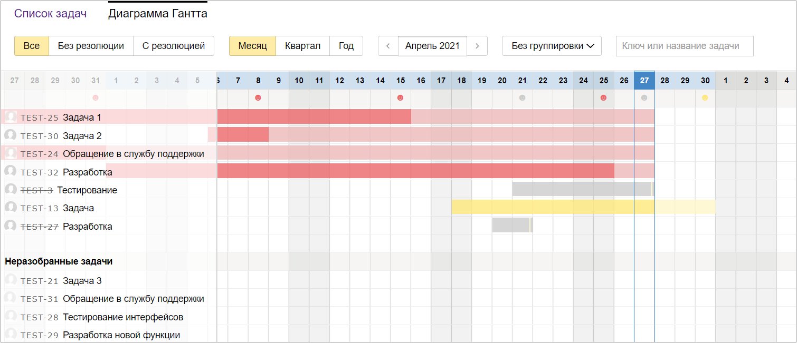

# Диаграмма Ганта в {{ tracker-name }}

Диаграмма Ганта в {{ tracker-name }} — это инструмент для составления календарного плана работ над задачами.

Сроки выполнения задач отмечаются на диаграмме полосками, направленными вдоль оси времени. Начало каждой полоски соответствует дате начала работы над задачей, а ее конец — дате дедлайна. Если задача не закрыта к дедлайну, полоска становится красной.

- [Диаграмма Ганта для задач по фильтру](search.md)
- [Диаграмма Ганта для очереди](queue.md)
- [Диаграмма Ганта для проекта](project.md)
- [Диаграмма Ганта для списка проектов](list-of-projects.md)
- [Диаграмма Ганта для портфеля проектов](portfolio.md)