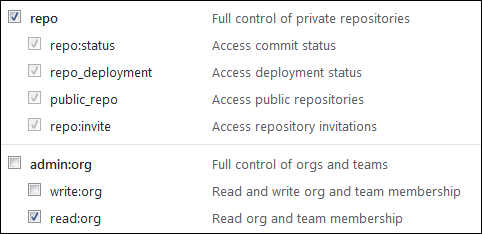

# Подключить репозиторий к {{ tracker-name }}



Подключать репозитории может только [администратор](../role-model.md).



Подключите ваши репозитории к {{ tracker-name }}, чтобы привязывать коммиты к задачам. Вы можете подключить любое количество репозиториев, размещенных в сервисах GitHub, GitLab и Bitbucket.

Вы также можете подключить к {{ tracker-name }} собственный сервер, связанный с сервисами GitHub, GitLab и Bitbucket. В таком случае к {{ tracker-name }} будут подключены все репозитории, к которым есть доступ у токена.

## GitHub {#section_mhj_yrk_m2b}

Чтобы подключить репозиторий на [GitHub](https://github.com) к {{ tracker-name }}:



- Публичный репозиторий

    1. 

    1.  

    1. В поле **{{ ui-key.startrek.blocks-desktop_repository-modal.platform }}** выберите GitHub.

    1. Укажите адрес публичного репозитория в формате `https://github.com/<логин владельца репозитория>/<имя репозитория>`. Поле **{{ ui-key.startrek.blocks-desktop_repository-modal.token }}** оставьте пустым.

    1. Нажмите кнопку **{{ ui-key.startrek.blocks-desktop_repository-modal.button--connect }}**.

    1. Убедитесь, что статус репозитория отображается в {{ tracker-name }} как **{{ ui-key.startrek.blocks-desktop_page-admin-tab_type_repositories.status--success }}**.

- Закрытый репозиторий

    1. 

    1. 

    1. В поле **{{ ui-key.startrek.blocks-desktop_repository-modal.platform }}** выберите GitHub.

    1. Получите на GitHub OAuth-токен для своего репозитория:

        - Авторизуйтесь на GitHub. Если репозиторий прикреплен к GitHub-организации, убедитесь, что у вас есть права администратора.

        - Нажмите на свое фото в правом верхнем углу и выберите **Settings**.
        - На панели слева выберите **Developer settings** → **Personal access token** → **Tokens (classic)**.
        - Нажмите кнопку **Generate new token**.

        - Придумайте название для токена.

        - Настройте разрешения для токена. Для правильной работы с {{ tracker-name }} необходимо, чтобы опции **repo** и **read:org** были включены:

            

        - Нажмите кнопку **Generate token**.

        - Скопируйте токен в буфер обмена.

            

            Значение токена отображается только один раз. Если закрыть страницу, вы больше не сможете его просмотреть.

            

    1. Укажите адрес репозитория в формате `https://github.com/<логин владельца репозитория>/<имя репозитория>` и токен для подключения.

    1. Нажмите кнопку **{{ ui-key.startrek.blocks-desktop_repository-modal.button--connect }}**.

    1. Убедитесь, что статус репозитория отображается в {{ tracker-name }} как **{{ ui-key.startrek.blocks-desktop_page-admin-tab_type_repositories.status--success }}**.



Чтобы привязать коммит к задаче в {{ tracker-name }}, укажите ключ задачи в комментарии к коммиту. Привязанные коммиты можно просмотреть:

- на странице задачи на вкладке **{{ ui-key.startrek-backend.fields.issue.commits-key-value }}**;
- на странице очереди на вкладке **{{ ui-key.startrek.blocks-desktop_b-page_type_queue.tab_commits }}**.

Если вы не видите вкладки **{{ ui-key.startrek.blocks-desktop_b-page_type_queue.tab_commits }}**, убедитесь, что она включена в [настройках очереди](edit-queue-general.md#ul_gcz_xlp_m2b).

## GitLab {#section_kjw_cy2_ggb}

Чтобы подключить репозиторий на [GitLab](https://gitlab.com) к {{ tracker-name }}:



- Публичный репозиторий

    1. 

    1. 

    1. В поле **{{ ui-key.startrek.blocks-desktop_repository-modal.platform }}** выберите GitLab.

    1. Укажите адрес публичного репозитория в формате `https://gitlab.com/<логин владельца репозитория>/<имя репозитория>`. Поле **{{ ui-key.startrek.blocks-desktop_repository-modal.token }}** оставьте пустым.

    1. Нажмите кнопку **{{ ui-key.startrek.blocks-desktop_repository-modal.button--connect }}**.

    1. Убедитесь, что статус репозитория отображается в {{ tracker-name }} как **{{ ui-key.startrek.blocks-desktop_page-admin-tab_type_repositories.status--success }}**.

- Закрытый репозиторий

    

    Закрытый репозиторий доступен только авторизованным пользователям GitLab (**Internal project**) или команде проекта (**Private project**).

    

    1. 

    1. 

    1. В поле **{{ ui-key.startrek.blocks-desktop_repository-modal.platform }}** выберите GitLab.

    1. Получите на GitLab OAuth-токен для своего репозитория:

        - Авторизуйтесь на GitLab.

        - Нажмите на свое фото в правом верхнем углу и выберите **Settings**.

        - На панели слева выберите **Access Tokens**.

        - Введите название токена в поле **Name**.

        - Задайте срок действия токена в поле **Expires at**.

        - Настройте разрешение для токена. Для правильной работы с {{ tracker-name }} необходимо, чтобы опция **api** была включена:

            

        - Нажмите кнопку **Create personal access token**.

        - Скопируйте токен в буфер обмена.

            

            Значение токена отображается только один раз. Если закрыть страницу, вы больше не сможете его просмотреть.

            

    1. Укажите адрес публичного репозитория в формате `https://gitlab.com/<логин владельца репозитория>/<имя репозитория>` и токен для подключения.

    1. Нажмите кнопку **{{ ui-key.startrek.blocks-desktop_repository-modal.button--connect }}**.

    1. Убедитесь, что статус репозитория отображается в {{ tracker-name }} как **{{ ui-key.startrek.blocks-desktop_page-admin-tab_type_repositories.status--success }}**.



Чтобы привязать коммит к задаче в {{ tracker-name }}, укажите ключ задачи в комментарии к коммиту. Привязанные коммиты можно просмотреть:

- на странице задачи на вкладке **{{ ui-key.startrek-backend.fields.issue.commits-key-value }}**;
- на странице очереди на вкладке **{{ ui-key.startrek.blocks-desktop_b-page_type_queue.tab_commits }}**.

Если вы не видите вкладки **{{ ui-key.startrek.blocks-desktop_b-page_type_queue.tab_commits }}**, убедитесь, что она включена в [настройках очереди](edit-queue-general.md#ul_gcz_xlp_m2b).

## Bitbucket {#section_u5z_zxk_m2b}

Чтобы подключить репозиторий на [Bitbucket](https://bitbucket.org) к {{ tracker-name }}:

1. 

1. 

1. В поле **{{ ui-key.startrek.blocks-desktop_repository-modal.platform }}** выберите Bitbucket.

1. Создайте для {{ tracker-name }} пароль на Bitbucket. С помощью этого пароля {{ tracker-name }} сможет подключаться к вашим репозиториям.
    - Авторизуйтесь на Bitbucket.
    - Нажмите на свое фото в левом нижнем углу и выберите **Bitbucket settings**.
    - Выберите **App passwords** в блоке **Access management**.
    - Нажмите **Create app password**.
    - Придумайте название для пароля, например `Tracker integration password`.
    - Настройте разрешения для пароля. Для правильной работы с {{ tracker-name }} необходимо, чтобы опция **read** в блоке **Repositories** была включена:
        
    - Нажмите кнопку **Create**.
    - Скопируйте пароль в буфер обмена.

        

        Значение пароля отображается только один раз. Если закрыть страницу, вы больше не сможете его просмотреть.

        

1. Укажите адрес репозитория в формате `https://bitbucket.org/<логин владельца репозитория>/<имя репозитория>` и ваш логин на Bitbucket.

1. Вставьте пароль, который вы создали для доступа {{ tracker-name }} к Bitbucket. Ваш личный пароль от Bitbucket для этого не подойдет.

1. Нажмите кнопку **{{ ui-key.startrek.blocks-desktop_repository-modal.button--connect }}**.

1. Убедитесь, что статус репозитория отображается в {{ tracker-name }} как **{{ ui-key.startrek.blocks-desktop_page-admin-tab_type_repositories.status--success }}**.

Чтобы привязать коммит к задаче в {{ tracker-name }}, укажите ключ задачи в комментарии к коммиту. Привязанные коммиты можно просмотреть:

- на странице задачи на вкладке **{{ ui-key.startrek-backend.fields.issue.commits-key-value }}**;
- на странице очереди на вкладке **{{ ui-key.startrek.blocks-desktop_b-page_type_queue.tab_commits }}**.

Если вы не видите вкладки **{{ ui-key.startrek.blocks-desktop_b-page_type_queue.tab_commits }}**, убедитесь, что она включена в [настройках очереди](edit-queue-general.md#ul_gcz_xlp_m2b).

## Собственный сервер {#server}

Чтобы подключить к {{ tracker-name }} собственный сервер:

1. 

1. 

1. В поле **{{ ui-key.startrek.blocks-desktop_repository-modal.platform }}** выберите платформу, к которой подключен ваш сервер.

1. В поле **{{ ui-key.startrek.ui_components_admin-repositories_ConnectRepositoryDialog_fields_UrlField.server-url-label }}** укажите адрес вашего сервера до любого доступного по токену репозитория.

1. В поле **{{ ui-key.startrek.ui_components_admin-repositories_ConnectRepositoryDialog.token-label }}** укажите токен для подключения к вашему серверу.

1. Нажмите кнопку **{{ ui-key.startrek.blocks-desktop_repository-modal.button--connect }}**.

1. Убедитесь, что статус репозиториев отображается в {{ tracker-name }} как **{{ ui-key.startrek.blocks-desktop_page-admin-tab_type_repositories.status--success }}**.