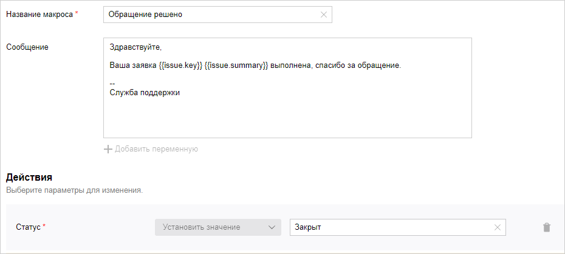

# Макросы

Макрос в {{ tracker-name }} — это запрограммированный набор операций, который можно запустить на странице задачи. Используйте макросы, чтобы автоматизировать рутинные действия. Макросы позволяют в одно нажатие изменять параметры задачи, создавать типовые комментарии и отправлять письма.

## Создать макрос {#section_inq_5b1_x2b}



По умолчанию настраивать очередь может [только ее владелец](queue-access.md).



У каждой очереди в {{ tracker-name }} свой набор макросов. Чтобы создать для очереди новый макрос:

1. 

1. В правом верхнем углу нажмите  **Настройки очереди**.

1. На панели слева выберите **Автоматизация** → **Макросы** и нажмите кнопку **Создать макрос**.

1. Настройте параметры нового макроса:
    - **Название макроса**.
    - **Сообщение** — текст сообщения (комментария  или письма), которое будет создано при выполнении макроса. Если вы не хотите, чтобы макрос создавал сообщение, оставьте поле пустым.
        В текст сообщения можно подставлять [значения полей задачи](../user/vars.md). Для этого нажмите кнопку **Добавить переменную** и выберите одно или несколько значений. В поле **Сообщение** появится конструкция вида `{{issue.ключ_поля}}`.
    - **Действия** — выберите, какие поля задачи будет изменять макрос, и укажите их новые значения.

1. Нажмите кнопку **Создать**.

## Изменить и удалить макрос {#section_swl_sdb_x2b}



По умолчанию настраивать очередь может [только ее владелец](queue-access.md).



1. 

1. В правом верхнем углу нажмите  **Настройки очереди**.

1. На панели слева выберите **Автоматизация** → **Макросы** и наведите указатель на нужный макрос.

1. Чтобы изменить макрос, нажмите на значок .
   Чтобы удалить макрос, нажмите на значок .

## Выполнить макрос {#section_ekq_22b_x2b}

С помощью макросов вы можете изменять параметры задачи, создавать типовые комментарии и отправлять письма. Выполнить макрос может любой пользователь, у которого есть доступ к изменению задачи.

Чтобы выполнить макрос:

1. Откройте страницу задачи.

1. Перейдите к полю для ввода комментария.

1. Нажмите  **Макросы** и выберите макрос из раскрывающегося списка. 
    Вы можете выбрать несколько макросов одновременно. Если макросы изменяют один и тот же параметр, к параметру будет применен макрос, который выбран последним.



1. Чтобы отправить письмо с помощью макроса, переключитесь на вкладку **Письмо** и [настройте его параметры](../user/comments.md#send-comment).



1. Чтобы выполнить макрос, нажмите кнопку **Выполнить**.

## Пример макроса {#macro_example}


### Закрыть задачу и уведомить пользователя {#macro_example_close_task}

Предположим, что сотрудники службы поддержки регистрируют обращения пользователей в {{ tracker-name }}. После того как работа по обращению выполнена, задачу нужно закрыть и отправить пользователю уведомление о решении его обращения. Настроим макрос, который будет выполнять эти действия:

1. 

1. В правом верхнем углу нажмите  **Настройки очереди**.

1. На панели слева выберите **Автоматизация** → **Макросы** → **Создать макрос**.

1. Задайте название макроса.

1. Напишите текст письма. Вы можете добавить в письмо параметры задачи с помощью кнопки  **Добавить переменную**.

1. Чтобы макрос закрывал задачу, в блоке **Действия** выберите поле **Статус** → **Установить значение** → **Закрыт**.

   

1. Нажмите **Создать**. 

Чтобы выполнить созданный макрос:

1. Откройте любую задачу в очереди, в которой вы создали макрос.

1. В поле для ввода комментария нажмите **Макрос** и выберите название вашего макроса.

1. Над полем комментария включите опцию **Письмо** и укажите адрес получателя. Если задача была [создана из письма пользователя](../user/create-ticket-by-mail.md), в поле **Кому** будет автоматически подставлена почта автора обращения. 

1. Нажмите кнопку **Отправить**. Пользователю будет отправлено письмо, а задача перейдет в статус **Закрыт**.



### Перевести задачу на вторую линию службы поддержки {#macro_example_shift_line}

Предположим, что сотрудник первой линии службы поддержки хочет перевести обращение пользователя в {{ tracker-name }} на сотрудника второй линии. Настроим макрос, который будет выполнять это действие:

1. Откройте очередь. 

1. В разделе **Макросы** нажмите кнопку [**Создать макрос**](#section_inq_5b1_x2b).

1. Задайте название макроса.

1. Напишите текст сообщения, которое будет добавлено в комментарий к задаче. Вы можете добавить параметры задачи с помощью кнопки **Добавить переменную**.

1. Чтобы макрос назначил задачу на определенного сотрудника второй линии поддержки, в блоке **Действия** выберите поле **Системные** → **Исполнитель** и укажите имя сотрудника.

1. Чтобы макрос изменил статус задачи, в блоке **Действия** выберите поле **Системные** → **Статус** и установите значение **Вторая линия поддержки**.
   Если в списке значений нет нужного статуса, [настройте воркфлоу](add-workflow.md). 
 
   

1. Сохраните макрос. 

Чтобы выполнить созданный макрос:

1. Откройте страницу задачи.

1. Перейдите к полю для ввода комментария.

1. Нажмите  **Макросы** и выберите макрос из раскрывающегося списка.

1. Нажмите кнопку **Выполнить**. Задача будет переведена на вторую линию поддержки.