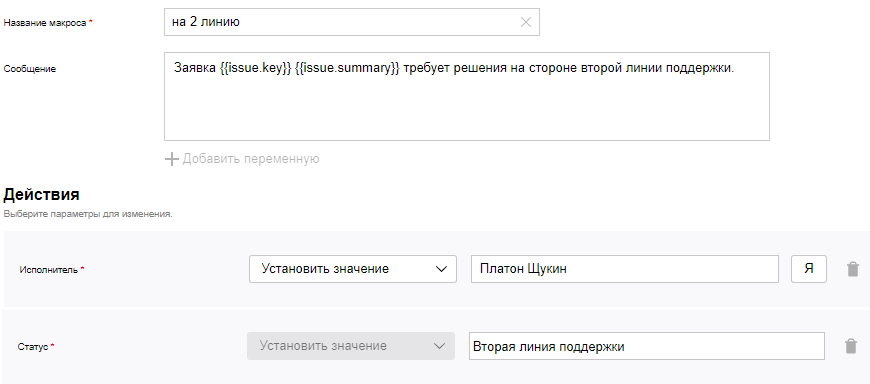

# Макросы

Макрос в {{ tracker-name }} — это запрограммированный набор операций, который можно запустить на странице задачи. Используйте макросы, чтобы автоматизировать рутинные действия. Макросы позволяют в одно нажатие изменять параметры задачи, создавать типовые комментарии.

## Создать макрос {#section_inq_5b1_x2b}



По умолчанию настраивать очередь может [только ее владелец](queue-access.md).



У каждой очереди в {{ tracker-name }} свой набор макросов. Чтобы создать для очереди новый макрос:

1. Откройте [страницу очереди](../user/queue.md).

1. Слева от имени очереди выберите  → **Администрирование**.

1. На панели слева выберите **Автоматизация** → **Макросы** и нажмите кнопку **Создать макрос**.

1. Настройте параметры нового макроса:
    - **Название макроса**.
    - **Сообщение** — текст сообщения (комментария ), которое будет создано при выполнении макроса. Если вы не хотите, чтобы макрос создавал сообщение, оставьте поле пустым.
        В текст сообщения можно подставлять [значения полей задачи](../user/vars.md). Для этого нажмите кнопку **Добавить переменную** и выберите одно или несколько значений. В поле **Сообщение** появится конструкция вида `{{issue.ключ_поля}}`.
    - **Действия** — выберите, какие поля задачи будет изменять макрос, и укажите их новые значения.

1. Нажмите кнопку **Создать макрос**.

## Изменить и удалить макрос {#section_swl_sdb_x2b}



По умолчанию настраивать очередь может [только ее владелец](queue-access.md).



1. Откройте [страницу очереди](../user/queue.md).

1. Слева от имени очереди выберите  → **Администрирование**.

1. На панели слева выберите **Автоматизация** → **Макросы** и наведите указатель на нужный макрос.

1. Чтобы изменить макрос, нажмите на значок .
   Чтобы удалить макрос, нажмите на значок .

## Выполнить макрос {#section_ekq_22b_x2b}

С помощью макросов вы можете изменять параметры задачи, создавать типовые комментарии. Выполнить макрос может любой пользователь, у которого есть доступ к изменению задачи.

Чтобы выполнить макрос:

1. Откройте страницу задачи.

1. Перейдите к полю для ввода комментария.

1. Выберите макрос из раскрывающегося списка **Макросы**.
    Вы можете выбрать несколько макросов одновременно. Если макросы изменяют один и тот же параметр, к параметру будет применен макрос, который выбран последним.

1. Чтобы выполнить макрос, нажмите кнопку **Отправить**.

## Пример макроса {#macro_example}

Предположим, что сотрудник первой линии службы поддержки хочет перевести обращение пользователя в {{ tracker-name }} на сотрудника второй линии. Настроим макрос, который будет выполнять это действие:

1. Перейдите в настройки очереди, в которой нужно создать макрос для перевода обращения на другую линию службы поддержки.

1. В разделе **Макросы** нажмите кнопку [**Создать макрос**](#section_inq_5b1_x2b).

1. Задайте название макроса.

1. Напишите текст сообщения, которое будет добавлено в комментарий к задаче. Вы можете добавить параметры задачи с помощью кнопки **Добавить переменную**.

1. Чтобы макрос назначил задачу на определенного сотрудника второй линии поддержки, в блоке **Действия** выберите поле **Системные** → **Исполнитель** и укажите имя сотрудника.

1. Чтобы макрос изменил статус задачи, в блоке **Действия** выберите поле **Системные** → **Статус** и установите значение **Вторая линия поддержки**.
   Если в списке значений нет нужного статуса, [настройте воркфлоу](add-workflow.md). 
 
   

1. Сохраните макрос. 

Чтобы выполнить созданный макрос:

1. Откройте любую задачу в очереди, в которой вы создали макрос.

1. В поле для ввода комментария нажмите **Макрос** и выберите название вашего макроса.

1. В тело комментария автоматически добавится текст, вы можете его отредактировать. 

1. Нажмите кнопку **Отправить**. Задача будет переведена на вторую линию поддержки.

