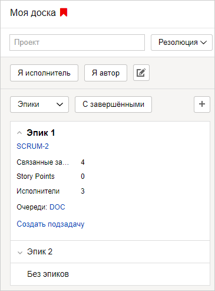

# Эпики

Эпик — тип задачи, который позволяет группировать задачи, связанные общей темой. В эпик могут входить задачи из разных очередей и спринтов.

Эпики удобно использовать на доске типа **{{ ui-key.startrek.components_QueuePresetOnboarding.preset-name--scrum-development-preset }}**, чтобы [планировать работу команды](create-agile-sprint.md#section_sjg_111_2gb). Вы можете распределить задачи из эпика между несколькими спринтами. Это позволит спрогнозировать трудозатраты и сроки выполнения задач.



Задача может входить только в один эпик.



#### Отфильтровать задачи по эпикам

1. На верхней панели {{ tracker-name }} нажмите **{{ ui-key.startrek.blocks-desktop_m-head.menu-agile }}** и выберите вашу доску.

1. В правом верхнем углу страницы нажмите кнопку **{{ ui-key.startrek.blocks-desktop_b-page-agile-board.sprints }}**.

1. В левой части страницы выберите группировку задач по эпикам.

    

    В списке отобразятся эпики, [добавленные на доску](../user/agile.md#add-tasks) или созданные на доске.

1. Нажмите карточку эпика. В бэклоге и в спринтах отобразятся задачи из выбранного эпика.

1. Чтобы посмотреть свойства эпика, нажмите стрелку слева от его названия. 

    На карточке эпика указано общее число задач в эпике, сумма [Story Points](agile.md#dlen_sp) всех задач, количество исполнителей задач и очереди, задачи которых входят в эпик.

#### Создать эпик на доске

1. Над списком эпиков нажмите значок .

1. Укажите очередь для создания эпика, его название и владельца.

1. Нажмите кнопку **{{ ui-key.startrek.blocks-desktop_b-page-agile-sprints.create-epic }}**.

#### Добавить задачу в эпик

На странице спринтов перетащите задачу из бэклога или любого спринта на карточку эпика.

Также вы можете добавить задачу в эпик с помощью [связи](../user/ticket-links.md):

1. На странице задачи нажмите **{{ ui-key.startrek.ui_components_IssueMenu.title }}** → **{{ ui-key.startrek.ui_components_CreateIssueLinkButton.add-relation }}**.

1. Выберите тип связи **{{ ui-key.startrek-backend.fields.issue.links.relationship.has.epic }}**.

1. Укажите [ключ эпика](../user/create-ticket.md#key).

#### Создать новую задачу в эпике

1. Раскройте карточку эпика, нажав стрелку слева от его названия. 

1. Внизу карточки нажмите **{{ ui-key.startrek.blocks-desktop_epic-card.create-subtask }}**. 

1. Заполните поля задачи и нажмите кнопку **{{ ui-key.startrek.blocks-desktop_agile-create-issue.create }}**. Новая задача будет добавлена в эпик.

#### Удалить задачу из эпика

Удалить задачу из эпика можно на странице спринтов или на странице задачи.

- На доске откройте страницу спринтов и перетащите задачу на карточку **{{ ui-key.startrek.blocks-desktop_b-page-agile-sprints.without-epics }}**.

- Откройте страницу задачи, в блоке **{{ ui-key.startrek.ui_components_IssueLinks.links-group-title--relates }}** наведите указатель мыши на строку эпика и нажмите значок .
