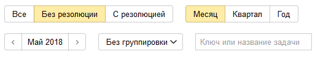

# Диаграмма Ганта в {{ tracker-name }}

Диаграмма Ганта в {{ tracker-name }} — это инструмент для составления календарного плана работ над задачами. Диаграмму Ганта можно построить для списка задач очереди или для списка задач, найденных с помощью фильтра.

Сроки выполнения задач отмечаются на диаграмме полосками, направленными вдоль оси времени. Начало каждой полоски соответствуют дате начала работы над задачей, а ее конец — дате завершения или дедлайна.

Цвет полоски обозначает состояние задачи:

- Желтая — дедлайн по задаче еще не наступил.
- Красная — дедлайн задачи уже прошел, но задача не закрыта.
- Серая — задача закрыта.

## Построить диаграмму для фильтра {#section_pwy_tgx_tdb}

Чтобы построить диаграмму Ганта:

1. Выберите [системный фильтр задач](../user/default-filters.md) или [создайте новый](../user/create-filter.md).

1. Настройте условия фильтра, чтобы отобрать задачи, для которых вы хотите построить диаграмму Ганта.

1. На верхней панели нажмите кнопку .

Для выбранных задач будет построена диаграмма Ганта. Если на диаграмме слишком много задач, воспользуйтесь быстрыми фильтрами или группировкой задач:

## Построить диаграмму для очереди {#sec_queue}

1. Откройте [список задач очереди](../user/queue.md).

1. С помощью [быстрых фильтров](quick-filters.md#section_y5w_chh_11b) выберите задачи, для которых вы хотите построить диаграмму Ганта.

1. Перейдите на вкладку **Диаграмма Ганта**.

Диаграмма Ганта будет построена с учетом фильтров, настроенных на вкладке **Задачи**. Если задач на диаграмме слишком много, воспользуйтесь быстрыми фильтрами или группировкой задач:

## Управлять сроками {#section_yz2_xgx_tdb}

Если у задачи не заданы даты начала и завершения, на диаграмме выделите подходящий интервал дат с помощью мыши.

Чтобы изменить дату начала или завершения задачи, наведите указатель мыши на границу полоски и перетащите ее.

Также вы можете нажать название задачи и на карточке задачи справа изменить значения полей **Дата начала**, **Дата завершения**, **Дедлайн**. Чтобы изменения отобразились на диаграмме, обновите страницу.

## Неразобранные задачи {#section_p5k_ygx_tdb}

Задачи, для которых не заданы даты начала и завершения работы, попадают в группу **Неразобранные задачи**. К этим задачам не применяются настройки группировки и быстрых фильтров.

Чтобы задать сроки выполнения таких задач на диаграмме:

1. В строке задачи на диаграмме выделите интервал дат с помощью мыши.

1. В появившемся окне при необходимости измените значения полей **Дата начала** и **Дата завершения**, задайте значение поля **Дедлайн**.

1. Нажмите кнопку **Сохранить**.

Также вы можете нажать название задачи и указать сроки выполнения на карточке задачи справа. Чтобы изменения отобразились на диаграмме, обновите страницу.