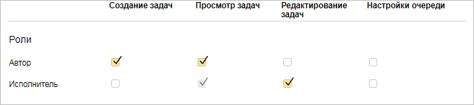
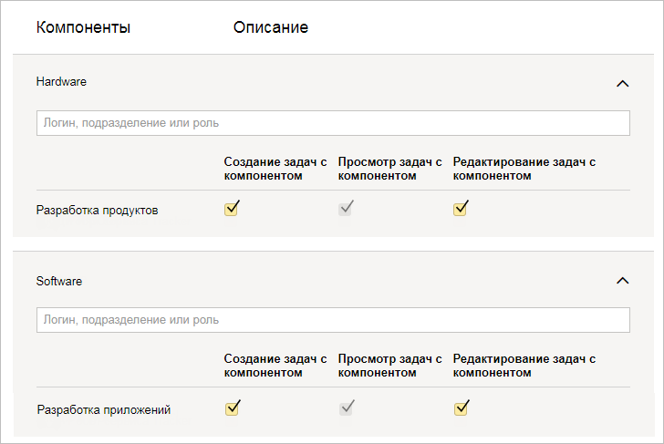

# Настроить доступ к очереди



По умолчанию настраивать очередь может только ее владелец.



## Настроить доступ к очереди {#set-access}

По умолчанию доступ пользователей к задачам очереди не ограничен.

В случае, если вы ограничите доступ к очереди, доступ к задачам по умолчанию будут иметь пользователи, указанные в полях **Автор**, **Исполнитель**, **Наблюдатели**, **Доступ**.



Для создания и редактирования задач, кроме доступа к очереди, пользователю требуется [полный доступ](../access.md) к {{ tracker-name }}. Подробнее читайте в разделе [{#T}](../role-model.md).



Вы можете изменить настройки доступа для отдельных пользователей, групп или ролей:

1. Откройте [страницу очереди](../user/queue.md).

1. В правом верхнем углу страницы нажмите  **Настройки очереди**.

1. Перейдите на вкладку **Доступ** → **Все задачи**.

1. Добавьте пользователей и группы, для которых нужно настроить доступ:
    * **Люди и роботы** — индивидуальные настройки для отдельных пользователей. Чтобы добавить пользователя в эту категорию, введите его логин или имя в строку поиска в верхней части таблицы.
    * **Группы** — настройки для всех сотрудников.
        

    * **Роли** — настройки для пользователей, обладающих определенными ролями по отношению к задачам очереди:
        * **Доступ** — пользователи, перечисленные в поле **Доступ** задачи;
        * **Наблюдатель** — пользователи, подписавшиеся на задачу;
        * **Автор** — автор задачи;
        * **Исполнитель** — исполнитель задачи;
        * **Владелец очереди**;
        * **Участник команды очереди** — пользователи, добавленные в [команду очереди](queue-team.md). По умолчанию этой роли нет в списке, ее можно добавить с помощью строки поиска вверху таблицы.

1. Задайте права на действия с очередью:
    * **Создание задач** — пользователи могут создавать новые задачи в этой очереди. 
    * **Просмотр задач** — пользователи могут комментировать задачу и менять ее статус, но не имеют возможности менять значения полей в задаче.

        

        Для [изменения статуса одновременно у нескольких задач](bulk-change.md#change-status) прав на просмотр недостаточно. Необходимо иметь права на редактирование задач.

        

    * **Редактирование задач** — пользователи могут комментировать задачу, менять ее статус и редактировать поля задачи (например, изменять дедлайн, добавлять наблюдателей и так далее). 
    * **Настройки очереди** — пользователи могут изменять [параметры очереди](edit-queue-general.md). 

1. Нажмите кнопку **Сохранить**.

Если пользователь одновременно обладает несколькими ролями, то ему доступны права на все действия, которые разрешены настройками этих ролей.

> **Пример**
>
> 
>
> Если пользователь является одновременно автором и исполнителем задачи, у него будут права на **Создание задач**, **Чтение задач** и **Редактирование задач**.

## Добавить сообщение для пользователей, у которых нет доступа {#deny-message}

По умолчанию при попытке открыть задачу очереди, к которой нет доступа, пользователи видят сообщение <q>Обратитесь к владельцу очереди</q> и имя владельца.

Вы можете изменить это сообщение. Например, указать другого пользователя с правами администратора очереди, к которому можно обратиться для получения доступа. Или написать, по какой причине доступ к очереди закрыт.

Чтобы изменить сообщение для пользователей, у которых нет доступа к очереди:

1. Откройте [страницу очереди](../user/queue.md).

1. В правом верхнем углу страницы нажмите  **Настройки очереди**.

1. Перейдите на вкладку **Доступ** → **Все задачи**.

1. В блоке **Сообщение для пользователей без доступа** нажмите кнопку **Редактировать**.

1. Напишите сообщение и нажмите кнопку **Сохранить**. 
  

## Настроить доступ к задачам с компонентом {#access-components}

Вы можете настраивать доступ к различным [компонентам](components.md) очереди. Это позволит задавать разные настройки для задач очереди без компонентов и для задач с компонентами. 



Правила доступа к компоненту имеют приоритет над правилами доступа к очереди.



Чтобы настроить доступ к задачам компонента:

1. Откройте [страницу очереди](../user/queue.md).

1. [Добавьте в очередь компоненты](components.md#create-component), с помощью которых вы будете разграничивать доступ к задачам.

1. В правом верхнем углу страницы нажмите  **Настройки очереди**.

1. Перейдите на вкладку **Доступ** → **Задачи с компонентом**.

1. Добавьте пользователей и группы, для которых нужно настроить доступ:
    * **Люди и роботы** — индивидуальные настройки для отдельных пользователей. Чтобы добавить пользователя в эту категорию, введите его логин или имя в строку поиска в верхней части таблицы.

    * **Группы** — настройки для всех сотрудников.

		

    * **Роли** — настройки для пользователей, обладающих определенными ролями по отношению к задачам очереди:
        * **Доступ** — пользователи, перечисленные в поле **Доступ** задачи;
        * **Наблюдатель** — пользователи, подписавшиеся на задачу;
        * **Автор** — автор задачи;
        * **Исполнитель** — исполнитель задачи;
        * **Владелец очереди**;
        * **Участник команды очереди** — пользователи, добавленные в [команду очереди](queue-team.md). По умолчанию этой роли нет в списке, ее можно добавить с помощью строки поиска вверху таблицы.

1. Нажмите кнопку **Сохранить**.

	

	Если нужно отключить специальные права доступа для компонента, нажмите кнопку **Очистить**.

	

1. Чтобы настроить для отдельной задачи доступ, который отличается от настроек доступа всей очереди, добавьте в задачу компонент.

Если задача относится к нескольким компонентам, доступ к задаче имеют все пользователи, которым разрешен доступ хотя бы к одному компоненту.

> **Пример**
>
> 
>
> Если задача относится к компонентам **Hardware** и **Software**, доступ к ней будут иметь как пользователи из группы <q>Разработка продуктов</q>, так и пользователи из группы <q>Разработка приложений</q>.

