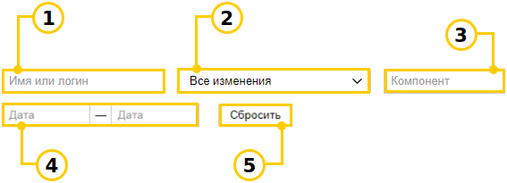

# Посмотреть историю изменений очереди



По умолчанию настройка очереди доступна только ее владельцу.



В журнале собраны записи об изменениях настроек очереди. В каждой записи указаны дата, автор и содержание изменений.

## Просмотреть журнал изменений {#section_yj4_f1c_r2b}

1. Откройте страницу очереди.

1. Слева от имени очереди выберите  → **Администрирование**.

1. Перейдите на вкладку **Журнал изменений**.

## Фильтровать записи {#section_pyt_rnb_r2b}

Чтобы найти нужную запись в журнале, воспользуйтесь фильтрами:

1. **По автору изменений**
    Найти изменения, которые сделал определенный пользователь.

1. **По типу изменений**
    Просмотреть изменения настроек, которые относятся к определенному типу.

1. **По компоненту**
    Просмотреть изменения компонента: создание, удаление, изменение параметров и т. д.

1. **По дате**
    Найти изменения за определенный период. Вы можете выбрать интервал или задать только начало или конец диапазона.

1. **Сбросить фильтры**
    Чтобы отменить действие фильтра, нажмите кнопку Сбросить.

