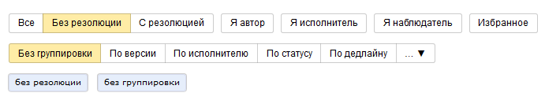

# Найти задачи в очереди

По умолчанию на [странице очереди](../user/queue.md) отображаются все задачи, входящие в очередь. Для поиска задач в списке используйте [быструю фильтрацию](#section_y5w_chh_11b) или [конструктор фильтров](#section_kfq_2hh_11b). При необходимости вы можете сохранить полученный список задач в виде файла.

## Быстрые фильтры {#section_y5w_chh_11b}

С помощью быстрых фильтров вы можете фильтровать и сортировать задачи в пару нажатий. Кнопки управления быстрыми фильтрами расположены над списком задач.

Чтобы отфильтровать задачи по [резолюции](../manager/create-resolution.md), нажмите кнопку **Резолюция** и выберите нужные значения из списка.

  

1. Фильтр по резолюции. Выберите одну из опций:

    - **Все** — на странице отображаются все задачи, независимо от наличия резолюции.

    - **Без резолюции** — на странице отображаются только задачи без резолюции.

    - **С резолюцией** — на странице отображаются только задачи с резолюцией.

1. Группа фильтров, позволяющих отбирать задачи в зависимости от вашей роли. Вы можете включить несколько фильтров одновременно:

    - **Я автор**.

    - **Я исполнитель**.

    - **Я наблюдатель**.

1. **Избранное** — фильтр для задач, которые вы добавили в избранное.

1. Группировка задач по различным признакам. Вы можете выбрать один из доступных признаков.



В результате в списке задач появятся только те задачи, которые удовлетворяют всем выбранным фильтрам.

## Конструктор фильтров {#section_kfq_2hh_11b}

Если вам не хватает возможностей быстрых фильтров, воспользуйтесь конструктором. Вы можете использовать конструктор фильтров прямо на странице очереди: 

1. Перейдите на страницу очереди.

1. Над списком задач нажмите кнопку  **Добавить поле для фильтрации** и выберите поле.

1. Задайте значение для параметра.

## Отобразить поля задач {#section_wbf_33h_11b}

Настройте отображение полей для списка задач, чтобы видеть только важные для вас параметры:

1. Перейдите на страницу очереди.

1. Нажмите кнопку  **Настройки** над списком задач справа.

1. Выберите параметры, которые вы хотите видеть в списке задач.

1. Нажмите кнопку **Применить**.

Изменения вступают в силу сразу же, обновлять страницу не нужно.

  

## Сохранить список на Вики {#section_uy5_hds_3bb}

Вы можете вставить список задач на вики-страницу:

1. В левом верхнем углу страницы выберите  → **Получить код для Вики**.

1. Скопируйте код.

1. Разместите код на вики-странице.

Такой список обновляется автоматически. Он всегда будет содержать актуальную информацию о статусах задач, их названиях и исполнителях.



## Сохранить список в файл {#section_vjt_x3h_11b}

Вы можете сохранить список задач в файл в одном из форматов: XML, CSV или XLSX.



Список задач сохраняется с учетом всех фильтров и настроек полей.



Чтобы сохранить список задач в файл:

1. В правом верхнем углу нажмите кнопку  **Действия над очередью**.

1. Затем нажмите кнопку  **Выгрузить**.

1. Выберите формат, в котором вы хотите сохранить список задач.

1. Дождитесь окончания загрузки файла на ваше устройство.

